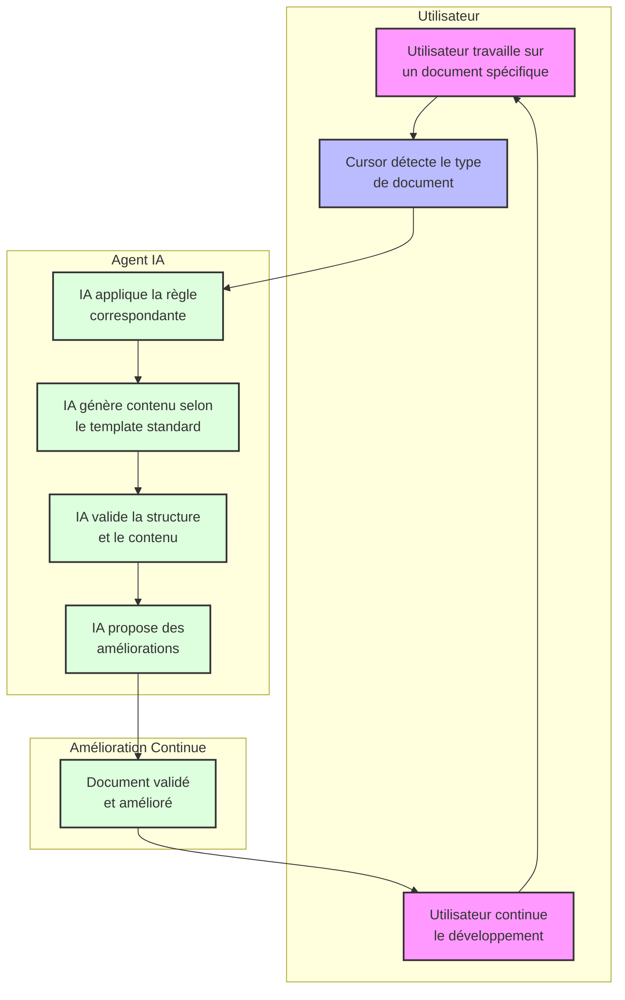

# Cursor Auto Rules pour Workflow Agile

## À propos du Projet

Ce projet fournit un ensemble complet de règles Cursor et templates standardisés qui permettent d'établir un workflow agile robuste piloté par l'IA, tout en maintenant une documentation de haute qualité.

L'objectif principal est de simplifier votre expérience de développement grâce à :

- Des règles Cursor qui s'activent automatiquement selon le contexte
- Un workflow documenté qui garantit cohérence et traçabilité
- Une génération et maintenance automatique des documents clés (fondation technique, PRD, architecture, stories)

> 💡 **Note:** Ce système assure que l'IA de Cursor suit toujours les bonnes pratiques et standards définis par votre équipe, sans effort manuel supplémentaire.

## Structure du Projet

```
.
├── .cursor/rules/          # Règles Cursor standardisées
├── docs/                   # Tutoriels et documentation
│   ├── scenario-*.md       # Guides pour différents scénarios
│   └── index.md            # Table des matières des scénarios
├── scripts/                # Outils de validation et d'automation
│   ├── validate-docs.js    # Script de validation de la documentation
│   └── setup-validation.sh # Script d'installation
├── templates/              # Templates standardisés
│   ├── workflow-agile-standardized.md
│   ├── template-project-foundation-standardized.md
│   ├── template-prd-standardized.md
│   ├── template-arch-standardized.md
│   └── template-story-standardized.md
└── README.md               # Ce fichier
```

## Démarrage Rapide

### Option A - Nouveau Projet avec Workflow Agile

Utilisez cette méthode pour créer un nouveau projet avec toutes les règles et la structure déjà en place :

```bash
# Cloner ce repository
git clone https://github.com/votre-organisation/cursor-auto-rules-agile-workflow.git
cd cursor-auto-rules-agile-workflow

# Appliquer les règles à votre nouveau projet
./apply-rules.sh /chemin/vers/nouveau-projet

# Exemple:
./apply-rules.sh ~/projects/mon-nouveau-projet
```

Le script créera le dossier de projet s'il n'existe pas encore, puis y copiera toutes les règles et la documentation nécessaires.

### Option B - Ajouter à un Projet Existant

Pour améliorer l'expérience de développement d'un projet existant :

```bash
# Cloner ce repository
git clone https://github.com/votre-organisation/cursor-auto-rules-agile-workflow.git
cd cursor-auto-rules-agile-workflow

# Appliquer les règles à votre projet existant
./apply-rules.sh /chemin/vers/projet-existant
```

Le script :

1. Copiera les règles standardisées dans votre répertoire `.cursor/rules/`
2. Ajoutera la documentation dans le dossier `docs/`
3. Mettra à jour `.gitignore` pour protéger les règles privées
4. Préservera toutes les règles existantes dans votre projet

### Utilisation des Règles Cursor

1. **Documentez d'abord les fondations techniques** de votre projet en suivant le template fourni
2. **Créez le PRD** basé sur les fondations techniques validées
3. **Établissez l'architecture** en cohérence avec le PRD et les fondations techniques
4. **Définissez les stories** à implémenter, avec leurs critères d'acceptation
5. **Utilisez les scripts** pour valider la qualité de votre documentation

```bash
# Valider tous les documents
./scripts/validate-docs.js

# Valider un document spécifique
./scripts/validate-docs.js chemin/vers/document.md

# Générer un rapport détaillé
./scripts/validate-docs.js --report
```

## Tutoriels

Nous fournissons des guides détaillés pour différents scénarios d'utilisation:

1. [Première Utilisation des Règles Cursor](docs/scenario-1-premiere-utilisation.md)
2. [Documentation des Fondations Techniques du Projet](docs/scenario-2-fondation-projet.md)
3. [Mise à Jour d'une Story Existante](docs/scenario-2-mise-a-jour-story.md)
4. [Création et Intégration de Diagrammes Mermaid](docs/scenario-3-diagrammes-mermaid.md)
5. [Validation Automatisée de la Documentation](docs/scenario-4-validation-documentation.md)
6. [Adaptation des Templates Standardisés](docs/scenario-5-adaptation-templates.md)
7. [Intégration dans un Pipeline CI/CD](docs/scenario-6-integration-cicd.md)
8. [Création d'une Nouvelle Règle Cursor](docs/scenario-7-creation-regle-cursor.md)

Consultez le [guide d'utilisation complet](docs/index.md) pour une vue d'ensemble.

## Comment Fonctionne le Système de Règles



## Système de Validation

Le système de validation automatisée vérifie:

- **Formatage Markdown**: Structure des titres, formatage, etc.
- **Diagrammes Mermaid**: Syntaxe et validité des diagrammes
- **Critères d'Acceptation**: Format Gherkin et cohérence
- **Tableaux de Risques**: Structure et contenu

Pour une documentation complète sur la validation, consultez [le guide de validation](docs/scenario-4-validation-documentation.md).

## Bonnes Pratiques

1. **Commencez par les fondations techniques**:

   - Définissez clairement vos choix technologiques avant de commencer
   - Justifiez chaque choix pour faciliter les décisions futures

2. **Maintenez la cohérence**:

   - Utilisez les templates fournis pour tous vos documents
   - Vérifiez régulièrement la validation pour maintenir la qualité

3. **Intégrez dans votre workflow**:
   - Faites de la documentation une partie intégrante du processus de développement
   - Utilisez les scripts de validation dans votre pipeline CI/CD

## Contribution

Les contributions sont les bienvenues! Pour contribuer:

1. Forker le repository
2. Créer une branche pour votre fonctionnalité (`git checkout -b feature/nom-fonctionnalite`)
3. Committer vos changements (`git commit -am 'Ajout de fonctionnalité'`)
4. Pousser vers la branche (`git push origin feature/nom-fonctionnalite`)
5. Créer une Pull Request

Veuillez respecter les standards de code et de documentation du projet.

## Licence

Ce projet est sous licence MIT. Voir le fichier LICENSE pour plus de détails.

## Contact

Pour toute question ou suggestion, n'hésitez pas à ouvrir une issue ou à contacter les mainteneurs du projet.

---

_Projet maintenu par Giak - 2025_
