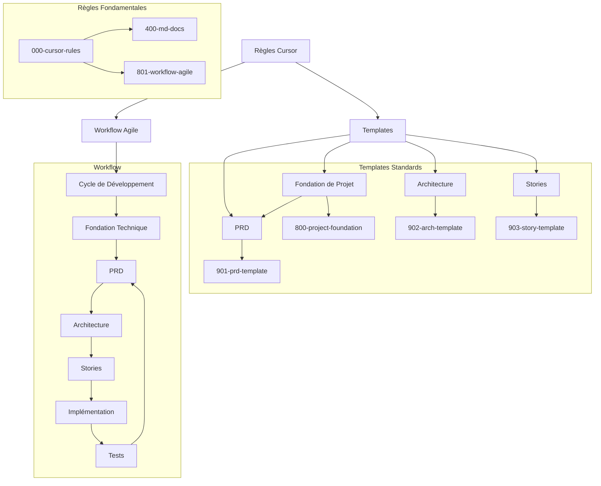
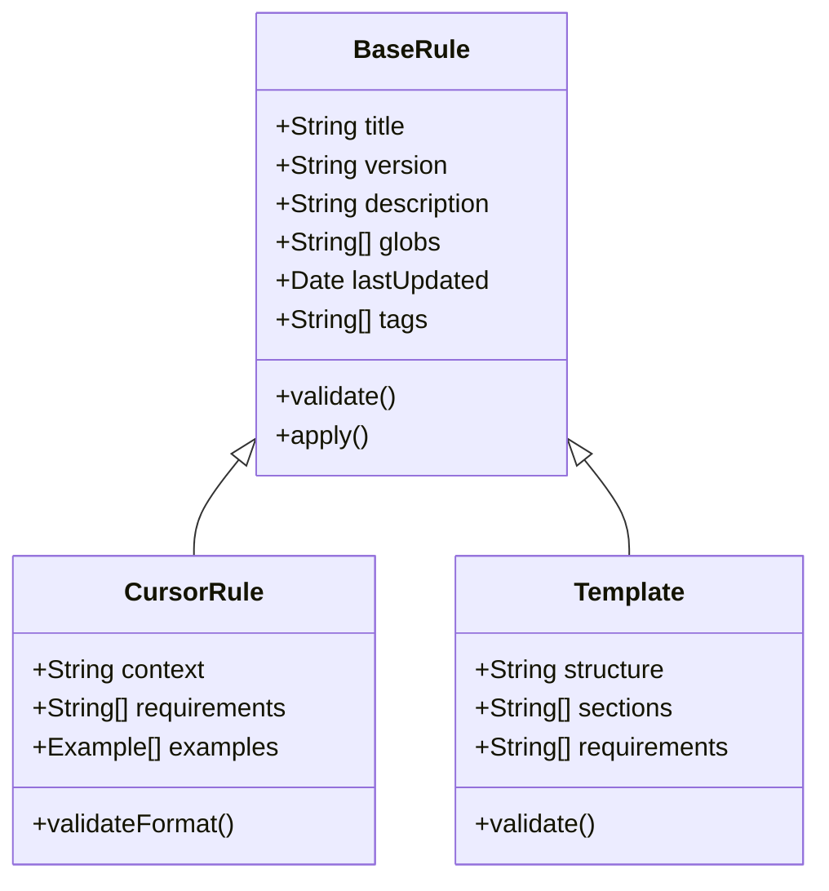
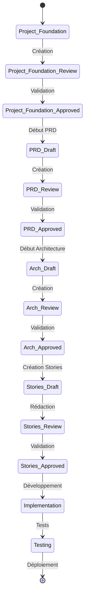
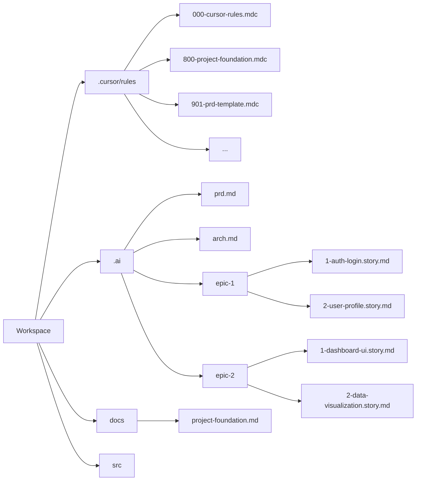
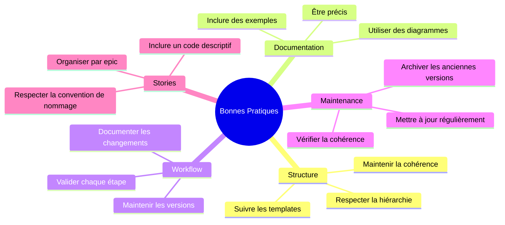

# Guide d'Utilisation du Système de Règles et Templates

## Vue d'Ensemble du Système



## Structure des Règles



## Workflow Agile Détaillé



## Guide d'Utilisation

### 1. Organisation des Fichiers



### 2. Création d'un Nouveau Projet

1. **Initialisation**

   - Créer le dossier `.cursor/rules/`
   - Copier les règles standardisées
   - Initialiser le dossier `.ai/`

2. **Workflow Documentation**
   - Créer la fondation de projet (`docs/project-foundation.md`)
   - Créer le PRD (`.ai/prd.md`)
   - Créer l'Architecture (`.ai/arch.md`)
   - Créer les dossiers d'Epics (`.ai/epic-{n}/`)
   - Créer les Stories (`.ai/epic-{n}/{m}-{code}.story.md`)

### 3. Convention de Nommage des Stories

La nouvelle convention de nommage des stories suit ce format:

```
.ai/epic-{n}/{m}-{code}.story.md
```

Où:

- `{n}` est le numéro de l'Epic (ex: 1, 2, 3)
- `{m}` est le numéro de la Story dans l'Epic (ex: 1, 2, 3)
- `{code}` est un résumé du titre de la story en minuscules séparés par des tirets

Exemples:

- `.ai/epic-1/1-authentification-utilisateur.story.md`
- `.ai/epic-2/3-interface-plateau-echecs.story.md`
- `.ai/epic-3/7-gestion-erreurs-api.story.md`

### 4. Application des Règles

Les règles sont automatiquement appliquées en fonction des patterns glob :

- `*.md` → Règles de documentation Markdown
- `prd.md` → Template PRD
- `arch.md` → Template Architecture
- `*.story.md` → Template Story

## FAQ

### Questions Fréquentes

1. **Q: Comment sont détectées les règles ?**
   R: Les règles sont détectées via les patterns glob définis dans leur frontmatter.

2. **Q: Puis-je personnaliser les templates ?**
   R: Oui, en créant des versions personnalisées dans `.cursor/rules/` tout en respectant la structure de base.

3. **Q: Comment gérer les conflits entre règles ?**
   R: Les règles suivent une hiérarchie basée sur leur préfixe numérique (0XX > 9XX).

4. **Q: Comment mettre à jour les règles ?**
   R: Modifier les fichiers dans `.cursor/rules/` en incrémentant leur version.

5. **Q: Pourquoi cette nouvelle convention pour les stories ?**
   R: La convention `.ai/epic-{n}/{m}-{code}.story.md` améliore l'organisation et la lisibilité en groupant les stories par epic et en incluant un résumé descriptif dans le nom de fichier.

### Bonnes Pratiques



## Références

- [Documentation Mermaid](https://mermaid-js.github.io/)
- [Markdown Guide](https://www.markdownguide.org/)
- [Clean Architecture](https://blog.cleancoder.com/uncle-bob/2012/08/13/the-clean-architecture.html)
