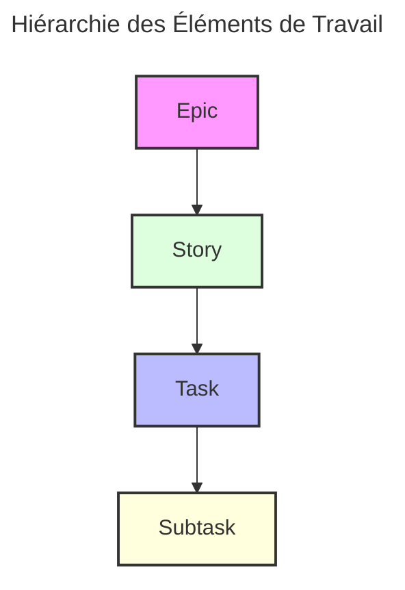
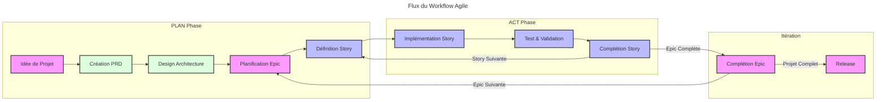
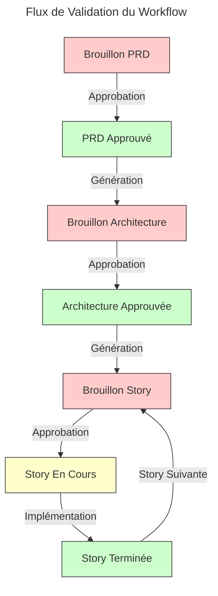

# Cursor Agile Workflow Documentation

## 📋 Table des Matières

- [Vue d'Ensemble](#vue-densemble)
- [Hiérarchie des Éléments de Travail](#hiérarchie-des-éléments-de-travail)
- [Structure de Projet et Organisation](#structure-de-projet-et-organisation)
- [Phases du Workflow](#phases-du-workflow)
- [Procédures d'Implémentation](#procédures-dimplémentation)
- [Principes de Développement](#principes-de-développement)
- [Utilisation du Workflow](#utilisation-du-workflow)
- [Intégration avec Cursor AI](#intégration-avec-cursor-ai)
- [Standards de Version et Commit](#standards-de-version-et-commit)
- [Validation et Qualité](#validation-et-qualité)
- [FAQ](#faq)

## 📋 Vue d'Ensemble

Le Cursor Agile Workflow combine les méthodologies agiles traditionnelles avec le développement assisté par IA pour créer un processus de développement efficace et robuste. Cette approche structurée permet de maintenir le focus du projet tout en garantissant une progression constante.

> ⚠️ **Attention**: La qualité de la documentation est fondamentale pour le succès de ce workflow. Tous les documents doivent suivre les standards définis dans les règles Cursor.

### Approches d'Implémentation

Le workflow peut être utilisé de deux manières principales:

#### 1. Implémentation Basée sur les Règles (Automatique)

- Utilise les templates dans `.cursor/rules/`
- Applique automatiquement les standards aux fichiers correspondants
- Garantit une structure cohérente et systématique

| Avantages               | Inconvénients                          |
| :---------------------- | :------------------------------------- |
| Application automatique | Configuration initiale nécessaire      |
| Cohérence garantie      | Moins flexible pour les petits projets |
| Documentation intégrée  | Courbe d'apprentissage plus élevée     |

#### 2. Implémentation Basée sur les Notepads (Flexible)

- Utilise les templates dans `xnotes/`
- Plus léger et adaptable
- Idéal pour les sessions de développement ciblées

| Avantages                  | Inconvénients                     |
| :------------------------- | :-------------------------------- |
| Flexibilité accrue         | Moins de garanties de cohérence   |
| Mise en place rapide       | Nécessite une discipline manuelle |
| Overhead contextuel réduit | Moins adapté aux grands projets   |

## 🏗️ Hiérarchie des Éléments de Travail



### 1. Epics

- Fonctionnalités larges et autonomes
- Une seule active à la fois
- Exemple: "Système de Matchmaking en Ligne"
- Format standard: `Epic-{N}: {Titre} ({Status})`

### 2. Stories

- Unités de travail plus petites et implémentables
- Doivent appartenir à un Epic
- Exemple: "Création de Profil Utilisateur"
- Format standard selon [`903-story-template-standardized.mdc`](../.cursor/rules/903-story-template-standardized.mdc)
- Structure: "En tant que... Je veux... afin de..."

### 3. Tasks

- Étapes d'implémentation technique
- Critères de complétion clairs
- Exemple: "Implémentation du Schéma de Base de Données"
- Format standard: `- [ ] {Description}`

### 4. Subtasks

- Éléments de travail granulaires
- Incluent souvent des exigences de test
- Exemple: "Écriture des Tests Unitaires"
- Format standard: `  - [ ] {Description}`

## 📁 Structure de Projet et Organisation

Le workflow agile génère et maintient une structure de projet organisée pour la documentation et le suivi:

```
.ai/
├── prd.md                 # Document d'Exigences Produit
├── arch.md                # Document d'Architecture
├── epic-1/               # Répertoire de l'Epic courante
│   ├── 1-authentification-utilisateur.story.md  # Fichiers Story pour Epic 1
│   ├── 2-gestion-profil.story.md
│   └── 3-recuperation-mot-de-passe.story.md
├── epic-2/               # Répertoire d'Epic future
│   └── ...
└── epic-3/               # Répertoire d'Epic future
    └── ...
```

### Conventions de Nommage

| Type de Fichier | Convention             | Exemple                                |
| :-------------- | :--------------------- | :------------------------------------- |
| PRD             | `prd.md`               | `.ai/prd.md`                           |
| Architecture    | `arch.md`              | `.ai/arch.md`                          |
| Epic            | `epic-{N}/`            | `.ai/epic-1/`                          |
| Story           | `{M}-{code}.story.md`  | `.ai/epic-1/2-gestion-profil.story.md` |
| Task            | Format Liste (`- [ ]`) | À l'intérieur des fichiers story       |

> 💡 **Astuce**: Utilisez les commandes de création de fichiers du workflow pour générer automatiquement les fichiers avec la structure correcte.

## 🔄 Phases du Workflow

### 1. Phase PLAN

- Focus sur la documentation et la planification
- Modification uniquement des fichiers `.ai/`, docs, readme et rules
- Approbations requises pour le PRD et l'Architecture

#### Documents Clés de la Phase PLAN

| Document     | Règle Associée                                                                                | Objectif                                        |
| :----------- | :-------------------------------------------------------------------------------------------- | :---------------------------------------------- |
| PRD          | [`901-prd-template-standardized.mdc`](../.cursor/rules/901-prd-template-standardized.mdc)     | Définir les exigences produit                   |
| Architecture | [`902-arch-template-standardized.mdc`](../.cursor/rules/902-arch-template-standardized.mdc)   | Documenter les décisions d'architecture         |
| Epic         | Partie du workflow                                                                            | Organiser le travail en grandes fonctionnalités |
| Story        | [`903-story-template-standardized.mdc`](../.cursor/rules/903-story-template-standardized.mdc) | Définir les unités de travail implémentables    |

### 2. Phase ACT

- Implémentation de la story approuvée en cours
- Exécution tâche par tâche
- Test et validation continus
- Mise à jour régulière du statut dans les fichiers story

#### Processus d'Implémentation

1. **Test-Driven Development (TDD)**

   - Écrire d'abord les tests pour les critères d'acceptation
   - Implémenter pour faire passer les tests
   - Refactoriser si nécessaire

2. **Développement Incrémental**

   - Compléter une tâche à la fois
   - Mettre à jour le statut des tâches (`[ ]` → `[x]`)
   - Documenter les notes d'implémentation

3. **Standards de Code**
   - Conformité aux règles [`802-code-generation-standardized.mdc`](../.cursor/rules/802-code-generation-standardized.mdc)
   - Prévention de l'overengineering selon [`803-overengineering-prevention-standardized.mdc`](../.cursor/rules/803-overengineering-prevention-standardized.mdc)
   - Format de commit selon [`git-push-command-standardized.mdc`](../.cursor/rules/git-push-command-standardized.mdc)



> ℹ️ **Note**: Chaque transition entre phases nécessite une approbation formelle pour garantir la cohérence et la qualité.

## 📝 Procédures d'Implémentation

### Processus d'Implémentation des Stories

#### 1. Initialisation

- Vérifier l'existence du répertoire `.ai`
- Localiser l'architecture approuvée et la story actuelle
- S'assurer que la story est correctement marquée comme en cours

```bash
# Vérifier la structure du projet
ls -la .ai/
# Vérifier le statut des stories
grep -r "Statut:" .ai/epic-*/story-*.story.md
```

#### 2. Flux de Développement

- Suivre le Test-Driven Development (TDD)
- Mettre à jour régulièrement le statut des tâches/sous-tâches
- Documenter toutes les notes d'implémentation
- Enregistrer les commandes significatives utilisées

```javascript
// Exemple de test TDD
describe("UserProfile", () => {
  it("should validate email format", () => {
    const profile = new UserProfile();
    expect(profile.validateEmail("invalid")).toBe(false);
    expect(profile.validateEmail("user@example.com")).toBe(true);
  });
});
```

#### 3. Exigences de Complétion

- Tous les tests doivent passer
- La documentation doit être mise à jour
- L'utilisateur doit approuver la complétion

```bash
# Exécuter les tests
npm test
# Mettre à jour le statut de la story
# Modifier le fichier .ai/epic-N/story-M.story.md
```

### Règles Critiques

> 🚨 **Règles Critiques:**
>
> - Ne jamais créer la première story sans approbation du PRD et de l'Architecture
> - Une seule Epic peut être en cours à la fois
> - Une seule Story peut être en cours à la fois
> - Les Stories doivent être implémentées dans l'ordre spécifié dans le PRD
> - Ne jamais implémenter sans approbation de la story par l'utilisateur (marquée comme "In Progress" dans le fichier story)

## 🧠 Principes de Développement

### Principes Fondamentaux

#### 1. KISS (Keep It Simple, Stupid)

- Privilégier la solution la plus simple qui résout le problème actuel
- Viser la clarté du code plutôt que la sophistication
- Mesurer la complexité cyclomatique (objectif < 5 par fonction)

#### 2. YAGNI (You Aren't Gonna Need It)

- N'implémenter que les fonctionnalités explicitement requises
- Éviter d'anticiper des besoins hypothétiques futurs
- Reporter les décisions jusqu'au moment où elles sont nécessaires

#### 3. DRY (Don't Repeat Yourself) - Avec Modération

- Éviter la duplication de code lorsqu'elle devient problématique
- N'introduire une abstraction que lorsque la duplication est avérée
- Préférer parfois la duplication à une mauvaise abstraction

#### 4. Principes SOLID

- **S**ingle Responsibility Principle
- **O**pen/Closed Principle
- **L**iskov Substitution Principle
- **I**nterface Segregation Principle
- **D**ependency Inversion Principle

### Anti-Patterns à Éviter

| Anti-Pattern             | Description                                                 | Exemple à Éviter                                    |
| :----------------------- | :---------------------------------------------------------- | :-------------------------------------------------- |
| Abstractions Prématurées | Création de hiérarchies d'interfaces complexes dès le début | Créer un framework interne pour un petit projet     |
| Généralisation Excessive | Conception pour des cas d'usage hypothétiques               | Implémenter des "hooks" non requis                  |
| Optimisation Prématurée  | Micro-optimisations sans données de performance             | Compromis de lisibilité pour des gains négligeables |
| Sur-Modularisation       | Fragmentation excessive en micro-composants                 | Créer trop de modules indépendants                  |

## 🚀 Utilisation du Workflow

### Approche Basée sur les Règles

1. Installer les règles du workflow:

```bash
./apply-rules.sh /chemin/vers/votre/projet
```

2. Utiliser les templates fournis en les copiant dans le répertoire `.cursor/rules`:

   - `901-prd-template-standardized.mdc` pour les Exigences Produit
   - `902-arch-template-standardized.mdc` pour l'Architecture
   - `903-story-template-standardized.mdc` pour les Stories

3. Suivre le flux de travail défini dans `801-workflow-agile-standardized.mdc`

### Approche Basée sur les Notepads

1. Activer les Notepads dans les options de Cursor
2. Créer des notepads à partir des templates:

   - `workflow-agile.md` pour le workflow complet
   - `implementation-agile.md` pour l'implémentation de story

3. Utiliser `@notepad-name` pour accéder au contexte du workflow

> 💡 **Astuce:** Utilisez l'approche Notepad pour:
>
> - Configuration initiale du projet (notepad nommé plan-agile)
> - Implémentation de story (notepad nommé impl-story)
> - Sessions de développement ciblées
> - Réduction de l'overhead contextuel

- Commande d'exemple pour nouvelle fenêtre de contexte: `@plan-agile J'ai une idée pour <description haut niveau ici>`
- Commande d'exemple pour nouvelle fenêtre de contexte: `@impl-story Je suis prêt à commencer l'implémentation de la story actuelle en cours en tâches complètes`

## 📊 Progression des Statuts

Les Stories suivent une progression de statut stricte:

```
Draft -> In Progress -> Complete
```

Les Epics suivent une progression similaire:

```
Future -> Current -> Complete
```

### Flux de Validation des Documents



## 🔍 Intégration avec Cursor AI

Le workflow est conçu pour fonctionner parfaitement avec les capacités d'IA de Cursor:

### 1. Planification Assistée par IA

- L'IA aide à créer et raffiner le PRD
- L'IA suggère des améliorations d'architecture
- L'IA assiste dans la décomposition des stories

### 2. Implémentation Assistée par IA

- L'IA implémente les tâches des stories
- L'IA maintient la couverture de tests
- L'IA met à jour la documentation

### 3. Revue Assistée par IA

- L'IA vérifie les critères de complétion
- L'IA suggère des améliorations
- L'IA maintient la cohérence

### Optimisation des Coûts d'IA

- Les LLMs externes à Cursor, comme ChatGPT, Claude, Gemini, etc., sont excellents pour générer le PRD et l'architecture initiaux, et vraiment itérer dessus.
- Dans Cursor, vous pouvez utiliser DeepSeek R1 par exemple qui semble être gratuit et également décent pour mettre à jour le PRD et l'architecture - mais il s'est avéré un peu moins fiable pour suivre le format souhaité que Claude - mais beaucoup moins cher si vous essayez de faire toute la planification dans Cursor.

## 🔄 Standards de Version et Commit

### Format des Messages de Commit

Selon [`git-push-command-standardized.mdc`](../.cursor/rules/git-push-command-standardized.mdc), les messages de commit doivent suivre ce format:

```
type(scope): brief description

Changes made in this commit:
- Modified files: [liste des fichiers modifiés]
- Added files: [liste des fichiers ajoutés]
- Deleted files: [liste des fichiers supprimés]
- Key changes:
  - [changement spécifique 1]
  - [changement spécifique 2]
  ...

Explication détaillée des changements et raisonnement...

-bmadAi
```

### Types de Commit Standards

| Type     | Description                                         |
| :------- | :-------------------------------------------------- |
| feat     | Nouvelle fonctionnalité                             |
| fix      | Correction de bug                                   |
| docs     | Modification de la documentation                    |
| style    | Formatage, points-virgules manquants, etc.          |
| refactor | Refactorisation du code                             |
| test     | Ajout ou modification de tests                      |
| chore    | Changements de configuration, outils de build, etc. |
| perf     | Amélioration des performances                       |

## ✅ Validation et Qualité

### Validation de la Documentation

Pour assurer la qualité de votre documentation, utilisez les scripts de validation fournis:

```bash
# Valider tous les documents
./scripts/validate-docs.js

# Valider un document spécifique
./scripts/validate-docs.js chemin/vers/document.md

# Générer un rapport détaillé
./scripts/validate-docs.js --report
```

### Standards de Qualité

- **Tests**: Couverture minimale de 80% pour chaque fonctionnalité
- **Documentation**: Conforme aux templates standardisés
- **Code**: Respecte les principes SOLID et les standards de clean code
- **Commits**: Format standardisé avec descriptions détaillées

### Intégration CI/CD

Le workflow peut être intégré à votre pipeline CI/CD:

```yaml
# Exemple de configuration CI/CD
validate:
  script:
    - ./scripts/validate-docs.js --ci
  artifacts:
    paths:
      - validation-report.json

test:
  script:
    - npm test
  coverage: /Coverage: (\d+.\d+%)/
```

## ❓ FAQ

### Questions Générales

**Q: Dois-je créer tous les documents avant de commencer le développement?**
R: Oui. Le PRD et l'Architecture doivent être approuvés avant de créer des stories, et une story doit être approuvée avant l'implémentation.

**Q: Puis-je travailler sur plusieurs stories en même temps?**
R: Non. Une seule story peut être "In Progress" à la fois, pour maintenir le focus et la qualité.

**Q: Comment gérer les changements de requirements?**
R: Mettez à jour le PRD, obtenez l'approbation, puis ajustez l'architecture et les stories si nécessaire.

### Questions Techniques

**Q: Comment gérer les dépendances entre stories?**
R: Documentez-les dans la section "Contexte" de chaque story et planifiez l'ordre d'implémentation en conséquence.

**Q: Que faire si une story est trop complexe?**
R: Décomposez-la en stories plus petites et mieux définies, en suivant le principe d'atomicité.

**Q: Comment valider que mon implementation respecte l'architecture?**
R: Référez-vous régulièrement au document d'architecture et utilisez les tests pour valider les composants.

## 🔗 Références

- [Template de Workflow Agile](../.cursor/rules/801-workflow-agile-standardized.mdc)
- [Template de PRD](../.cursor/rules/901-prd-template-standardized.mdc)
- [Template d'Architecture](../.cursor/rules/902-arch-template-standardized.mdc)
- [Template de Story](../.cursor/rules/903-story-template-standardized.mdc)
- [Standards de Génération de Code](../.cursor/rules/802-code-generation-standardized.mdc)
- [Prévention de l'Overengineering](../.cursor/rules/803-overengineering-prevention-standardized.mdc)
- [Standards de Documentation Markdown](../.cursor/rules/400-md-docs-standardized.mdc)
- [Standards de Commit Git](../.cursor/rules/git-push-command-standardized.mdc)

---

<version>1.0.0</version>
