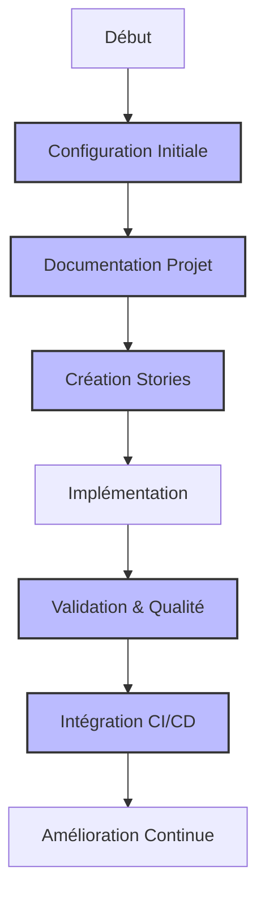

# Guide d'Utilisation des Règles Cursor pour le Workflow Agile

## Introduction

Ce guide complet vous accompagne dans l'utilisation efficace des règles Cursor pour mettre en œuvre un workflow agile structuré et automatisé. Il est organisé en scénarios d'utilisation, du plus fondamental au plus avancé, pour vous permettre d'adopter progressivement les meilleures pratiques.

## Scénarios d'Utilisation

### Première Utilisation

1. [**Première Utilisation des Règles Cursor**](scenario-1-premiere-utilisation.md)  
   _Guide de démarrage pour configurer et utiliser les règles Cursor dans un nouveau projet, de la création de la structure initiale jusqu'à l'implémentation des premières stories._

### Utilisation Quotidienne

2. [**Mise à Jour d'une Story Existante**](scenario-2-mise-a-jour-story.md)  
   _Comment réviser et mettre à jour une story existante en réponse à de nouvelles exigences ou à des modifications techniques._

3. [**Création et Intégration de Diagrammes Mermaid**](scenario-3-diagrammes-mermaid.md)  
   _Techniques pour créer et intégrer des diagrammes Mermaid dans votre documentation de projet pour une meilleure visualisation._

4. [**Validation Automatisée de la Documentation**](scenario-4-validation-documentation.md)  
   _Utilisation du système de validation automatisée pour vérifier et améliorer la qualité de la documentation._

### Personnalisation et Extensions

5. [**Adaptation des Templates Standardisés**](scenario-5-adaptation-templates.md)  
   _Comment personnaliser les templates standardisés pour répondre aux besoins spécifiques de votre équipe ou projet._

6. [**Intégration dans un Pipeline CI/CD**](scenario-6-integration-cicd.md)  
   _Intégration des processus de documentation agile et de validation dans votre pipeline d'intégration continue._

7. [**Création d'une Nouvelle Règle Cursor**](scenario-7-creation-regle-cursor.md)  
   _Guide pour créer une nouvelle règle Cursor personnalisée répondant à des besoins spécifiques._

## Comment Utiliser ce Guide

Pour tirer le meilleur parti de ce guide:

1. **Commencez par le premier scénario** si vous débutez avec les règles Cursor
2. **Consultez les scénarios spécifiques** qui correspondent à votre besoin immédiat
3. **Suivez la progression suggérée** pour une adoption graduelle des pratiques avancées
4. **Utilisez les diagrammes** pour visualiser les processus
5. **Adaptez les instructions** à votre contexte spécifique

## Ressources Complémentaires

- [Documentation officielle de Cursor](https://cursor.sh/docs)
- [Référence du langage Mermaid](https://mermaid.js.org/)
- [Principes Agile](https://agilemanifesto.org/principles.html)

## Maintien et Évolution

Ce guide est destiné à évoluer avec vos besoins et l'évolution des outils. N'hésitez pas à:

- Proposer des améliorations via pull requests
- Signaler des problèmes ou demander des clarifications
- Suggérer de nouveaux scénarios d'utilisation

---

_Dernière mise à jour: Octobre 2023_
