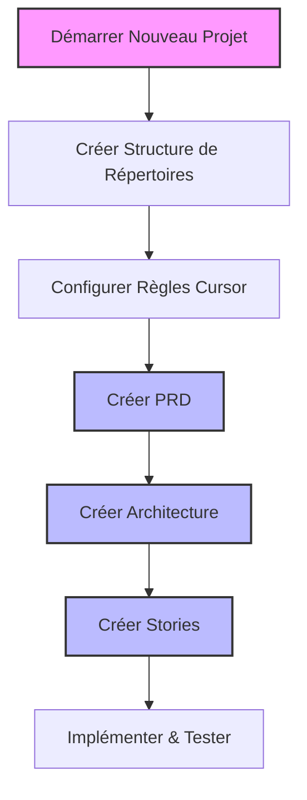
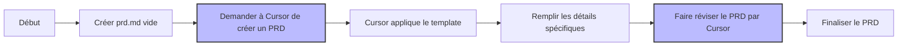
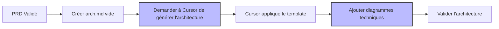
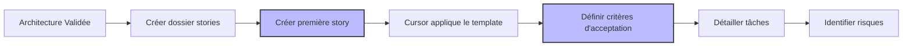

# Scénario 1: Première Utilisation des Règles Cursor

## Objectif

Ce guide vous accompagne dans la configuration initiale d'un nouveau projet utilisant le workflow agile standardisé avec les règles Cursor, depuis la création de la structure de base jusqu'à l'implémentation des premières stories.

## Vue d'ensemble du processus



## 1. Configuration Initiale

### Structure de répertoires

Commencez par créer la structure de base de votre projet:

```bash
# Créer les répertoires principaux
mkdir -p MonProjet
cd MonProjet
mkdir -p .cursor/rules .ai docs src
```

### Installation des règles Cursor

Copiez les règles standardisées dans votre répertoire `.cursor/rules/`:

```bash
# Supposons que vous avez les règles dans un répertoire externe
cp /chemin/vers/templates/*.mdc .cursor/rules/

# Vérifiez que les règles ont été copiées correctement
ls -la .cursor/rules/
```

Vous devriez voir les fichiers suivants:

- `000-cursor-rules-standardized.mdc` - Règles fondamentales
- `400-md-docs-standardized.mdc` - Standards de documentation
- `801-workflow-agile-standardized.mdc` - Workflow agile
- `901-prd-template-standardized.mdc` - Template PRD
- `902-arch-template-standardized.mdc` - Template architecture
- `903-story-template-standardized.mdc` - Template story
- `git-push-command-standardized.mdc` - Standards Git

## 2. Création du PRD (Product Requirements Document)



### Étapes détaillées

1. **Créez un fichier PRD vide**:

   ```bash
   touch .ai/prd.md
   ```

2. **Ouvrez ce fichier** dans votre éditeur et demandez à Cursor de générer un PRD:

   ```
   Je souhaite créer un PRD pour mon nouveau projet [description de votre projet].
   Peux-tu m'aider à créer un PRD complet en suivant le template standardisé?
   ```

3. **Cursor va détecter** que vous travaillez sur un PRD et appliquera le template `901-prd-template-standardized`.

4. **Remplissez chaque section** du template avec les informations spécifiques à votre projet:

   - Vue d'Ensemble
   - Objectifs
   - Cas d'Utilisation
   - Exigences Fonctionnelles
   - Exigences Non-Fonctionnelles
   - Contraintes
   - Risques et Hypothèses

5. **Demandez à Cursor de réviser votre PRD**:
   ```
   Peux-tu réviser mon PRD pour vérifier qu'il est complet, cohérent, et qu'il suit
   les meilleures pratiques? Y a-t-il des sections à améliorer?
   ```

### Exemple de PRD généré

```markdown
# Document des Exigences Produit: Système de Gestion de Projet

<version>1.0.0</version>

> Ce document définit les exigences pour le Système de Gestion de Projet, une application web permettant aux équipes de gérer efficacement leurs projets agiles.

## Vue d'Ensemble

Le Système de Gestion de Projet (SGP) vise à fournir une plateforme centralisée pour la planification, le suivi et l'exécution de projets. Cette solution permettra aux équipes de collaborer efficacement, de suivre la progression et de gérer les ressources.

## Objectifs

1. Simplifier la gestion des tâches et le suivi de la progression
2. Améliorer la collaboration entre les membres de l'équipe
3. Fournir une visibilité claire sur l'avancement des projets
4. Permettre une allocation efficace des ressources
5. Intégrer les méthodologies agiles dans le flux de travail

## Cas d'Utilisation

1. **Création et Gestion de Projets**

   - Les utilisateurs peuvent créer de nouveaux projets
   - Les utilisateurs peuvent définir les paramètres du projet (échéance, budget, etc.)
   - Les administrateurs peuvent assigner des membres à des projets

2. **Gestion des Tâches**

   - Les utilisateurs peuvent créer, modifier et supprimer des tâches
   - Les tâches peuvent être assignées à des membres de l'équipe
   - Les tâches peuvent être organisées en sprints ou itérations

3. **Suivi de Progression**
   - Les utilisateurs peuvent visualiser l'avancement via des tableaux de bord
   - Le système génère des rapports de progression
   - Les utilisateurs reçoivent des notifications sur les changements importants

## Exigences Fonctionnelles

...
```

## 3. Création du Document d'Architecture



### Étapes détaillées

1. **Créez un fichier architecture vide**:

   ```bash
   touch .ai/arch.md
   ```

2. **Demandez à Cursor de générer l'architecture**:

   ```
   J'ai maintenant besoin de créer un document d'architecture pour mon projet
   basé sur le PRD. Peux-tu m'aider à générer un document d'architecture
   complet en suivant le template standardisé?
   ```

3. **Cursor va détecter** que vous travaillez sur un document d'architecture et appliquera le template `902-arch-template-standardized`.

4. **Ajoutez des diagrammes techniques** pour illustrer l'architecture:
   - Diagrammes de composants
   - Diagrammes de déploiement
   - Diagrammes de séquence pour les flux importants

## 4. Création des Stories



### Étapes détaillées

1. **Créez un répertoire pour les stories**:

   ```bash
   mkdir -p .ai/stories
   ```

2. **Créez une première story**:

   ```bash
   touch .ai/stories/story-1.story.md
   ```

3. **Demandez à Cursor de générer une story**:

   ```
   Peux-tu m'aider à créer une première story pour mon projet basée sur
   le PRD et l'architecture? Cette story devrait concerner la fonctionnalité
   [décrivez la fonctionnalité].
   ```

4. **Détaillez les critères d'acceptation** en format Gherkin:

   ```markdown
   ## Critères d'Acceptation

   1. Étant donné un utilisateur connecté, quand il clique sur "Créer projet", alors un formulaire de création s'affiche.
   2. Étant donné le formulaire de création, quand l'utilisateur remplit tous les champs obligatoires et clique sur "Sauvegarder", alors un nouveau projet est créé.
   3. Étant donné un projet nouvellement créé, quand l'utilisateur consulte la liste des projets, alors le nouveau projet apparaît dans la liste.
   ```

5. **Définissez les tâches nécessaires** pour implémenter la story:

   ```markdown
   ## Tâches

   1. [ ] Créer le modèle de données pour les projets
   2. [ ] Développer l'API backend pour la création de projets
   3. [ ] Implémenter le formulaire frontend de création
   4. [ ] Développer la logique de validation des données
   5. [ ] Créer les tests unitaires et d'intégration
   ```

6. **Documentez les risques et hypothèses**:

   ```markdown
   ## Risques

   | Risque                                 | Impact | Probabilité | Stratégie d'atténuation                     |
   | -------------------------------------- | ------ | ----------- | ------------------------------------------- |
   | Performance de la BD avec grand volume | Élevé  | Moyen       | Implémenter pagination et indexation        |
   | Problèmes de validation côté client    | Moyen  | Faible      | Tests exhaustifs de l'interface utilisateur |
   ```

## 5. Implémentation et Tests

Maintenant que votre documentation est prête, vous pouvez commencer l'implémentation en suivant les stories créées.

## Récapitulatif

Ce processus garantit que votre projet démarre avec:

- Une structure claire et standardisée
- Une documentation complète (PRD, Architecture, Stories)
- Un workflow agile bien défini
- Des exigences claires et traçables

En suivant ce workflow et en utilisant les règles Cursor, vous obtiendrez une base solide pour le développement de votre projet avec une documentation cohérente et complète.
