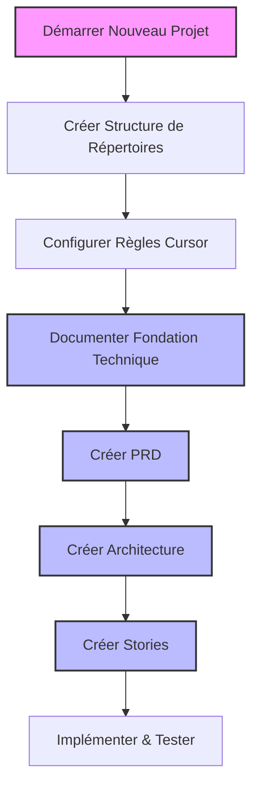
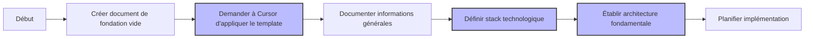
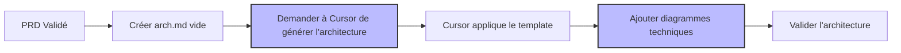
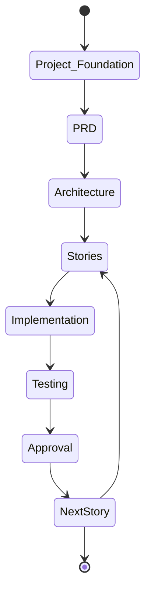

# Scénario 1: Première Utilisation des Règles Cursor

## Objectif

Ce guide vous accompagne dans la configuration initiale d'un nouveau projet utilisant le workflow agile standardisé avec les règles Cursor, depuis la création de la structure de base jusqu'à l'implémentation des premières stories.

## Vue d'ensemble du processus



## 1. Configuration Initiale

### Structure de répertoires

Commencez par créer la structure de base de votre projet:

```bash
# Créer les répertoires principaux
mkdir -p MonProjet
cd MonProjet
mkdir -p .cursor/rules .ai docs src
```

### Installation des règles Cursor

Copiez les règles standardisées dans votre répertoire `.cursor/rules/`:

```bash
# Supposons que vous avez les règles dans un répertoire externe
cp /chemin/vers/templates/*.mdc .cursor/rules/

# Vérifiez que les règles ont été copiées correctement
ls -la .cursor/rules/
```

Vous devriez voir les fichiers suivants:

- `000-cursor-rules-standardized.mdc` - Règles fondamentales
- `400-md-docs-standardized.mdc` - Standards de documentation
- `800-project-foundation-template-standardized.mdc` - Template de fondation de projet
- `801-workflow-agile-standardized.mdc` - Workflow agile
- `901-prd-template-standardized.mdc` - Template PRD
- `902-arch-template-standardized.mdc` - Template architecture
- `903-story-template-standardized.mdc` - Template story
- `git-push-command-standardized.mdc` - Standards Git

## 2. Documentation des Fondations Techniques du Projet

Avant de créer le PRD, établissez les fondations techniques de votre projet pour formaliser vos choix d'architecture et de technologies.



### Étapes détaillées

1. **Créez un document de fondation de projet**:

   Plus de détails dans le scénario [2: Fondation de Projet](scenario-2-fondation-projet.md)

   ```bash
   touch docs/project-foundation.md
   ```

2. **Ouvrez ce fichier** dans votre éditeur et demandez à Cursor d'initialiser le template:

   ```
   Je souhaite documenter les fondations techniques de mon projet [nom de votre projet].
   Peux-tu initialiser le document en utilisant le template standardisé de fondation de projet?
   ```

3. **Cursor va détecter** que vous travaillez sur un document de fondation et appliquera le template `800-project-foundation-template-standardized`.

4. **Complétez les sections clés** du template:

   - Informations Générales du Projet
   - Vision Technique & Objectifs
   - Stack Technologique (avec versions et justifications)
   - Architecture Fondamentale
   - Principes de Développement
   - Plan d'Implémentation
   - Risques et Mitigations

5. **Demandez à Cursor de réviser votre document**:
   ```
   Peux-tu réviser mon document de fondation technique pour vérifier qu'il est complet,
   cohérent, et qu'il couvre tous les aspects techniques importants? Y a-t-il des améliorations
   à apporter avant de l'utiliser comme base pour le PRD et l'architecture?
   ```

### Exemple de documentation de la stack technologique

```markdown
### Stack Technologique

#### Frontend

- **Framework**: React 18.2.0
- **Langage**: TypeScript 5.0.4
- **Bibliothèques Principales**:
  - Redux Toolkit (2.0.1) pour la gestion d'état
  - React Query (5.0.0) pour la gestion des requêtes API
  - Styled Components (6.0.7) pour le styling
  - Jest et React Testing Library pour les tests
- **Outils de Build**:
  - Vite 5.0.0 comme bundler
  - ESLint avec config Airbnb pour le linting
  - Prettier pour le formatage de code

**Justification**:

- React a été choisi pour sa flexibilité, son écosystème riche et la facilité de recrutement
- TypeScript assure la qualité du code et réduit les erreurs à l'exécution
- Redux Toolkit simplifie la gestion d'état complexe nécessaire pour notre application
- Vite offre des performances de développement supérieures par rapport à CRA
```

## 3. Création du PRD (Product Requirements Document)

Une fois les fondations techniques définies, créez le PRD en vous assurant qu'il s'aligne avec les choix techniques documentés.


### Étapes détaillées

1. **Créez un fichier PRD vide**:

   ```bash
   touch .ai/prd.md
   ```

2. **Ouvrez ce fichier** dans votre éditeur et demandez à Cursor de générer un PRD:

   ```
   Sur la base du document de fondation technique, je souhaite créer un PRD pour mon projet [description].
   Peux-tu m'aider à créer un PRD complet en suivant le template standardisé et en assurant
   la cohérence avec les choix techniques déjà documentés?
   ```

3. **Cursor va détecter** que vous travaillez sur un PRD et appliquera le template `901-prd-template-standardized`.

4. **Remplissez chaque section** du template avec les informations spécifiques à votre projet:

   - Vue d'Ensemble
   - Objectifs
   - Cas d'Utilisation
   - Exigences Fonctionnelles
   - Exigences Non-Fonctionnelles
   - Contraintes
   - Risques et Hypothèses

5. **Demandez à Cursor de réviser votre PRD**:
   ```
   Peux-tu réviser mon PRD pour vérifier qu'il est complet, cohérent, et qu'il suit
   les meilleures pratiques? Y a-t-il des sections à améliorer?
   ```

### Exemple de PRD généré

```markdown
# Document des Exigences Produit: Système de Gestion de Projet

<version>1.0.0</version>

> Ce document définit les exigences pour le Système de Gestion de Projet, une application web permettant aux équipes de gérer efficacement leurs projets agiles.

## Vue d'Ensemble

Le Système de Gestion de Projet (SGP) vise à fournir une plateforme centralisée pour la planification, le suivi et l'exécution de projets. Cette solution permettra aux équipes de collaborer efficacement, de suivre la progression et de gérer les ressources.

## Objectifs

1. Simplifier la gestion des tâches et le suivi de la progression
2. Améliorer la collaboration entre les membres de l'équipe
3. Fournir une visibilité claire sur l'avancement des projets
4. Permettre une allocation efficace des ressources
5. Intégrer les méthodologies agiles dans le flux de travail

## Cas d'Utilisation

1. **Création et Gestion de Projets**

   - Les utilisateurs peuvent créer de nouveaux projets
   - Les utilisateurs peuvent définir les paramètres du projet (échéance, budget, etc.)
   - Les administrateurs peuvent assigner des membres à des projets

2. **Gestion des Tâches**

   - Les utilisateurs peuvent créer, modifier et supprimer des tâches
   - Les tâches peuvent être assignées à des membres de l'équipe
   - Les tâches peuvent être organisées en sprints ou itérations

3. **Suivi de Progression**
   - Les utilisateurs peuvent visualiser l'avancement via des tableaux de bord
   - Le système génère des rapports de progression
   - Les utilisateurs reçoivent des notifications sur les changements importants

## Exigences Fonctionnelles

...
```

## 4. Création du Document d'Architecture



### Étapes détaillées

1. **Créez un fichier architecture vide**:

   ```bash
   touch .ai/arch.md
   ```

2. **Demandez à Cursor de générer l'architecture**:

   ```
   Sur la base du document de fondation technique et du PRD, j'ai maintenant besoin de créer
   un document d'architecture détaillé pour mon projet. Peux-tu m'aider à générer un document
   d'architecture complet en suivant le template standardisé et en élaborant sur les principes
   architecturaux déjà définis?
   ```

3. **Cursor va détecter** que vous travaillez sur un document d'architecture et appliquera le template `902-arch-template-standardized`.

4. **Ajoutez des diagrammes techniques** pour illustrer l'architecture:
   - Diagrammes de composants
   - Diagrammes de déploiement
   - Diagrammes de séquence pour les flux importants

## 5. Création des Stories

Une fois l'architecture approuvée, il est temps de créer votre première story pour commencer l'implémentation:


### Étapes détaillées

1. **Créez le dossier pour votre première epic et le fichier de votre première story**:

   ```bash
   mkdir -p .ai/epic-1
   touch .ai/epic-1/1-authentification-utilisateur.story.md
   ```

2. **Ouvrez le fichier** dans votre éditeur et demandez à Cursor d'initialiser le template:

   ```
   Je souhaite créer ma première story pour l'authentification des utilisateurs.
   Peux-tu initialiser le fichier avec le template standardisé?
   ```

3. **Cursor va détecter** que vous travaillez sur un fichier story et appliquera le template `903-story-template-standardized`.

4. **Complétez les sections clés**:

   - **Méta-information**: Identifiez l'Epic et le numéro de Story
   - **Description**: Formulez clairement le "En tant que/Je veux/afin de"
   - **Critères d'acceptation**: Définissez des critères testables (3-5 minimum)
   - **Tâches**: Décomposez en sous-tâches techniques précises

5. **Exemple de contenu**:

   ```markdown
   # Authentification Utilisateur

   Epic-1: Système d'Authentification
   Story-1: Connexion Utilisateur

   ## Description de la Story

   **En tant que** utilisateur du système
   **Je veux** pouvoir me connecter avec mon email et mot de passe
   **afin de** accéder à mes données personnelles et fonctionnalités réservées

   ## Statut

   Draft

   ## Contexte

   Cette story fait partie de l'Epic "Système d'Authentification" qui englobe toutes les fonctionnalités liées à la gestion des comptes utilisateurs. L'architecture de l'API et de la base de données est déjà définie dans le document d'architecture.

   ## Estimation

   Story Points: 3

   ## Critères d'Acceptation

   1. Étant donné un utilisateur enregistré, quand il saisit des identifiants valides, alors il est connecté et redirigé vers la page d'accueil
   2. Étant donné un utilisateur, quand il saisit un email non enregistré, alors un message d'erreur approprié s'affiche
   3. Étant donné un utilisateur, quand il saisit un mot de passe incorrect, alors un message d'erreur approprié s'affiche
   4. Étant donné un utilisateur, quand il clique sur "Mot de passe oublié", alors il est redirigé vers le processus de récupération

   ## Tâches

   1. - [ ] Créer le formulaire de connexion
      1. - [ ] Implémenter le design UI selon les maquettes
      2. - [ ] Ajouter validation des champs (email format, password min length)
      3. - [ ] Écrire tests UI
   2. - [ ] Implémenter l'API d'authentification
      1. - [ ] Développer endpoint POST /api/auth/login
      2. - [ ] Implémenter la validation des identifiants
      3. - [ ] Générer et retourner un JWT
      4. - [ ] Écrire tests unitaires et d'intégration
   3. - [ ] Intégrer le frontend et l'API
      1. - [ ] Connecter le formulaire à l'API
      2. - [ ] Implémenter la gestion des erreurs
      3. - [ ] Stocker le token JWT dans le navigateur
      4. - [ ] Écrire tests end-to-end

   ## Notes de Développement

   - Utiliser la bibliothèque JWT pour la génération des tokens
   - Stocker les tokens en localStorage avec expiration de 24h
   - Implémenter un mécanisme de refresh token dans une story future
   ```

6. **Demandez l'approbation** de votre story avant de commencer l'implémentation:

   ```
   Cette story est-elle correctement définie? Manque-t-il des éléments importants?
   ```

## 6. Implémentation et Tests

Maintenant que votre documentation est prête, vous pouvez commencer l'implémentation en suivant les stories créées.

## 7. Workflow Complet avec Itérations

Le processus de développement agile implique des itérations continues. Les documents comme le PRD et l'architecture évoluent au fil du temps en fonction des retours d'expérience et des nouvelles exigences. Voici une représentation détaillée du workflow itératif:

```mermaid
graph TD
    %% États initiaux
    Start([Démarrage Projet]) --> Config[Configuration Initiale]
    Config --> Foundation[Fondation Technique v1.0]

    %% Premier cycle - Documentation initiale
    Foundation --> PRD1[PRD v1.0]
    Foundation --> Risk1[Évaluation Risques Initiale]
    PRD1 --> Arch1[Architecture v1.0]

    %% Planification
    Arch1 --> Epic1[Création Epic-1]
    Epic1 --> Story1[Création Stories]
    Story1 --> Refinement1[Refinement Backlog]

    %% Premier Sprint
    Refinement1 --> Sprint1[Sprint 1]
    Sprint1 --> Dev1[Développement]
    Dev1 --> Test1[Tests & QA]

    %% Validations et feedback
    Test1 --> Hypotheses1[Validation Hypothèses]
    Test1 --> Review1[Revue Sprint]
    Review1 --> Demo1[Démo Stakeholders]

    %% Feedback et itération
    Demo1 --> Feedback1{Feedback & Apprentissages}
    Feedback1 -->|Changements mineurs| Retro1[Rétrospective]
    Feedback1 -->|Changements majeurs| PRD2[PRD v1.1]

    %% Mise à jour de la documentation
    PRD2 --> Risk2[Réévaluation Risques]
    PRD2 --> Arch2[Architecture v1.1]

    %% Production et dette technique
    Retro1 --> TechDebt{Dette Technique?}
    TechDebt -->|Mineure| Story2[Nouvelles Stories]
    TechDebt -->|Significative| Refactor[Sprint Refactoring]
    Refactor --> Story2

    %% Second cycle
    Story2 --> Refinement2[Refinement Backlog]
    Refinement2 --> Sprint2[Sprint 2]
    Sprint2 --> Dev2[Développement]
    Dev2 --> Test2[Tests & QA]
    Test2 --> Review2[Revue Sprint]
    Review2 --> Demo2[Démo Stakeholders]

    %% Premier déploiement en production
    Demo2 --> Release1{Prêt pour Production?}
    Release1 -->|Non| Feedback2
    Release1 -->|Oui| Prod1[Déploiement Production v1.0]
    Prod1 --> UserFeedback1[Feedback Utilisateurs]

    %% Nouvelle itération majeure
    UserFeedback1 --> Feedback2{Nouvelles Exigences?}
    Feedback2 -->|Évolution majeure| PRD3[PRD v2.0]
    Feedback2 -->|Évolution mineure| Retro2[Rétrospective]
    Retro2 -->|Amélioration Process| Epic2[Création Epic-2]

    %% Troisième cycle avec nouvelle architecture
    PRD3 --> Arch3[Architecture v2.0]
    PRD3 --> Risk3[Évaluation Risques v2.0]
    Arch3 --> Epic2
    Epic2 --> Story3[Création Stories Epic-2]
    Story3 --> Sprint3[Sprint 3]

    %% Continuation du cycle
    Sprint3 -.-> Continuum([Cycles Itératifs])

    %% Légende avec styles
    classDef foundation fill:#f9f,stroke:#333,stroke-width:2px;
    classDef document fill:#bbf,stroke:#333,stroke-width:2px;
    classDef implementation fill:#bfb,stroke:#333,stroke-width:2px;
    classDef feedback fill:#fbf,stroke:#333,stroke-width:2px;
    classDef risk fill:#fbb,stroke:#333,stroke-width:2px;
    classDef process fill:#ddf,stroke:#333,stroke-width:2px;
    classDef production fill:#ffd,stroke:#333,stroke-width:2px;

    class Foundation,PRD1,PRD2,PRD3 document;
    class Arch1,Arch2,Arch3 document;
    class Epic1,Epic2,Story1,Story2,Story3 document;
    class Dev1,Dev2,Test1,Test2,Sprint1,Sprint2,Sprint3 implementation;
    class Feedback1,Feedback2,UserFeedback1,Demo1,Demo2 feedback;
    class Risk1,Risk2,Risk3,TechDebt risk;
    class Refinement1,Refinement2,Retro1,Retro2 process;
    class Prod1,Release1 production;
```



### Points clés du workflow itératif enrichi

1. **Évolution documentaire**:

   - Le PRD évolue (v1.0 → v1.1 → v2.0) à mesure que les besoins se clarifient
   - L'Architecture s'adapte aux changements du PRD
   - Les évaluations de risques sont mises à jour à chaque version majeure

2. **Validation et apprentissage**:

   - **Validation d'hypothèses**: Tests explicites des hypothèses métier et techniques
   - **Démos stakeholders**: Obtention de feedback direct des parties prenantes
   - **Rétrospectives**: Moments dédiés à l'amélioration du processus lui-même

3. **Refinement continu**:

   - Sessions de refinement backlog avant chaque sprint
   - Priorisation régulière basée sur la valeur métier, les risques et la dette technique
   - Ajustement des estimations et découpage des stories

4. **Gestion proactive des risques**:

   - Identification dès le début du projet
   - Réévaluation systématique après chaque cycle majeur
   - Influence directe sur les priorités de développement

5. **Cycle de production**:

   - Décision explicite de déploiement en production
   - Collecte structurée du feedback utilisateur post-déploiement
   - Intégration du feedback réel dans les priorités suivantes

6. **Dette technique**:

   - Évaluation après chaque cycle
   - Possibilité de sprints dédiés au refactoring lorsque nécessaire
   - Équilibre entre nouvelles fonctionnalités et qualité technique

7. **Amélioration continue**:
   - Rétrospectives régulières pour améliorer le processus
   - Les apprentissages d'un cycle influencent directement le suivant
   - Adaptation des pratiques et des outils au fil du temps

Ce workflow itératif enrichi permet non seulement d'adapter votre projet aux changements fonctionnels, mais aussi d'améliorer continuellement la qualité, de gérer les risques proactivement, d'intégrer les parties prenantes, et d'optimiser le processus lui-même au fil du temps.

## Récapitulatif

Ce processus garantit que votre projet démarre avec:

- Une structure claire et standardisée
- Des fondations techniques solides et documentées
- Une documentation complète (Fondation, PRD, Architecture, Stories)
- Un workflow agile bien défini
- Des exigences claires et traçables

En suivant ce workflow et en utilisant les règles Cursor, vous obtiendrez une base solide pour le développement de votre projet avec une documentation cohérente et complète.

## 10. Résumé du Workflow

Voici un résumé complet du workflow à suivre pour chaque nouveau projet:



### Récapitulatif

1. **Configuration Initiale**

   - Création de la structure de répertoires
   - Installation des règles Cursor

2. **Documentation des Fondations Techniques**

   - `docs/project-foundation.md`

3. **Product Requirements Document (PRD)**

   - `.ai/prd.md`

4. **Document d'Architecture**

   - `.ai/arch.md`

5. **Stories**

   - `.ai/epic-{n}/{m}-{code}.story.md`
   - Exemple: `.ai/epic-1/1-authentification-utilisateur.story.md`

6. **Cycle de Développement TDD**

   - Créer les tests
   - Implémenter la fonctionnalité
   - Mettre à jour l'état de la story

7. **Validation et Intégration**
   - Vérification de la qualité
   - Revue de code
   - Création de la story suivante

### Commandes Utiles

```bash
# Initialiser un nouveau projet
mkdir -p MonProjet/.cursor/rules MonProjet/.ai MonProjet/docs MonProjet/src
cd MonProjet

# Copier les règles standardisées
cp /chemin/vers/templates/*.mdc .cursor/rules/

# Créer les documents essentiels
touch docs/project-foundation.md
touch .ai/prd.md
touch .ai/arch.md
mkdir -p .ai/epic-1
touch .ai/epic-1/1-authentification-utilisateur.story.md
```

---

Ce guide vous a présenté les bases du workflow agile standardisé avec les règles Cursor. Pour des informations plus détaillées sur chaque étape, consultez les scénarios spécifiques dans ce guide.

Pour aller plus loin:

- [Documentation des Fondations Techniques](scenario-2-fondation-projet.md)
- [Mise à Jour d'une Story Existante](scenario-2-mise-a-jour-story.md)
- [Création et Intégration de Diagrammes Mermaid](scenario-3-diagrammes-mermaid.md)
