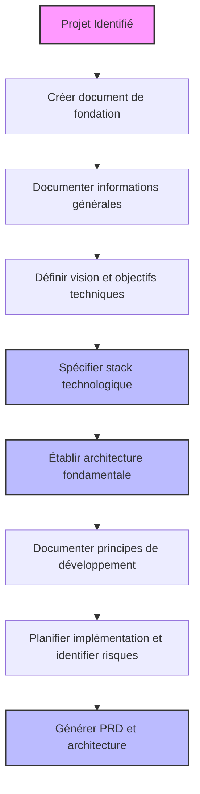
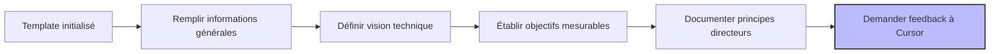
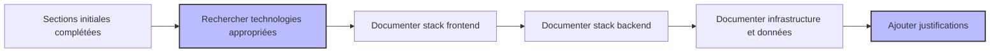
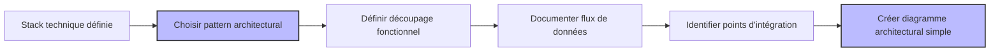
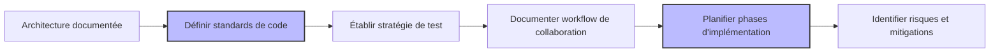
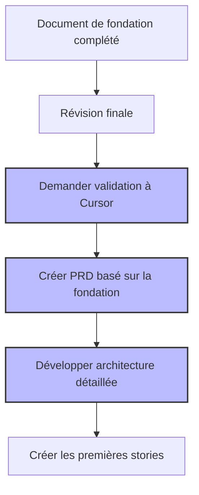

# Scénario 2: Documentation des Fondations Techniques du Projet

## Objectif

Ce guide vous accompagne dans l'utilisation du template de fondation de projet pour définir et documenter les fondements techniques d'un nouveau projet ou pour structurer la documentation d'un projet existant.

## Vue d'ensemble du processus



## 1. Préparation du Document de Fondation

### Création du document

Commencez par créer le fichier de documentation pour les fondations de votre projet:

```bash
# Créer le répertoire docs s'il n'existe pas
mkdir -p docs

# Créer le document de fondation du projet
touch docs/project-foundation.md
```

### Installation de la règle de fondation (si ce n'est pas déjà fait)

Assurez-vous que la règle `800-project-foundation-template-standardized.mdc` est installée dans votre répertoire `.cursor/rules/`:

```bash
# Vérifier que la règle est présente
ls -la .cursor/rules/800-project-foundation-template-standardized.mdc

# Si la règle n'est pas présente, copiez-la depuis votre source de règles
# cp /chemin/vers/templates/800-project-foundation-template-standardized.mdc .cursor/rules/
```

## 2. Initialisation du Document de Fondation


### Étapes détaillées

1. **Ouvrez le document de fondation** de projet que vous venez de créer dans Cursor.

2. **Demandez à Cursor d'initialiser le template**:

   ```
   Je souhaite documenter les fondations techniques de mon projet [nom de votre projet].
   Peux-tu initialiser le document en utilisant le template standardisé de fondation de projet?
   ```

3. **Cursor va détecter** que vous travaillez sur un document de fondation de projet et appliquera le template `800-project-foundation-template-standardized`.

4. **Révisez la structure** générée pour vous assurer qu'elle contient toutes les sections nécessaires:
   - Informations Générales du Projet
   - Vision Technique & Objectifs
   - Stack Technologique
   - Architecture Fondamentale
   - Principes de Développement
   - Plan d'Implémentation
   - Risques et Mitigations

## 3. Documentation des Informations Générales et de la Vision



### Étapes détaillées

1. **Complétez la section Informations Générales** avec les détails de votre projet:

   ```markdown
   ### 1️⃣ Informations Générales du Projet

   - **Nom du Projet**: Système de Gestion de Contenu Avancé
   - **Description Technique**: Système de gestion de contenu multiplateforme offrant des fonctionnalités d'édition collaborative, de workflows d'approbation et d'analyse de contenu
   - **Catégorie**: Web/SaaS
   - **Échelle Prévue**:
     - 500-1000 utilisateurs actifs par jour
     - 10,000+ articles de contenu
     - 5-10 TB de médias stockés
   - **Contraintes Principales**:
     - Performances élevées requises même à l'international
     - Conformité RGPD obligatoire
     - Multi-tenant avec isolation stricte des données
   ```

2. **Définissez la vision technique** et les objectifs pour votre projet:

   ```markdown
   ### 2️⃣ Vision Technique & Objectifs

   - **Vision Technique**: Construire un système de gestion de contenu évolutif et modulaire qui s'adapte aux différents besoins des départements tout en maintenant une base de code unifiée et optimisée pour les performances.

   - **Objectifs Techniques**:

     - Atteindre un temps de chargement initial < 2 secondes pour 95% des utilisateurs
     - Assurer une disponibilité de 99.9% sur une base mensuelle
     - Permettre le déploiement de nouvelles fonctionnalités en < 1 jour
     - Réduire le coût d'infrastructure cloud de 30% par rapport à la solution actuelle

   - **Principes Directeurs**:
     - API-first : toutes les fonctionnalités doivent être accessibles via API
     - Sécurité dès la conception : aucun compromis sur la sécurité des données
     - Observabilité complète : chaque composant doit être entièrement monitoré
     - Automatisation maximale : minimiser les interventions humaines pour la maintenance
   ```

3. **Demandez à Cursor de réviser ces sections**:
   ```
   Peux-tu réviser les sections Informations Générales et Vision Technique de mon document de fondation?
   Sont-elles suffisamment détaillées et précises? Y a-t-il des éléments manquants ou à améliorer?
   ```

## 4. Définition de la Stack Technologique



### Étapes détaillées

1. **Documentez chaque aspect de votre stack technologique** en suivant le format présenté dans le template, en vous assurant d'inclure les versions et les justifications:

   ```markdown
   ### 3️⃣ Stack Technologique

   #### Frontend

   - **Framework**: Next.js 14.0.1
   - **Langage**: TypeScript 5.3.2
   - **Bibliothèques Principales**:
     - Redux Toolkit (2.0.1) pour la gestion d'état
     - React Query (5.0.0) pour la gestion des requêtes API
     - TailwindCSS (3.4.0) pour le styling
     - Jest et React Testing Library pour les tests
   - **Outils de Build**:
     - Turborepo pour la gestion monorepo
     - ESLint avec config personnalisée pour le linting
     - Prettier pour le formatage de code

   **Justification**:

   - Next.js offre le rendu côté serveur, les routes API et une excellente optimisation des performances
   - TypeScript garantit la sécurité des types et améliore la maintenabilité du code
   - TailwindCSS facilite le design cohérent et responsive avec une taille de bundle minimale
   - Turborepo optimise les temps de build dans notre structure monorepo

   #### Backend

   - **Framework**: NestJS 10.2.1
   - **Langage**: TypeScript 5.3.2
   - **API Style**: REST avec OpenAPI
   - **Bibliothèques Principales**:
     - TypeORM 0.3.17 pour l'accès aux données
     - Passport.js pour l'authentification
     - Winston pour le logging
     - Jest pour les tests

   **Justification**:

   - NestJS favorise une architecture modulaire et facilite l'injection de dépendances
   - L'architecture inspirée d'Angular facilite l'onboarding des développeurs Angular
   - TypeORM offre une excellente compatibilité cross-database avec un modèle orienté objet

   #### Données

   - **Base(s) de Données**:
     - PostgreSQL 16.1 (données primaires)
     - Redis 7.2 (caching et files)
     - Elasticsearch 8.11 (recherche)
   - **ORM/DAL**: TypeORM avec repository pattern
   - **Stratégie de Migration**: Migrations versionnées automatisées via CI/CD
   - **Stratégie de Caching**:
     - Cache distribué Redis pour les données partagées
     - Cache local en mémoire pour les données fréquemment accédées et rarement modifiées

   #### Infrastructure

   - **Environnement d'Hébergement**: AWS Cloud
   - **Services Cloud**:
     - AWS ECS sur Fargate (conteneurs sans serveur)
     - RDS PostgreSQL (base de données)
     - ElastiCache (Redis)
     - CloudFront (CDN)
     - S3 (stockage d'objets)
   - **Conteneurisation**: Docker avec images multi-stage
   - **CI/CD**: GitHub Actions avec déploiement automatisé par environnement

   #### Monitoring & Observabilité

   - **Logging**: ELK Stack (Elasticsearch, Logstash, Kibana)
   - **Monitoring**: Prometheus avec Grafana
   - **Analytics**: Mixpanel pour l'analyse comportementale
   ```

2. **Demandez à Cursor de suggérer des améliorations** pour votre stack:
   ```
   Peux-tu analyser ma stack technologique et suggérer des améliorations ou des alternatives
   qui pourraient mieux répondre aux contraintes de notre projet? Y a-t-il des incohérences
   ou des composants qui pourraient poser problème?
   ```

## 5. Documentation de l'Architecture Fondamentale



### Étapes détaillées

1. **Documentez l'architecture fondamentale** de votre application:

   ````markdown
   ### 4️⃣ Architecture Fondamentale

   #### Pattern Architectural

   Monorepo avec architecture en microservices modulaires, organisé selon les principes de Clean Architecture.

   **Justification**: Cette approche nous permet de maintenir une base de code unifiée tout en permettant
   un développement et un déploiement indépendants des différents services. La Clean Architecture
   facilitera la testabilité et la séparation des préoccupations.

   #### Découpage Fonctionnel

   ```mermaid
   graph TD
     A[Frontend] --> B[API Gateway]
     B --> C[Service Authentification]
     B --> D[Service Gestion de Contenu]
     B --> E[Service Workflow]
     B --> F[Service Analytics]
     D --> G[(Base de Données Contenu)]
     E --> G
     F --> H[(Base de Données Analytics)]
     C --> I[(Base de Données Utilisateurs)]
   ```
   ````

   - **Service Authentification**: Gestion des utilisateurs, rôles, permissions et SSO
   - **Service Gestion de Contenu**: CRUD contenu, versionnement, médias, taxonomie
   - **Service Workflow**: Processus d'approbation, notifications, assignations
   - **Service Analytics**: Suivi d'audience, performance des contenus, rapports

   #### Flux de Données Principaux

   1. **Création et Publication de Contenu**:

      - Auteur crée contenu → Service Contenu sauvegarde brouillon
      - Auteur soumet pour revue → Service Workflow notifie réviseurs
      - Réviseur approuve → Service Contenu publie → Service Analytics enregistre l'événement

   2. **Authentification et Autorisation**:
      - Utilisateur se connecte → Service Auth valide → Token JWT généré
      - Requête API avec token → API Gateway valide token → Service vérifie permissions

   #### Points d'Intégration Externes

   - **API CRM** (Salesforce): Synchronisation bidirectionnelle des données clients
   - **API Marketing** (Marketo): Distribution automatique de contenu dans les campagnes
   - **CDN** (CloudFront): Distribution de contenu statique et mise en cache
   - **Services de traduction** (API DeepL): Traduction automatisée de contenus

   ```

   ```

2. **Demandez à Cursor de valider l'architecture**:
   ```
   Peux-tu examiner mon architecture fondamentale? Est-elle cohérente avec la stack technologique
   choisie? Y a-t-il des risques architecturaux que je n'ai pas identifiés ou des suggestions pour l'améliorer?
   ```

## 6. Documentation des Principes de Développement et du Plan d'Implémentation



### Étapes détaillées

1. **Documentez les principes de développement**:

   ```markdown
   ### 5️⃣ Principes de Développement

   #### Standards de Code

   - **Principes**: Adhérence stricte aux principes SOLID, DRY et KISS
   - **Convention de Nommage**: camelCase pour variables/fonctions, PascalCase pour classes/interfaces
   - **Formatage**: Prettier avec configuration partagée
   - **Qualité**: Maintenir un score SonarQube > 85% sur tous les critères
   - **Documentation**: JSDoc obligatoire pour les interfaces publiques et classes principales

   #### Stratégie de Test

   - **Tests Unitaires**: Couverture > 80% pour la logique métier
   - **Tests d'Intégration**: Validation des flux principaux et cas limites
   - **Tests E2E**: Cypress pour les parcours utilisateurs critiques
   - **Tests de Performance**: k6 pour les benchmarks de performance
   - **TDD** encouragé pour le développement des composants critiques

   #### Modèle de Collaboration

   - **Branching**: GitHub Flow (branches de fonctionnalités + main)
   - **PR**: Au moins 2 approbations requises avant merge
   - **CI**: Tests automatisés sur chaque PR
   - **CD**: Déploiement automatique en environnement de dev, manuel en production

   #### Documentation

   - **API**: Documentation OpenAPI générée et mise à jour automatiquement
   - **Architecture**: Diagrammes C4 mis à jour à chaque changement majeur
   - **Décisions**: Architecture Decision Records (ADR) pour toute décision significative
   ```

2. **Documentez le plan d'implémentation et les risques**:

   ```markdown
   ### 6️⃣ Plan d'Implémentation

   #### Phases Techniques

   1. **Phase 1 (Sprint 1-3)**: Infrastructure et socle technique

      - Mise en place environnements CI/CD
      - Configuration base de données et services cloud
      - Développement du service d'authentification

   2. **Phase 2 (Sprint 4-7)**: Core Services

      - Développement du service de gestion de contenu
      - Implémentation du service de workflow
      - Frontend basique pour ces fonctionnalités

   3. **Phase 3 (Sprint 8-10)**: Analytics et Intégrations

      - Service d'analytics
      - Intégrations externes (CRM, Marketing)
      - Optimisations de performance

   4. **Phase 4 (Sprint 11-13)**: Finalisation et Polissage
      - Tests de charge et optimisations
      - Documentation complète
      - Formation des utilisateurs clés

   #### Priorités Techniques

   1. Sécurité et authentification (fondation critique)
   2. API Core de gestion de contenu (fonctionnalité centrale)
   3. Interface utilisateur éditeur de contenu (expérience utilisateur clé)
   4. Workflows d'approbation (processus métier critique)

   #### Proof of Concepts

   - POC 1: Évaluation des performances Elasticsearch vs Algolia pour la recherche
   - POC 2: Test d'éditeur de contenu headless avec différentes options (ProseMirror vs Slate)
   - POC 3: Benchmark de performance pour l'architecture microservices vs monolithique

   ### 7️⃣ Risques et Mitigations

   | Risque                                         | Impact | Probabilité | Mitigation                                                                                          |
   | ---------------------------------------------- | ------ | ----------- | --------------------------------------------------------------------------------------------------- |
   | Performance insuffisante avec microservices    | Élevé  | Moyen       | Implementer caching agressif, monitoring précis, option de basculer vers approche plus monolithique |
   | Complexité d'intégration des services externes | Moyen  | Élevé       | Développer adaptateurs isolés, tests d'intégration automatisés, plan de rollback                    |
   | Dépassement de budget cloud                    | Moyen  | Moyen       | Monitoring des coûts, alertes sur seuils, utilisation d'instances réservées                         |
   | Adhérence inégale aux standards de code        | Moyen  | Élevé       | Linting automatique, revues de code strictes, workshops d'équipe réguliers                          |
   | Difficultés d'onboarding des développeurs      | Faible | Moyen       | Documentation détaillée, environnement de développement standardisé, période de shadowing           |

   #### Alternatives Envisagées

   - **Monolithe modulaire** vs Microservices : Écarté car limitait la scalabilité indépendante
   - **Firebase** vs Solution personnalisée : Écarté car limitations de flexibilité et coûts à l'échelle
   - **Vue.js** vs Next.js : Écarté car SSR et SEO moins matures
   ```

3. **Demandez à Cursor d'évaluer votre plan**:
   ```
   Peux-tu évaluer mon plan d'implémentation et mon analyse des risques?
   Les phases sont-elles logiques et bien séquencées? Ai-je oublié des risques importants
   ou des stratégies de mitigation cruciales?
   ```

## 7. Finalisation et Génération des Documents Associés



### Étapes détaillées

1. **Effectuez une révision finale** du document de fondation:

   - Vérifiez que toutes les sections sont complétées
   - Assurez-vous que les justifications sont présentes pour les choix importants
   - Confirmez que les versions sont spécifiées pour tous les composants techniques

2. **Demandez à Cursor de valider l'ensemble du document**:

   ```
   Peux-tu faire une révision complète de mon document de fondation de projet?
   Y a-t-il des sections qui manquent de détails ou qui pourraient être améliorées?
   Le document est-il prêt à servir de base pour le PRD et le document d'architecture?
   ```

3. **Créez le PRD basé sur la fondation technique**:

   ```bash
   # Créer le fichier PRD
   touch .ai/prd.md
   ```

   Puis, dans Cursor:

   ```
   Maintenant que notre document de fondation technique est complet, pourrais-tu m'aider
   à créer un PRD (Product Requirements Document) pour ce projet en suivant le template
   standardisé? Assure-toi que le PRD s'aligne avec les choix techniques que nous avons
   documentés.
   ```

4. **Développez l'architecture détaillée**:

   ```bash
   # Créer le fichier d'architecture
   touch .ai/arch.md
   ```

   Puis, dans Cursor:

   ```
   Sur la base de notre document de fondation de projet, pourrais-tu m'aider à développer
   un document d'architecture détaillé en suivant le template standardisé? Je souhaite
   approfondir chaque aspect architecturel avec des diagrammes et des détails d'implémentation.
   ```

## Récapitulatif

Ce processus vous a permis de:

1. **Créer un document complet** de fondation technique pour votre projet
2. **Documenter systématiquement** tous les aspects techniques essentiels:

   - Vision et objectifs techniques
   - Stack technologique avec justifications
   - Architecture fondamentale avec diagrammes
   - Principes de développement
   - Plan d'implémentation et analyse des risques

3. **Préparer le terrain** pour les documents associés:
   - PRD aligné avec les choix techniques
   - Document d'architecture détaillé
   - Stories techniques pour l'implémentation

### Bénéfices à Long Terme

- **Cohérence**: Tous les documents et choix techniques s'alignent sur une fondation commune
- **Clarté**: Les décisions techniques sont documentées avec leurs justifications
- **Communication**: Facilite la compréhension du projet par toutes les parties prenantes
- **Évolutivité**: Fournit une base solide pour les futures décisions architecturales
- **Onboarding**: Accélère l'intégration des nouveaux membres de l'équipe

En suivant ce workflow et en utilisant la règle de fondation de projet, vous établissez une base technique solide qui guidera efficacement le développement de votre projet tout au long de son cycle de vie.
