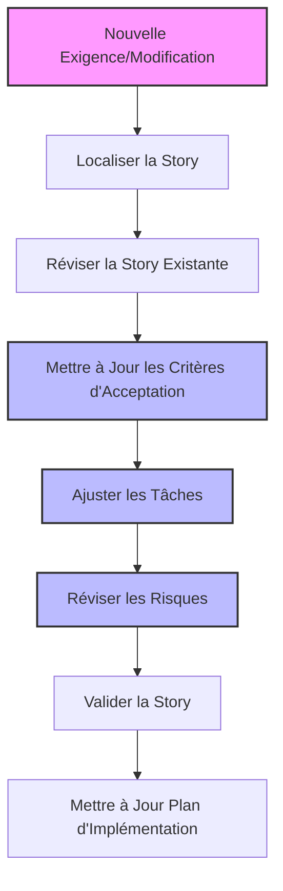
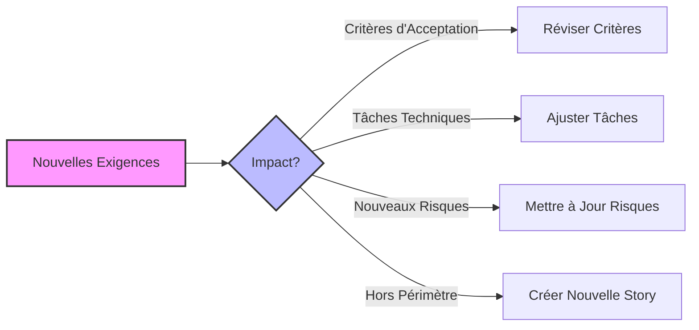
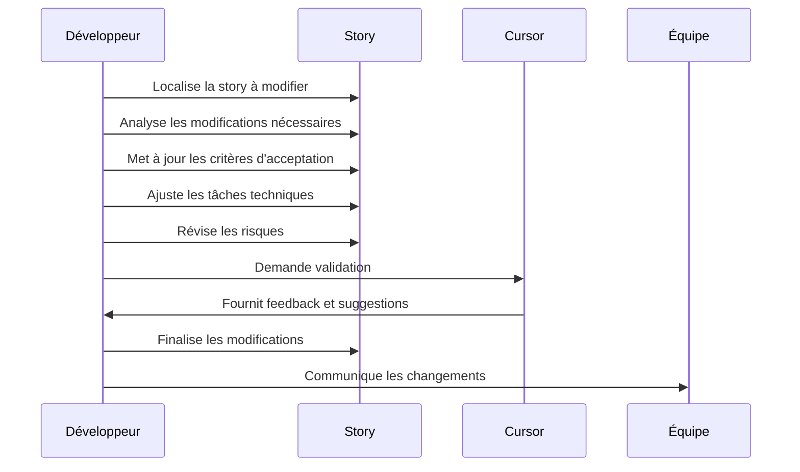

# Scénario 2: Mise à Jour d'une Story Existante

## Objectif

Ce guide vous montre comment réviser et mettre à jour une story existante dans un projet utilisant les règles Cursor standardisées, en réponse à de nouvelles exigences ou à des modifications techniques.

## Vue d'ensemble du processus



## 1. Localisation et Révision de la Story

### Identifier la story à modifier

```bash
# Identifier l'Epic contenant la story
ls -la .ai/epic-*

# Naviguer vers l'Epic concerné (exemple: epic-2)
cd .ai/epic-2/

# Lister les stories existantes dans cet Epic
ls -la *.story.md
```

### Ouvrir et examiner la story

```bash
# Ouvrir la story à modifier (exemple: 3-gestion-profil.story.md)
cat 3-gestion-profil.story.md
```

## 2. Analyse des Nouvelles Exigences



### Évaluer l'impact des changements

Avant de modifier la story, analysez l'impact des nouvelles exigences:

1. **Changements fonctionnels**: Nécessitent la mise à jour des critères d'acceptation
2. **Changements techniques**: Nécessitent l'ajustement des tâches
3. **Nouveaux risques**: Nécessitent la mise à jour du tableau des risques
4. **Changements majeurs**: Pourraient nécessiter une nouvelle story

## 3. Mise à Jour de la Story

### Mettre à jour les critères d'acceptation

Ouvrez la story dans Cursor et modifiez la section des critères d'acceptation:

```markdown
## Critères d'Acceptation

1. Étant donné un utilisateur connecté, quand il clique sur "Gérer Profil", alors une page de gestion du profil s'affiche.
2. Étant donné la page de gestion du profil, quand l'utilisateur change sa photo de profil, alors la nouvelle photo est enregistrée et visible immédiatement.
3. Étant donné la page de gestion du profil, quand l'utilisateur active l'authentification à deux facteurs, alors un QR code est généré pour configuration.
4. [NOUVEAU] Étant donné un utilisateur avec l'authentification à deux facteurs activée, quand il se connecte, alors un code de vérification lui est demandé.
5. [NOUVEAU] Étant donné un utilisateur connecté, quand il demande des codes de secours, alors 10 codes à usage unique sont générés et peuvent être téléchargés.
```

### Ajuster les tâches

Mettez à jour la liste des tâches pour refléter les nouvelles exigences:

```markdown
## Tâches

1. - [x] Créer la page de gestion du profil
2. - [x] Implémenter la fonctionnalité de changement de photo de profil
3. - [x] Développer la génération de QR code pour l'authentification à deux facteurs
4. - [ ] Implémenter la vérification du code 2FA lors de la connexion
5. - [ ] Créer la fonctionnalité de génération des codes de secours
6. - [ ] Ajouter la possibilité de télécharger les codes de secours au format PDF
7. - [ ] Développer les tests pour les nouvelles fonctionnalités
```

### Mettre à jour les risques

Ajoutez ou modifiez la section des risques pour inclure les nouvelles considérations:

```markdown
## Risques et Hypothèses

### 🔴 Risques identifiés

| Risque                                              | Impact potentiel                | Probabilité | Mesures d'atténuation                                                       |
| --------------------------------------------------- | ------------------------------- | ----------- | --------------------------------------------------------------------------- |
| Perte des codes de secours par l'utilisateur        | Élevé (blocage du compte)       | Moyenne     | Ajouter des instructions claires et un processus de récupération alternatif |
| Problèmes de compatibilité des applications 2FA     | Moyen (frustration utilisateur) | Faible      | Tester avec les applications 2FA les plus populaires                        |
| Expiration des sessions pendant la vérification 2FA | Moyen (échec de connexion)      | Moyenne     | Implémenter un mécanisme de session temporaire pendant la vérification      |

### 🟡 Hypothèses formulées

| Hypothèse                                                  | Validation nécessaire           | Responsable | Statut   |
| ---------------------------------------------------------- | ------------------------------- | ----------- | -------- |
| Les utilisateurs préfèrent les codes QR aux clés manuelles | Test utilisateur A/B            | Sarah       | En cours |
| 10 codes de secours sont suffisants                        | Analyse des pratiques du marché | Thomas      | Validée  |
```

## 4. Validation de la Story Mise à Jour

### Vérification de la cohérence

Avant de finaliser la story, vérifiez la cohérence et l'exhaustivité:

- Les nouveaux critères correspondent aux nouvelles exigences
- Les tâches couvrent toutes les modifications nécessaires
- Les risques sont correctement identifiés et adressés
- Le statut de la story est mis à jour (ex: "In Progress")

### Demander une validation

Soumettez la story mise à jour à l'examen de Cursor:

```
J'ai mis à jour cette story pour inclure les nouvelles exigences liées à l'authentification à deux facteurs.
Est-ce que la story est complète et cohérente? Y a-t-il des aspects que j'ai oubliés?
```

## 5. Mise à Jour du Plan d'Implémentation

### Réévaluer l'estimation

Si les nouvelles exigences modifient significativement l'ampleur de la story, mettez à jour l'estimation:

```markdown
## Estimation

Story Points: 5 (était: 3) - Augmentation due à l'ajout de l'authentification à deux facteurs
```

### Ajuster la planification

Si la story fait partie d'un sprint ou d'une release, mettez à jour la planification en conséquence:

```
Avec l'augmentation de la complexité, cette story devra être répartie sur deux sprints:
- Sprint 5: Implémentation de la base 2FA (tâches 1-4)
- Sprint 6: Implémentation des codes de secours (tâches 5-7)
```

## 6. Bonnes Pratiques pour la Mise à Jour des Stories

Pour maintenir la qualité et la cohérence dans votre gestion des stories:

### Documentation des Changements

Ajoutez une section "Historique des Modifications" pour tracer l'évolution de la story:

```markdown
## Historique des Modifications

| Date       | Version | Modifications                                     | Auteur |
| ---------- | ------- | ------------------------------------------------- | ------ |
| 2025-03-01 | 1.0     | Création initiale                                 | Alice  |
| 2025-03-15 | 1.1     | Ajout des fonctionnalités 2FA et codes de secours | Bob    |
```

### Communication

Assurez-vous que toutes les parties prenantes sont informées des modifications:

- Discutez des changements lors des stand-ups ou réunions d'équipe
- Mentionnez les modifications dans les outils de gestion de projet
- Documentez l'impact sur les autres stories dépendantes

## 7. Automatisation Avec Cursor

Cursor peut vous aider à maintenir la cohérence lors de la mise à jour des stories:

1. **Vérification automatique**: Cursor valide que les modifications respectent le template standardisé
2. **Suggestions d'amélioration**: Cursor peut proposer des ajustements pour améliorer la qualité
3. **Détection d'incohérences**: Cursor signale les inconsistances entre critères et tâches

Demandez à Cursor de vérifier la story mise à jour:

```
Peux-tu vérifier si cette story respecte toujours le format standardisé après mes modifications?
Y a-t-il des sections qui pourraient être améliorées?
```

## 8. Résumé du Processus



En suivant ce processus de mise à jour des stories, vous maintiendrez une documentation agile cohérente et de haute qualité, facilitant la collaboration et l'implémentation des fonctionnalités évolutives.
