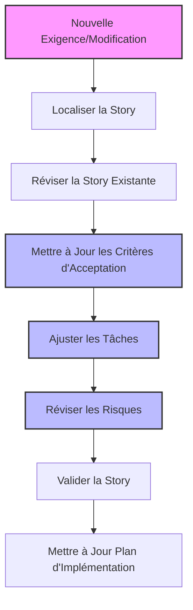
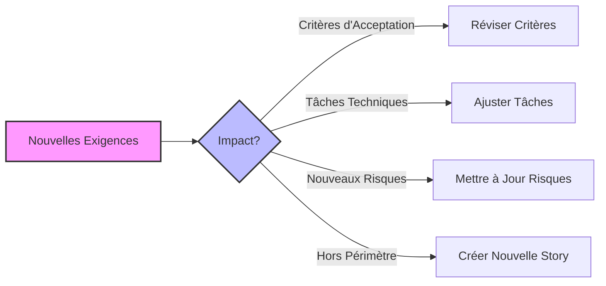
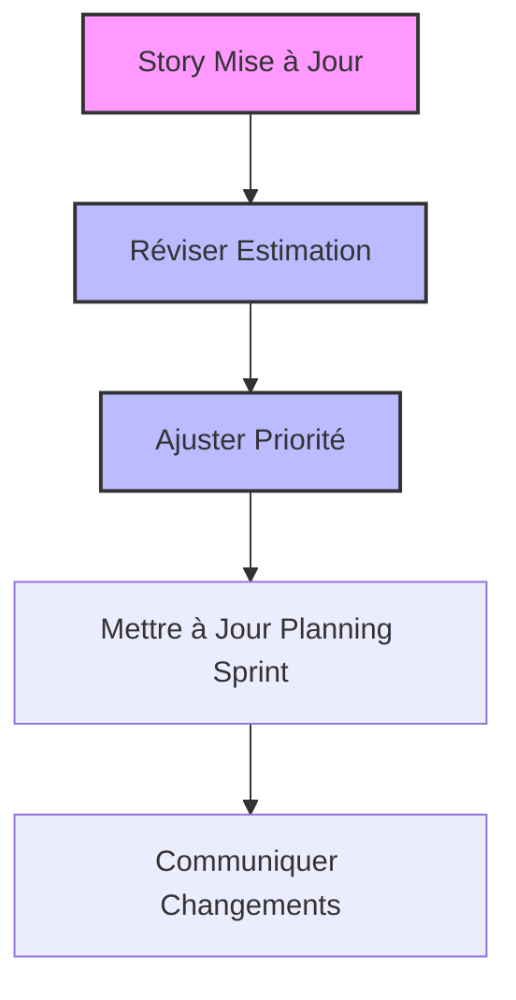

# Scénario 2: Mise à Jour d'une Story Existante

## Objectif

Ce guide vous montre comment réviser et mettre à jour une story existante dans un projet utilisant les règles Cursor standardisées, en réponse à de nouvelles exigences ou à des modifications techniques.

## Vue d'ensemble du processus



## 1. Localisation et Révision de la Story

### Identifier la story à modifier

```bash
# Naviguer vers le dossier des stories
cd .ai/stories/

# Lister les stories existantes
ls -la *.story.md
```

### Ouvrir et examiner la story

```bash
# Ouvrir la story à modifier (exemple: story-3.story.md)
cat story-3.story.md
```

## 2. Analyse des Nouvelles Exigences



### Évaluer l'impact des changements

Avant de modifier la story, analysez l'impact des nouvelles exigences:

1. **Changements fonctionnels**: Nécessitent la mise à jour des critères d'acceptation
2. **Changements techniques**: Nécessitent l'ajustement des tâches
3. **Nouveaux risques**: Nécessitent la mise à jour du tableau des risques
4. **Changements majeurs**: Pourraient nécessiter une nouvelle story

## 3. Mise à Jour de la Story

### Mettre à jour les critères d'acceptation

Ouvrez la story dans Cursor et modifiez la section des critères d'acceptation:

```markdown
## Critères d'Acceptation

1. Étant donné un utilisateur connecté, quand il clique sur "Gérer Profil", alors une page de gestion du profil s'affiche.
2. Étant donné la page de gestion du profil, quand l'utilisateur change sa photo de profil, alors la nouvelle photo est enregistrée et visible immédiatement.
3. Étant donné la page de gestion du profil, quand l'utilisateur active l'authentification à deux facteurs, alors un QR code est généré pour configuration.
4. [NOUVEAU] Étant donné un utilisateur avec l'authentification à deux facteurs activée, quand il se connecte, alors un code de vérification lui est demandé.
5. [NOUVEAU] Étant donné un utilisateur connecté, quand il demande des codes de secours, alors 10 codes à usage unique sont générés et peuvent être téléchargés.
```

### Ajuster les tâches

Mettez à jour la liste des tâches pour refléter les nouvelles exigences:

```markdown
## Tâches

1. [x] Créer la page de gestion du profil
2. [x] Implémenter la fonctionnalité de changement de photo de profil
3. [x] Développer la génération de QR code pour l'authentification à deux facteurs
4. [ ] Implémenter la vérification du code 2FA lors de la connexion
5. [ ] Créer la fonctionnalité de génération des codes de secours
6. [ ] Ajouter la possibilité de télécharger les codes de secours au format PDF
7. [ ] Développer les tests pour les nouvelles fonctionnalités
```

### Mettre à jour les risques

Ajustez le tableau des risques pour inclure les nouveaux défis:

```markdown
## Risques

| Risque                                    | Impact | Probabilité | Stratégie d'atténuation                  |
| ----------------------------------------- | ------ | ----------- | ---------------------------------------- |
| Sécurité des codes de secours             | Élevé  | Faible      | Chiffrement des codes en base de données |
| UX complexe pour 2FA                      | Moyen  | Moyen       | Tests utilisateurs et tutoriels intégrés |
| Compatibilité des apps d'authentification | Moyen  | Faible      | Tests avec principales apps du marché    |
```

## 4. Validation avec Cursor

Pour vous assurer que votre story mise à jour est conforme aux standards, demandez à Cursor de la réviser:

```
Peux-tu réviser cette story mise à jour pour vérifier qu'elle est complète,
cohérente et qu'elle suit le format standardisé? Est-ce que les nouveaux
critères d'acceptation sont bien formulés et est-ce que les tâches couvrent
bien tous les aspects à implémenter?
```

## 5. Mise à Jour du Plan d'Implémentation



### Réviser l'estimation et la planification

1. **Réévaluez l'effort** nécessaire pour implémenter la story mise à jour
2. **Ajustez la priorité** si nécessaire
3. **Mettez à jour le planning du sprint** si la story est dans le sprint actuel
4. **Communiquez les changements** à l'équipe

## Exemple Complet: Avant et Après

### Story Originale

```markdown
# Story: Gestion du Profil Utilisateur

<version>1.0.0</version>
<statut>En Cours</statut>
<priorité>Moyenne</priorité>
<estimation>5 points</estimation>

> Cette story concerne la gestion du profil utilisateur avec possibilité de changer la photo de profil et d'activer l'authentification à deux facteurs.

## Contexte

Les utilisateurs ont besoin de pouvoir personnaliser leur profil et sécuriser leur compte.

## Critères d'Acceptation

1. Étant donné un utilisateur connecté, quand il clique sur "Gérer Profil", alors une page de gestion du profil s'affiche.
2. Étant donné la page de gestion du profil, quand l'utilisateur change sa photo de profil, alors la nouvelle photo est enregistrée et visible immédiatement.
3. Étant donné la page de gestion du profil, quand l'utilisateur active l'authentification à deux facteurs, alors un QR code est généré pour configuration.

## Tâches

1. [ ] Créer la page de gestion du profil
2. [ ] Implémenter la fonctionnalité de changement de photo de profil
3. [ ] Développer la génération de QR code pour l'authentification à deux facteurs
4. [ ] Créer les tests pour les fonctionnalités

## Risques

| Risque               | Impact | Probabilité | Stratégie d'atténuation                  |
| -------------------- | ------ | ----------- | ---------------------------------------- |
| UX complexe pour 2FA | Moyen  | Moyen       | Tests utilisateurs et tutoriels intégrés |
```

### Story Mise à Jour

```markdown
# Story: Gestion du Profil Utilisateur

<version>1.1.0</version>
<statut>En Cours</statut>
<priorité>Haute</priorité>
<estimation>8 points</estimation>

> Cette story concerne la gestion du profil utilisateur avec possibilité de changer la photo de profil, d'activer l'authentification à deux facteurs et de générer des codes de secours.

## Contexte

Les utilisateurs ont besoin de pouvoir personnaliser leur profil et sécuriser leur compte. Suite à une revue de sécurité, nous ajoutons la vérification 2FA lors de la connexion et la génération de codes de secours.

## Critères d'Acceptation

1. Étant donné un utilisateur connecté, quand il clique sur "Gérer Profil", alors une page de gestion du profil s'affiche.
2. Étant donné la page de gestion du profil, quand l'utilisateur change sa photo de profil, alors la nouvelle photo est enregistrée et visible immédiatement.
3. Étant donné la page de gestion du profil, quand l'utilisateur active l'authentification à deux facteurs, alors un QR code est généré pour configuration.
4. Étant donné un utilisateur avec l'authentification à deux facteurs activée, quand il se connecte, alors un code de vérification lui est demandé.
5. Étant donné un utilisateur connecté, quand il demande des codes de secours, alors 10 codes à usage unique sont générés et peuvent être téléchargés.

## Tâches

1. [x] Créer la page de gestion du profil
2. [x] Implémenter la fonctionnalité de changement de photo de profil
3. [x] Développer la génération de QR code pour l'authentification à deux facteurs
4. [ ] Implémenter la vérification du code 2FA lors de la connexion
5. [ ] Créer la fonctionnalité de génération des codes de secours
6. [ ] Ajouter la possibilité de télécharger les codes de secours au format PDF
7. [ ] Développer les tests pour les nouvelles fonctionnalités

## Risques

| Risque                                    | Impact | Probabilité | Stratégie d'atténuation                  |
| ----------------------------------------- | ------ | ----------- | ---------------------------------------- |
| UX complexe pour 2FA                      | Moyen  | Moyen       | Tests utilisateurs et tutoriels intégrés |
| Sécurité des codes de secours             | Élevé  | Faible      | Chiffrement des codes en base de données |
| Compatibilité des apps d'authentification | Moyen  | Faible      | Tests avec principales apps du marché    |
```

## Récapitulatif

Ce processus de mise à jour des stories vous permet de:

- Maintenir une documentation à jour
- Garder une traçabilité des modifications des exigences
- Assurer que tous les aspects des nouvelles exigences sont couverts
- Communiquer clairement les changements à l'équipe

En suivant ce workflow pour la mise à jour des stories, vous maintenez l'intégrité de votre documentation agile tout en vous adaptant aux évolutions des besoins du projet.
