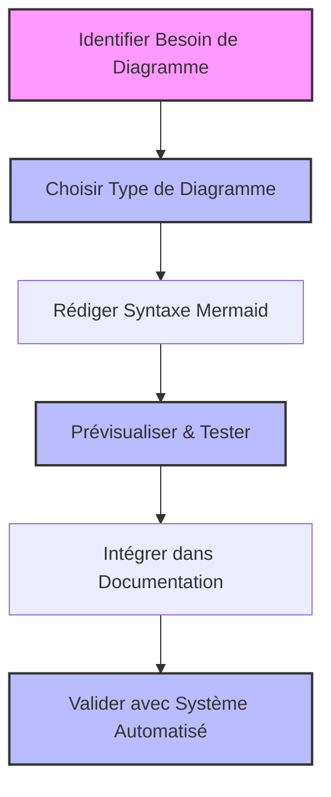
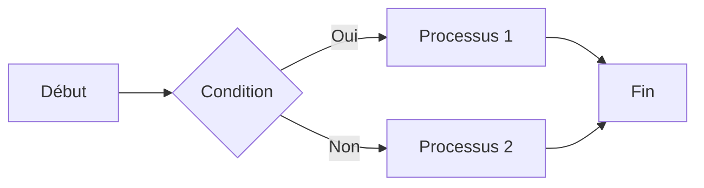
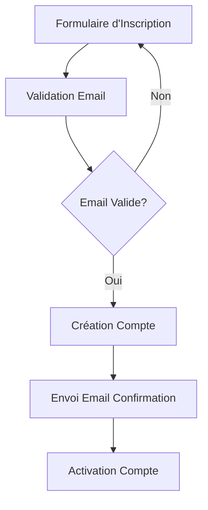
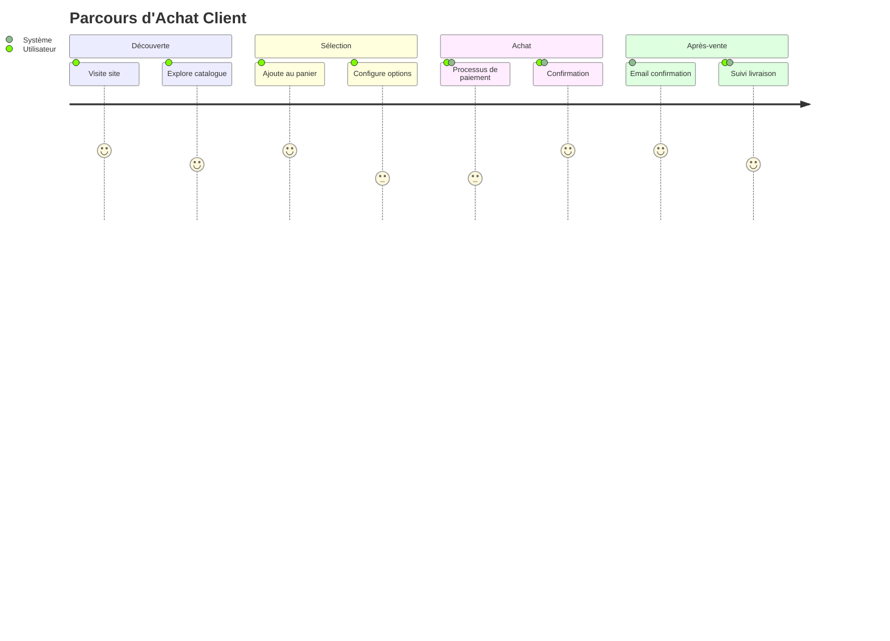
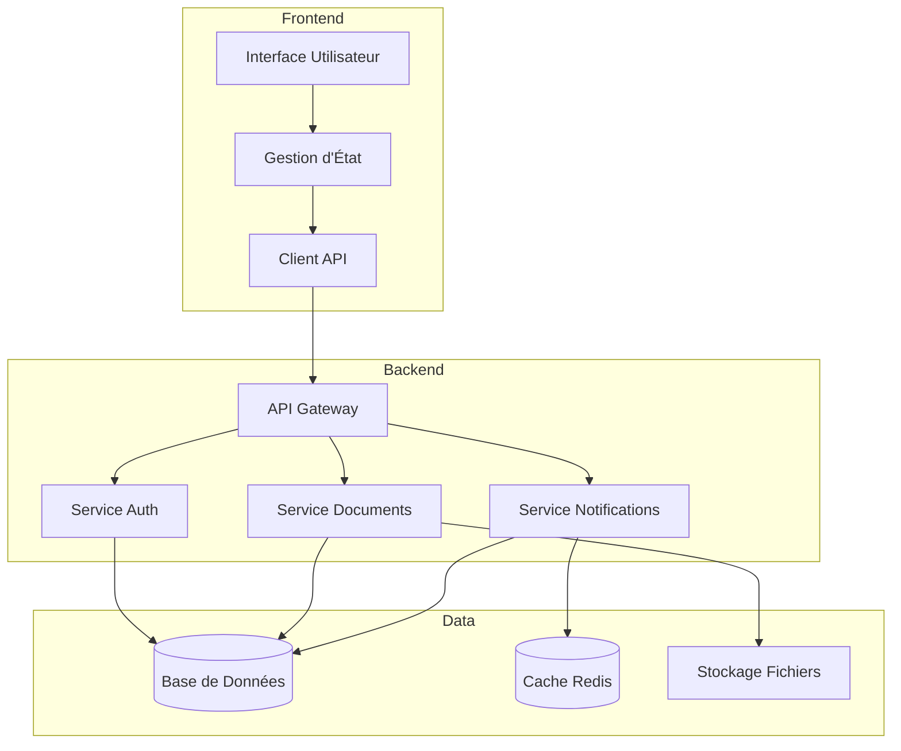
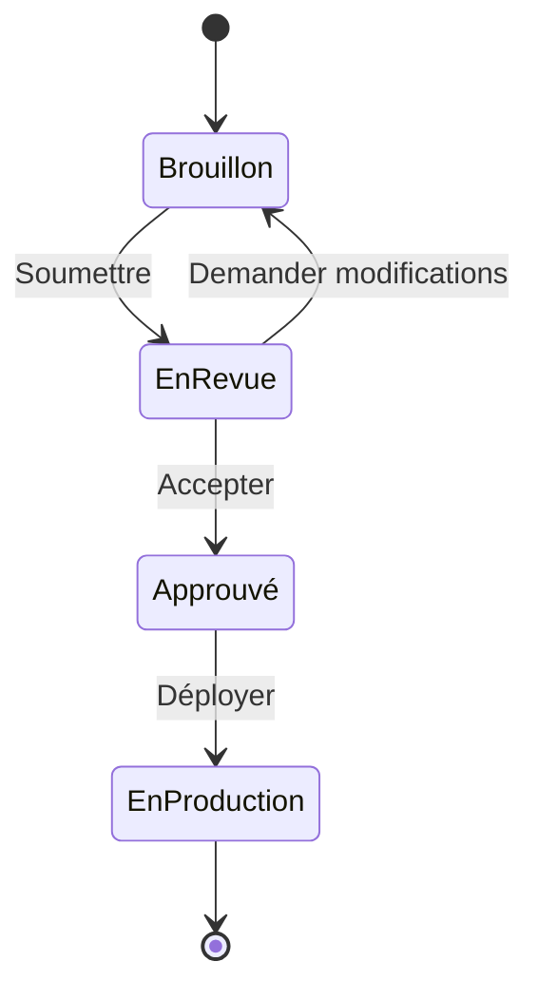

# Scénario 3: Création et Intégration de Diagrammes Mermaid

## Objectif

Ce guide vous montre comment créer et intégrer des diagrammes Mermaid dans votre documentation de projet, en utilisant les règles Cursor standardisées pour garantir des diagrammes clairs, maintenables et conformes aux standards.

## Vue d'ensemble du processus



## 1. Sélection du Type de Diagramme

Mermaid propose plusieurs types de diagrammes adaptés à différents besoins de documentation:

```mermaid
mindmap
  root((Types de Diagrammes))
    Flux
      flowchart
      sequence
      gantt
    Architecture
      classDiagram
      entityRelationship
      componentDiagram
    Organisation
      mindmap
      pieChart
      timeline
    Spécifiques
      gitGraph
      journey
      stateDiagram
```

### Types de diagrammes courants

1. **Flowchart** - Pour les flux de processus, workflows et algorithmes
2. **Sequence** - Pour les interactions entre systèmes ou composants
3. **Class Diagram** - Pour les modèles de données et relations d'objets
4. **Entity Relationship** - Pour les modèles de base de données
5. **Gantt** - Pour la planification et les calendriers
6. **Component Diagram** - Pour l'architecture système

## 2. Création de Diagrammes avec Syntaxe Mermaid

### Diagramme de Flux (Flowchart)

````markdown

````

````

Ce qui génère:

```mermaid
flowchart LR
    A[Début] --> B{Condition}
    B -->|Oui| C[Processus 1]
    B -->|Non| D[Processus 2]
    C --> E[Fin]
    D --> E
````

### Diagramme de Séquence

````markdown
```mermaid
sequenceDiagram
    participant U as Utilisateur
    participant F as Frontend
    participant A as API
    participant BD as Base de Données

    U->>F: Soumet formulaire
    F->>A: POST /api/data
    A->>BD: Insère données
    BD-->>A: Confirmation
    A-->>F: 201 Created
    F-->>U: Affiche confirmation
```
````

````

Ce qui génère:

```mermaid
sequenceDiagram
    participant U as Utilisateur
    participant F as Frontend
    participant A as API
    participant BD as Base de Données

    U->>F: Soumet formulaire
    F->>A: POST /api/data
    A->>BD: Insère données
    BD-->>A: Confirmation
    A-->>F: 201 Created
    F-->>U: Affiche confirmation
````

### Diagramme de Classes

````markdown
```mermaid
classDiagram
    User <|-- Admin
    User <|-- Customer
    User : +String username
    User : +String email
    User : +verifyEmail()

    class Admin {
        +manageUsers()
        +configureSystem()
    }

    class Customer {
        +Cart cart
        +placeOrder()
    }
```
````

````

Ce qui génère:

```mermaid
classDiagram
    User <|-- Admin
    User <|-- Customer
    User : +String username
    User : +String email
    User : +verifyEmail()

    class Admin {
        +manageUsers()
        +configureSystem()
    }

    class Customer {
        +Cart cart
        +placeOrder()
    }
````

## 3. Bonnes Pratiques pour Diagrammes Mermaid

```mermaid
flowchart TD
    A[Bonnes Pratiques] --> B[Simplicité]
    A --> C[Cohérence]
    A --> D[Lisibilité]
    A --> E[Commentaires]
    A --> F[Validation]

    B --> B1[Max 15-20 éléments]
    C --> C1[Conventions uniformes]
    D --> D1[Étiquettes claires]
    E --> E1[Documenter complexité]
    F --> F1[Tester régulièrement]
```

### Conseils pour des diagrammes efficaces

1. **Gardez vos diagrammes simples**

   - Limitez-vous à 15-20 éléments par diagramme
   - Divisez les diagrammes complexes en plusieurs plus petits

2. **Utilisez une convention cohérente**

   - Direction: LR (gauche à droite) ou TD (haut en bas)
   - Style d'éléments: rectangles, losanges pour décisions, etc.

3. **Adoptez des étiquettes claires et concises**

   - Texte court et descriptif
   - Évitez les abréviations peu claires

4. **Ajoutez des styles pour améliorer la lisibilité**

   - Utilisez des couleurs pour différencier les types d'éléments
   - Accentuez les éléments importants

5. **Testez vos diagrammes** avant de les intégrer
   - Utilisez [Mermaid Live Editor](https://mermaid.live/) pour valider la syntaxe
   - Vérifiez le rendu sur différents appareils

## 4. Intégration de Diagrammes dans la Documentation

### Dans un PRD (Product Requirements Document)

````markdown
## Flux Utilisateur - Inscription

Le processus d'inscription comprend plusieurs étapes pour garantir une expérience utilisateur sécurisée et intuitive:


````

Cette approche permet d'optimiser le taux de conversion tout en garantissant la validité des données utilisateur.

````

### Dans un Document d'Architecture

```markdown
## Architecture du Système d'Authentification

Le système d'authentification utilise une approche multi-couches pour assurer sécurité et flexibilité:

```mermaid
sequenceDiagram
    participant U as Utilisateur
    participant F as Frontend
    participant A as Auth Service
    participant I as Identity Provider

    U->>F: Demande Login
    F->>A: Authentification
    A->>I: Vérification Identité
    I-->>A: Tokens (JWT)
    A-->>F: Session Authentifiée
    F-->>U: Redirection Dashboard
````

Cette architecture permet l'intégration future de méthodes d'authentification supplémentaires comme OAuth2.

````

### Dans une Story

```markdown
## Contexte

L'utilisateur doit pouvoir modifier ses préférences de notification pour personnaliser son expérience.

```mermaid
stateDiagram-v2
    [*] --> Désactivées
    Désactivées --> Email: Active Email
    Email --> Push: Active Push
    Push --> Email: Désactive Push
    Email --> Désactivées: Désactive Email
    Push --> Désactivées: Désactive Tout
````

Cette fonctionnalité est essentielle pour améliorer l'engagement utilisateur.

````

## 5. Validation et Tests des Diagrammes

### Utilisation du Mermaid Live Editor

1. Accédez à [Mermaid Live Editor](https://mermaid.live/)
2. Collez votre syntaxe Mermaid
3. Vérifiez le rendu en temps réel
4. Corrigez les erreurs de syntaxe signalées
5. Exportez ou copiez le code validé

```mermaid
flowchart LR
    A[Écrire Diagramme] --> B[Copier dans Editor]
    B --> C{Erreurs?}
    C -->|Oui| D[Corriger Syntaxe]
    D --> B
    C -->|Non| E[Copier Code Validé]
    E --> F[Intégrer dans Document]
````

### Validation avec le Système Automatisé

Pour vérifier que vos diagrammes respectent les standards:

```bash
# Dans le répertoire racine du projet
./scripts/validate-docs.js --verbose

# Pour vérifier uniquement un fichier spécifique
./scripts/validate-docs.js --verbose path/to/document.md
```

## 6. Exemples de Diagrammes pour Différents Contextes

### Pour un PRD: User Journey



### Pour l'Architecture: Diagramme de Composants



### Pour une Story: Diagramme d'État



## Récapitulatif

L'utilisation efficace des diagrammes Mermaid dans votre documentation:

- Améliore la clarté et la compréhension des concepts
- Facilite la communication entre équipes techniques et non-techniques
- Permet de visualiser des workflows, architectures et processus complexes
- Maintient une cohérence visuelle dans tous les documents du projet
- Facilite la maintenance de la documentation (pas de fichiers externes à gérer)

En suivant ce guide et les bonnes pratiques proposées, vous créerez des diagrammes efficaces qui enrichiront considérablement votre documentation de projet tout en respectant les standards définis.
