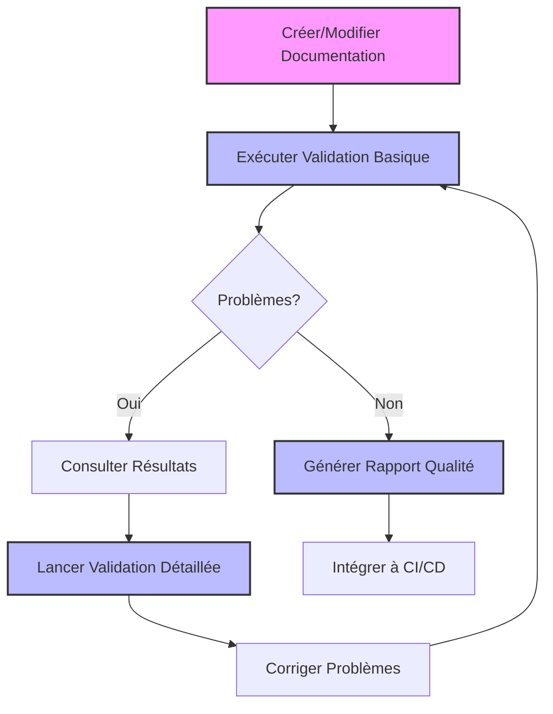
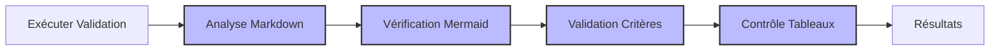
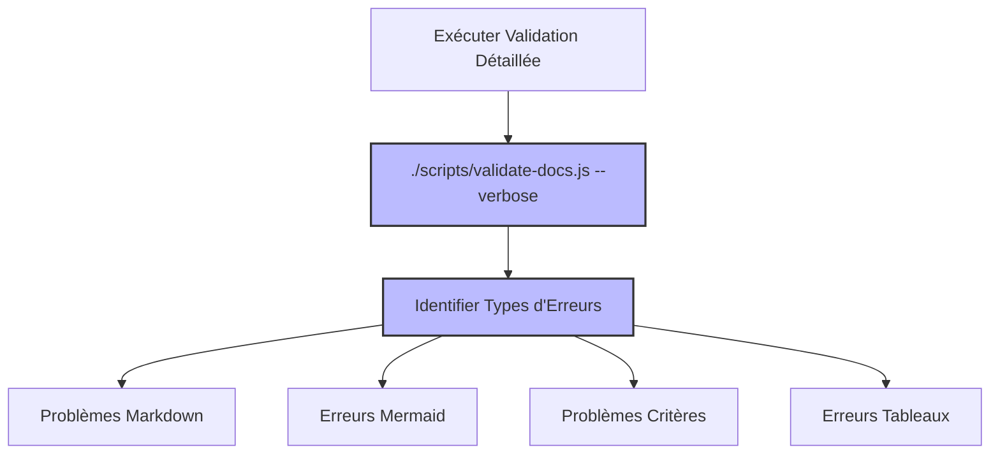
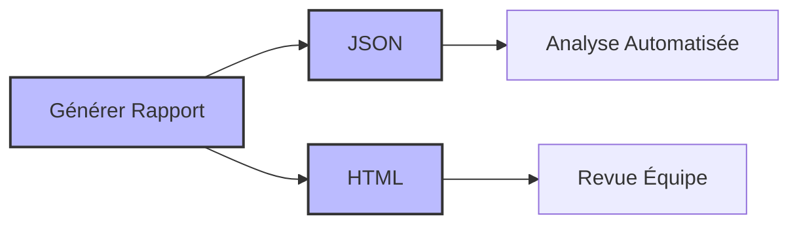
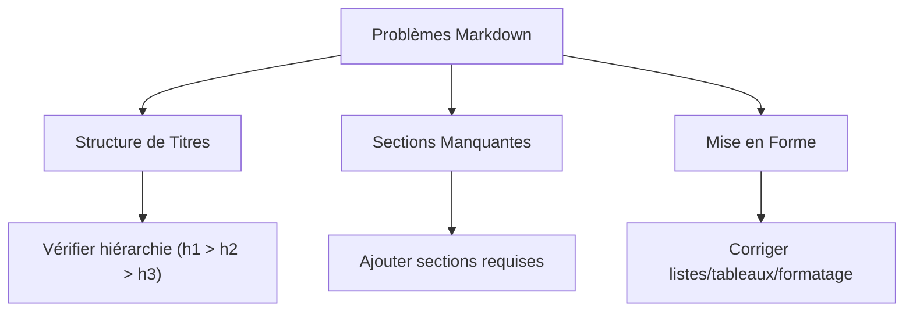
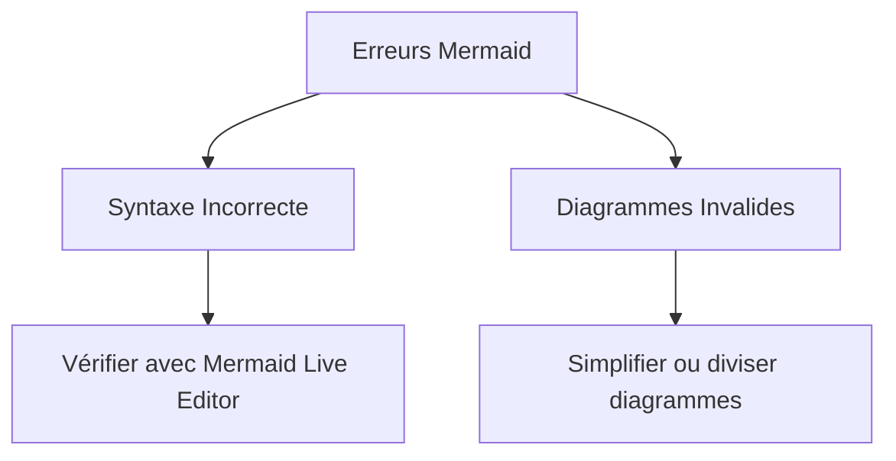
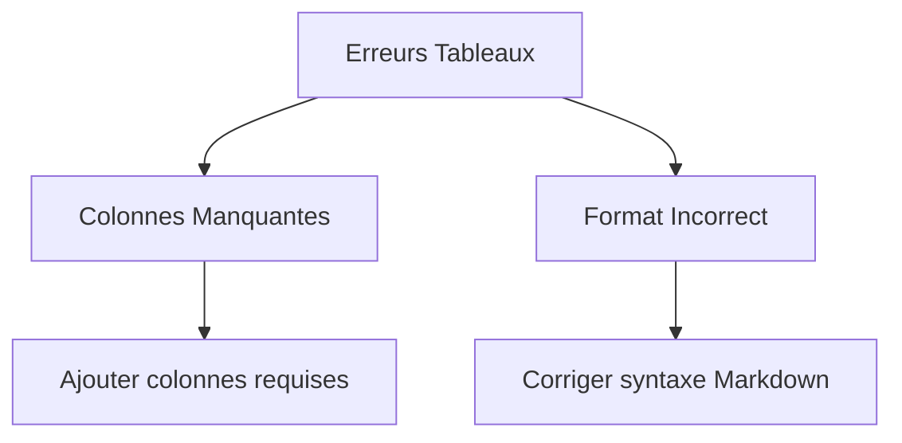
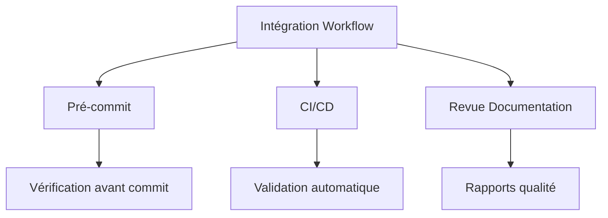
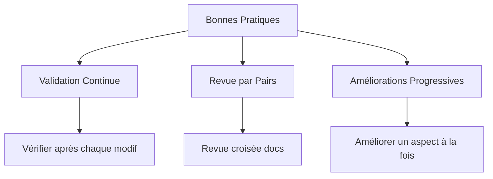

# Scénario 4: Validation Automatisée de la Documentation

## Objectif

Ce guide vous explique comment utiliser le système de validation automatisée pour vérifier et améliorer la qualité de votre documentation de projet, assurer le respect des standards et identifier rapidement les problèmes potentiels.

## Vue d'ensemble du processus



## 1. Installation et Configuration du Système de Validation

### Prérequis système

- Node.js 14+
- PNPM 10+
- Accès en écriture au répertoire du projet

### Installation des outils de validation

```bash
# Naviguez vers la racine de votre projet
cd /chemin/vers/votre/projet

# Exécutez le script d'installation
./scripts/setup-validation.sh

# Vérifiez que l'installation a réussi
./scripts/validate-docs.js --help
```

L'installation met en place:

- Les dépendances NPM nécessaires
- Les configurations de validation
- Les hooks git (optionnels)

## 2. Exécution de la Validation Basique



### Valider tous les documents

Pour vérifier tous les documents de votre projet:

```bash
# À la racine du projet
./scripts/validate-docs.js
```

Exemple de sortie:

```
Validation de la documentation démarrée
Trouvé 5 documents à valider

- templates/project-idea-prompt-standardized.md: ❌ Validation échouée
- templates/template-arch-standardized.md: ❌ Validation échouée (3 erreurs Mermaid)
- templates/template-prd-standardized.md: ❌ Validation échouée (1 erreur Mermaid)
- templates/template-story-standardized.md: ❌ Validation échouée (1 problème Risques & Hypothèses)
- templates/workflow-agile-standardized.md: ❌ Validation échouée (3 erreurs Mermaid)

Résumé de validation:
- 5 documents ont des problèmes de formatage Markdown
- 3 documents contiennent des erreurs dans les diagrammes Mermaid
- 1 document a des problèmes avec les tableaux de Risques & Hypothèses

Pour plus de détails, utilisez l'option --verbose
```

### Valider un document spécifique

Pour vérifier un seul document:

```bash
./scripts/validate-docs.js chemin/vers/document.md
```

## 3. Analyse Détaillée des Problèmes



### Obtenir des informations détaillées

Pour voir les détails complets de tous les problèmes:

```bash
./scripts/validate-docs.js --verbose
```

Exemple de sortie détaillée:

```
Validation de la documentation démarrée (mode verbeux)
Trouvé 5 documents à valider

DOCUMENT: templates/template-arch-standardized.md
[MARKDOWN] Structure de titres incorrecte: Le niveau 2 (##) est suivi directement par un niveau 4 (####)
[MARKDOWN] Section manquante: "Considérations de Sécurité" requise dans les documents d'architecture
[MERMAID] Erreur de syntaxe dans le diagramme ligne 78:
  flowchartTD  <-- "flowchartTD" devrait être "flowchart TD"
    A[Composant Frontend] --> B[API Gateway]
    B --> C[Service Utilisateurs]

DOCUMENT: templates/template-story-standardized.md
[RISQUES] Tableau de risques incomplet, colonnes requises: "Risque", "Impact", "Probabilité", "Stratégie d'atténuation"
[RISQUES] Trouvé: "Risque", "Consequence", "Probabilité", "Mitigation"

...
```

### Focus sur un type de problème spécifique

Pour se concentrer sur un type de validation spécifique:

```bash
# Vérifier uniquement les diagrammes Mermaid
./scripts/validate-docs.js --verbose --only=mermaid

# Vérifier uniquement les critères d'acceptation
./scripts/validate-docs.js --verbose --only=acceptance-criteria
```

## 4. Génération de Rapports de Qualité



### Créer un rapport JSON

Pour générer un rapport complet au format JSON:

```bash
./scripts/validate-docs.js --report
```

Cela créera un fichier `docs-validation-report.json` à la racine du projet, contenant toutes les informations sur les problèmes détectés.

### Analyser le rapport avec jq

```bash
# Compter le nombre d'erreurs par type
cat docs-validation-report.json | jq '.summary.errorsByType'

# Lister tous les documents avec des erreurs Mermaid
cat docs-validation-report.json | jq '.documents[] | select(.errors.mermaid != null)'
```

## 5. Correction des Problèmes Courants

### Problèmes Markdown



#### Exemple de correction pour les titres

Problème:

```markdown
# Titre principal

#### Sous-section (incorrect: h4 après h1)
```

Correction:

```markdown
# Titre principal

## Sous-section (correct: h2 après h1)
```

### Erreurs Mermaid



#### Exemple de correction pour la syntaxe Mermaid

Problème:

````markdown
```mermaid
sequencediagram  <!-- Incorrect: devrait être sequenceDiagram -->
    Alice->>Bob: Hello
    Bob->>Alice: Hi
```
````

````

Correction:
```markdown
```mermaid
sequenceDiagram  <!-- Correct: casse correcte -->
    Alice->>Bob: Hello
    Bob->>Alice: Hi
````

````

### Problèmes de Critères d'Acceptation

```mermaid
flowchart TD
    A[Erreurs Critères] --> B[Format Gherkin]
    A --> C[Numérotation]

    B --> B1["Utiliser 'Étant donné/Quand/Alors'"]
    C --> C1["Vérifier séquence numérique"]
````

#### Exemple de correction pour le format Gherkin

Problème:

```markdown
## Critères d'Acceptation

1. L'utilisateur peut créer un compte <!-- Non conforme au format Gherkin -->
```

Correction:

```markdown
## Critères d'Acceptation

1. Étant donné un visiteur du site, quand il remplit le formulaire d'inscription et clique sur "Créer un compte", alors un nouveau compte est créé et l'utilisateur est connecté
```

### Problèmes de Tableaux



#### Exemple de correction pour les tableaux de risques

Problème:

```markdown
## Risques

| Risque           | Consequence | Probabilité | Mitigation      |
| ---------------- | ----------- | ----------- | --------------- |
| Perte de données | Élevé       | Faible      | Backup régulier |
```

Correction:

```markdown
## Risques

| Risque           | Impact | Probabilité | Stratégie d'atténuation |
| ---------------- | ------ | ----------- | ----------------------- |
| Perte de données | Élevé  | Faible      | Backup régulier         |
```

## 6. Intégration avec le Workflow Agile



### Configuration des hooks Git

Pour vérifier automatiquement la documentation avant chaque commit:

```bash
# Installation du hook pre-commit
cp scripts/hooks/pre-commit .git/hooks/
chmod +x .git/hooks/pre-commit
```

Exemple de hook:

```bash
#!/bin/bash
echo "Vérification de la documentation..."
./scripts/validate-docs.js --quick

if [ $? -ne 0 ]; then
  echo "⚠️ Problèmes détectés dans la documentation. Utilisez --no-verify pour forcer le commit."
  exit 1
fi
```

### Intégration CI/CD

Ajoutez cette étape à votre workflow CI/CD (exemple GitHub Actions):

```yaml
- name: Valider Documentation
  run: |
    ./scripts/setup-validation.sh
    ./scripts/validate-docs.js --report
    if [ $? -ne 0 ]; then
      echo "::warning::Problèmes détectés dans la documentation"
      cat docs-validation-report.json | jq '.summary'
    fi
```

## 7. Bonnes Pratiques pour la Qualité de la Documentation



### Conseils pour maintenir une documentation de qualité

1. **Vérifiez régulièrement** la documentation avec le système de validation
2. **Corrigez immédiatement** les problèmes détectés, surtout les erreurs de syntaxe
3. **Planifiez des revues périodiques** de la documentation
4. **Mettez à jour les règles de validation** à mesure que vos standards évoluent
5. **Utilisez les rapports de qualité** pour mesurer l'amélioration au fil du temps

## Référence: Options de Validation

| Option        | Description                                                    |
| ------------- | -------------------------------------------------------------- |
| `--verbose`   | Affiche les détails complets de chaque problème                |
| `--report`    | Génère un rapport JSON détaillé                                |
| `--quick`     | Validation rapide, moins complète mais plus performante        |
| `--only=type` | Valide uniquement un type spécifique (markdown, mermaid, etc.) |
| `--fix`       | Tente de corriger automatiquement certains problèmes simples   |

## Récapitulatif

L'utilisation du système de validation automatisée vous permet de:

- Détecter rapidement les problèmes dans votre documentation
- Maintenir la cohérence entre tous les documents du projet
- Assurer le respect des standards définis
- Améliorer la qualité globale de la documentation
- Intégrer la validation dans votre workflow de développement

En suivant ce processus, vous garantissez une documentation de haute qualité, facile à maintenir et qui répond aux besoins de tous les membres de l'équipe.
