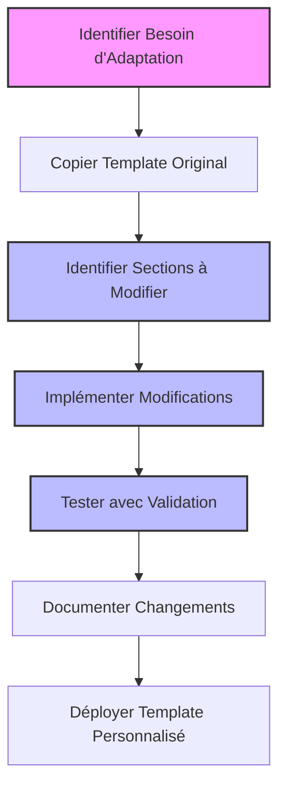
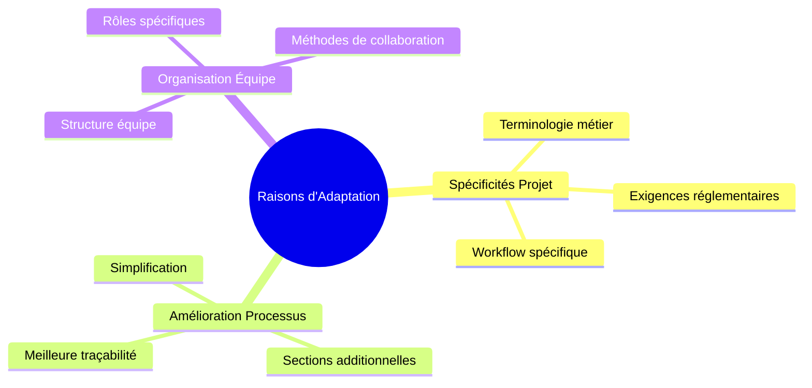
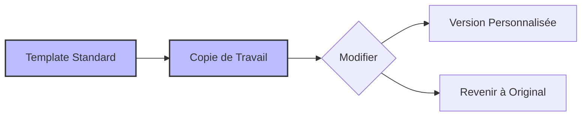
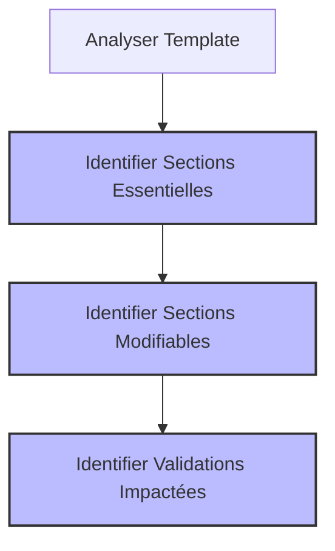
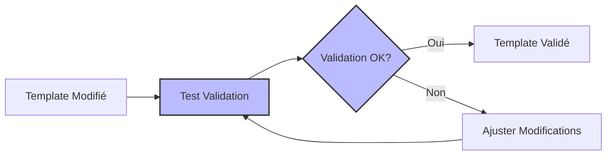
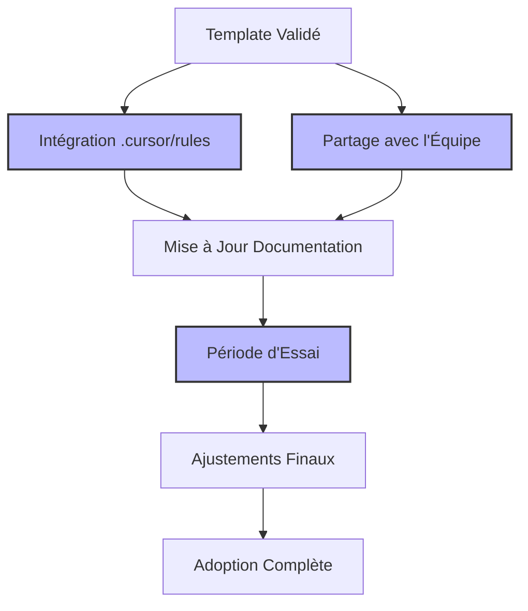

# Scénario 5: Adaptation des Templates Standardisés pour Besoins Spécifiques

## Objectif

Ce guide vous montre comment personnaliser les templates standardisés des règles Cursor pour répondre aux besoins spécifiques de votre équipe ou projet, tout en maintenant la compatibilité avec le système de validation et le workflow agile.

## Vue d'ensemble du processus



## 1. Analyse des Besoins d'Adaptation

### Raisons communes pour personnaliser les templates



### Questions à se poser avant de modifier un template

1. Quel problème spécifique essayez-vous de résoudre?
2. Les modifications sont-elles nécessaires pour tout le projet ou seulement pour certains types de documents?
3. Les changements respectent-ils toujours les principes fondamentaux du workflow agile?
4. Comment les modifications affecteront-elles le processus de validation automatisée?

## 2. Création d'une Copie du Template Original



### Étapes pour créer une version modifiable

```bash
# Créer un répertoire pour les templates personnalisés
mkdir -p .cursor/custom-rules

# Copier le template à modifier (exemple: PRD)
cp .cursor/rules/901-prd-template-standardized.mdc .cursor/custom-rules/901-prd-template-custom.mdc

# Ouvrir pour édition
nano .cursor/custom-rules/901-prd-template-custom.mdc
```

### Garder une trace des modifications

Ajoutez une section au début du fichier pour documenter les changements:

```markdown
# Template PRD Personnalisé

<version>1.1.0</version>

<base>901-prd-template-standardized.mdc v1.0.0</base>

> Modifications:
>
> - Ajout d'une section "Impact sur la Performance"
> - Extension de la section Risques avec analyse quantitative
> - Simplification de la section Contraintes pour notre contexte spécifique
```

## 3. Identification des Sections à Modifier



### Comprendre la structure du template

Les templates standardisés comportent généralement:

- **Sections critiques**: Ne devraient pas être supprimées (affecte la validation)
- **Sections modifiables**: Peuvent être adaptées tout en conservant leur fonction
- **Sections optionnelles**: Peuvent être ajoutées/supprimées selon les besoins

### Exemple d'analyse pour un PRD

```markdown
# Template PRD

## Sections Critiques (Ne pas supprimer)

- Titre et métadonnées (version, etc.)
- Vue d'Ensemble
- Objectifs
- Exigences Fonctionnelles
- Risques et Hypothèses (structure des tableaux importante pour validation)

## Sections Modifiables

- Cas d'Utilisation (peut être adapté au format de votre équipe)
- Exigences Non-Fonctionnelles (peut être restructuré)
- Contraintes (peut être adapté au contexte)

## Sections Optionnelles

- Peuvent ajouter: Impact sur Performance, Considérations UX, Exigences Légales, etc.
```

## 4. Implémentation des Modifications

### Modification d'une Section Existante

Exemple de modification d'une section de Risques et Hypothèses pour inclure une analyse quantitative:

Avant:

```markdown
## Risques et Hypothèses

| Risque                  | Impact               | Probabilité          | Stratégie d'atténuation |
| ----------------------- | -------------------- | -------------------- | ----------------------- |
| [Description du risque] | [Faible/Moyen/Élevé] | [Faible/Moyen/Élevé] | [Stratégie]             |
```

Après:

```markdown
## Risques et Hypothèses

| Risque                  | Impact (1-5) | Probabilité (1-5) | Score (I×P) | Stratégie d'atténuation | Propriétaire |
| ----------------------- | ------------ | ----------------- | ----------- | ----------------------- | ------------ |
| [Description du risque] | [1-5]        | [1-5]             | [Calculé]   | [Stratégie]             | [Nom]        |

> Note: Score de risque: 1-8 = Faible, 9-15 = Moyen, 16-25 = Élevé
```

### Ajout d'une Nouvelle Section

Exemple d'ajout d'une section pour l'impact sur la performance:

```markdown
## Impact sur la Performance

| Fonctionnalité   | Métrique                 | Valeur Actuelle | Valeur Cible | Méthode de Test       |
| ---------------- | ------------------------ | --------------- | ------------ | --------------------- |
| [Fonctionnalité] | [Temps de réponse]       | [Valeur]        | [Objectif]   | [Description du test] |
| [Fonctionnalité] | [Utilisation ressources] | [Valeur]        | [Objectif]   | [Description du test] |

### Considérations de Performance Globales

- [Description des impacts globaux sur la performance du système]
- [Stratégies d'optimisation]
- [Compromis acceptables]
```

## 5. Test avec le Système de Validation



### Validation du template personnalisé

```bash
# Créer un document test utilisant le template personnalisé
cp .cursor/custom-rules/901-prd-template-custom.mdc test-prd.md

# Éditer pour remplir quelques sections
nano test-prd.md

# Exécuter la validation
./scripts/validate-docs.js --verbose test-prd.md
```

### Adapter le validateur si nécessaire

Si vos modifications nécessitent des ajustements dans le système de validation:

```bash
# Modifier les règles de validation pour vos templates personnalisés
nano scripts/validation-rules.js

# Exemple d'ajustement: ajouter une règle pour le nouveau format de tableau de risques
function validateRiskTable(document) {
  // Code de validation adapté pour le nouveau format
}
```

## 6. Documentation des Changements

### Création d'un guide de transition

Pour aider votre équipe à adopter le nouveau template, créez un document de transition:

```markdown
# Guide d'Utilisation du Template PRD Personnalisé

## Changements par rapport au template standard

- **Nouveau**: Section "Impact sur la Performance" pour documenter les métriques clés
- **Modifié**: Tableau des risques étendu avec analyse quantitative
- **Simplifié**: Section Contraintes adaptée à notre contexte

## Comment remplir les nouvelles sections

1. **Impact sur la Performance**:

   - Identifiez les fonctionnalités à fort impact
   - Définissez des métriques mesurables
   - Établissez des valeurs cibles réalistes

2. **Analyse Quantitative des Risques**:
   - Notez l'impact de 1 (minimal) à 5 (critique)
   - Notez la probabilité de 1 (rare) à 5 (presque certain)
   - Le score est calculé automatiquement
   - Assignez un propriétaire responsable de l'atténuation
```

## 7. Déploiement du Template Personnalisé



### Déploiement dans l'environnement de travail

1. **Mise à disposition du template**:

   ```bash
   # Option 1: Remplacer le template standard (si toute l'équipe adopte)
   cp .cursor/custom-rules/901-prd-template-custom.mdc .cursor/rules/901-prd-template-standardized.mdc

   # Option 2: Ajouter comme alternative (coexistence avec standard)
   cp .cursor/custom-rules/901-prd-template-custom.mdc .cursor/rules/901-prd-template-custom.mdc
   ```

2. **Partage avec l'équipe**:

   - Présentation des changements lors d'une réunion d'équipe
   - Formation sur l'utilisation des nouvelles sections
   - Période d'essai avec retours d'expérience

3. **Mise à jour de la documentation**:
   - Ajouter les nouvelles règles au guide de documentation
   - Mettre à jour les exemples et références

## 8. Exemples de Personnalisations Courantes

### Pour les PRD - Focus Technologique

```markdown
## Considérations d'Architecture

| Composant       | Technologies Envisagées | Avantages | Inconvénients | Décision   |
| --------------- | ----------------------- | --------- | ------------- | ---------- |
| Frontend        | React, Vue, Angular     | ...       | ...           | React      |
| API             | REST, GraphQL           | ...       | ...           | GraphQL    |
| Base de données | SQL, NoSQL              | ...       | ...           | PostgreSQL |

## Dette Technique

| Élément   | Impact sur le Projet      | Plan de Remédiation | Priorité              |
| --------- | ------------------------- | ------------------- | --------------------- |
| [Élément] | [Description de l'impact] | [Plan d'action]     | [Haute/Moyenne/Basse] |
```

### Pour les Stories - Tracking Technique

```markdown
## Informations Techniques

| Composant   | Complexité                | Couverture Tests   | Revue Code         |
| ----------- | ------------------------- | ------------------ | ------------------ |
| [Composant] | [Simple/Moyenne/Complexe] | [Requise: Oui/Non] | [Requise: Oui/Non] |

## Dépendances

| ID Story  | Relation        | Description                                        |
| --------- | --------------- | -------------------------------------------------- |
| STORY-123 | Bloque          | Cette story nécessite que STORY-123 soit complétée |
| STORY-456 | Est bloquée par | STORY-456 dépend de cette story                    |
```

### Pour l'Architecture - Matrices de Décision

```markdown
## Décisions d'Architecture

| ID   | Décision         | Alternatives          | Critères                | Résultat                 |
| ---- | ---------------- | --------------------- | ----------------------- | ------------------------ |
| AD-1 | [Décision prise] | [Options considérées] | [Critères d'évaluation] | [Justification du choix] |

## Matrice d'Évaluation pour AD-1

| Alternative | Critère 1 (1-5) | Critère 2 (1-5) | Critère 3 (1-5) | Score Total |
| ----------- | --------------- | --------------- | --------------- | ----------- |
| Option A    | 4               | 3               | 5               | 12          |
| Option B    | 5               | 2               | 3               | 10          |
| Option C    | 3               | 5               | 4               | 12          |
```

## Récapitulatif

L'adaptation des templates standardisés vous permet de:

- Ajuster la documentation à vos besoins spécifiques
- Intégrer des processus propres à votre organisation
- Améliorer l'efficacité de votre équipe
- Maintenir la cohérence tout en apportant de la flexibilité

Points clés à retenir:

1. Conservez toujours les sections essentielles pour la validation
2. Documentez clairement vos modifications
3. Testez avec le système de validation avant déploiement
4. Formez votre équipe aux nouveaux formats
5. Recueillez des retours et itérez sur vos templates

En suivant ce processus, vous créerez des templates personnalisés qui répondent parfaitement à vos besoins tout en préservant les avantages du workflow agile standardisé.
