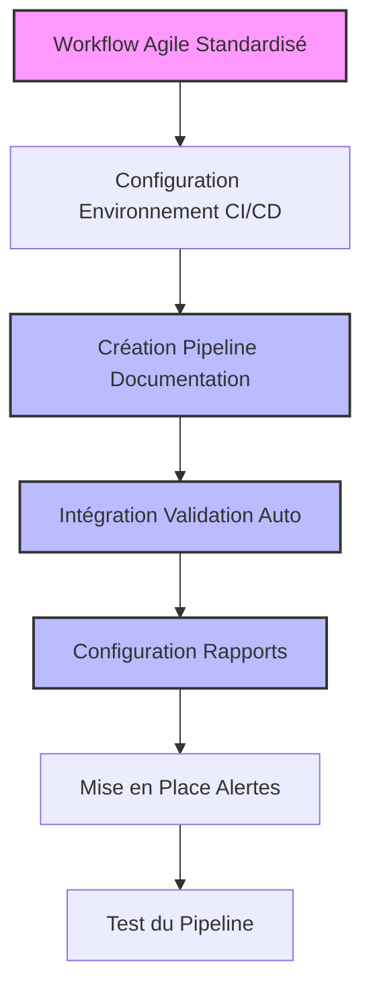
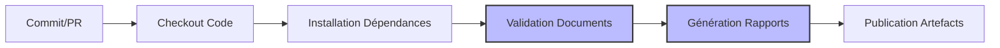
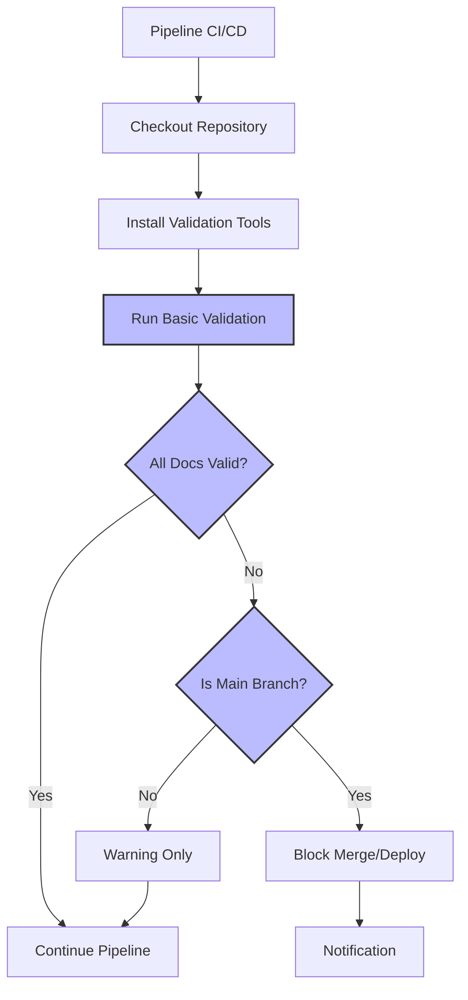
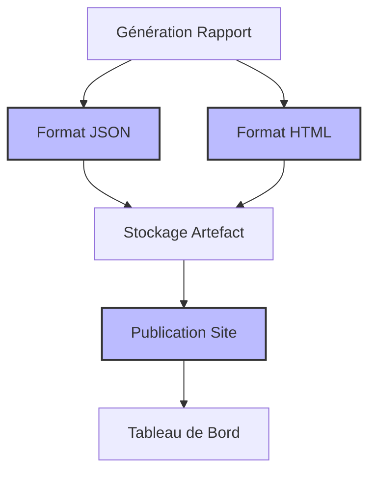
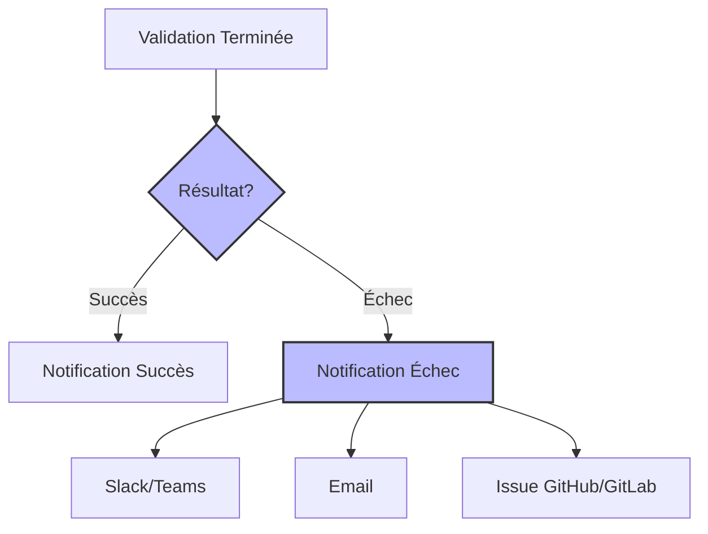
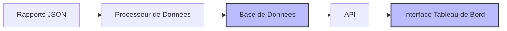

# Scénario 6: Intégration du Workflow Agile dans un Pipeline CI/CD

## Objectif

Ce guide vous montre comment intégrer les processus de documentation agile et de validation dans votre pipeline d'intégration continue et de déploiement continu (CI/CD), assurant ainsi que la qualité de la documentation est vérifiée automatiquement à chaque étape du développement.

## Vue d'ensemble du processus



## 1. Préparation de l'Environnement CI/CD

### Plateforme CI/CD prise en charge

Ce guide couvre l'intégration avec les plateformes CI/CD les plus courantes:

- GitHub Actions
- GitLab CI/CD
- Jenkins
- Azure DevOps

### Prérequis

- Scripts de validation de documentation opérationnels
- Accès administrateur à votre plateforme CI/CD
- Structure de projet conforme au workflow agile standardisé

## 2. Création du Pipeline de Documentation



### Exemple avec GitHub Actions

Créez un fichier `.github/workflows/doc-validation.yml`:

```yaml
name: Documentation Validation

on:
  push:
    branches: [main, develop]
    paths:
      - "**/*.md"
      - ".ai/**"
  pull_request:
    branches: [main, develop]
    paths:
      - "**/*.md"
      - ".ai/**"

jobs:
  validate:
    runs-on: ubuntu-latest
    steps:
      - uses: actions/checkout@v3

      - name: Setup Node.js
        uses: actions/setup-node@v3
        with:
          node-version: "16"

      - name: Install dependencies
        run: |
          cd scripts
          npm install

      - name: Validate documentation
        run: |
          ./scripts/validate-docs.js --report

      - name: Upload validation report
        if: always()
        uses: actions/upload-artifact@v3
        with:
          name: doc-validation-report
          path: docs-validation-report.json
```

### Exemple avec GitLab CI/CD

Créez un fichier `.gitlab-ci.yml`:

```yaml
stages:
  - validate

doc-validation:
  stage: validate
  image: node:16
  script:
    - cd scripts
    - npm install
    - cd ..
    - ./scripts/validate-docs.js --report
  artifacts:
    paths:
      - docs-validation-report.json
    when: always
  only:
    changes:
      - "**/*.md"
      - ".ai/**"
```

### Exemple avec Jenkins

Créez un `Jenkinsfile`:

```groovy
pipeline {
    agent {
        docker {
            image 'node:16'
        }
    }

    stages {
        stage('Setup') {
            steps {
                sh 'cd scripts && npm install'
            }
        }
        stage('Validate') {
            steps {
                sh './scripts/validate-docs.js --report'
            }
        }
    }

    post {
        always {
            archiveArtifacts artifacts: 'docs-validation-report.json', allowEmptyArchive: true
        }
    }
}
```

## 3. Intégration de la Validation Automatique



### Configuration pour différents niveaux de rigueur

#### Validation stricte (bloque en cas d'échec)

Pour GitHub Actions:

```yaml
- name: Validate documentation (strict)
  run: |
    ./scripts/validate-docs.js --report
    if [ $? -ne 0 ]; then
      echo "Documentation validation failed. Please fix the issues before merging."
      exit 1
    fi
```

#### Validation informative (avertissement uniquement)

Pour GitHub Actions:

```yaml
- name: Validate documentation (warning only)
  run: |
    ./scripts/validate-docs.js --report
    if [ $? -ne 0 ]; then
      echo "::warning::Documentation validation found issues. See report for details."
    fi
```

## 4. Configuration des Rapports de Qualité



### Génération de rapports HTML à partir du JSON

Ajoutez cette étape à votre pipeline:

```yaml
- name: Generate HTML report
  if: always()
  run: |
    ./scripts/generate-html-report.js docs-validation-report.json
```

Exemple de script `generate-html-report.js`:

```javascript
const fs = require("fs");
const path = require("path");

// Lire le rapport JSON
const reportPath = process.argv[2];
const report = JSON.parse(fs.readFileSync(reportPath, "utf8"));

// Générer HTML
let html = `
<!DOCTYPE html>
<html>
<head>
    <title>Documentation Validation Report</title>
    <style>
        body { font-family: Arial, sans-serif; margin: 20px; }
        .summary { background: #f0f0f0; padding: 15px; border-radius: 5px; }
        .error { color: #d32f2f; }
        .warning { color: #f57c00; }
        .success { color: #388e3c; }
        table { border-collapse: collapse; width: 100%; }
        th, td { border: 1px solid #ddd; padding: 8px; text-align: left; }
        th { background-color: #f2f2f2; }
    </style>
</head>
<body>
    <h1>Documentation Validation Report</h1>
    <div class="summary">
        <h2>Summary</h2>
        <p>Total Documents: ${report.summary.totalDocuments}</p>
        <p>Valid Documents: ${report.summary.validDocuments}</p>
        <p>Invalid Documents: ${report.summary.invalidDocuments}</p>
        <p>Execution Time: ${report.summary.executionTime} seconds</p>
    </div>
`;

// Ajouter les détails pour chaque document
report.documents.forEach((doc) => {
  html += `
    <h2>Document: ${doc.path}</h2>
    <p class="${doc.isValid ? "success" : "error"}">Status: ${
    doc.isValid ? "Valid" : "Invalid"
  }</p>
    `;

  if (!doc.isValid) {
    html += `<h3>Issues:</h3><ul>`;

    if (doc.errors.markdown) {
      html += `<li class="error">Markdown Issues: ${doc.errors.markdown.length}</li>`;
    }
    if (doc.errors.mermaid) {
      html += `<li class="error">Mermaid Issues: ${doc.errors.mermaid.length}</li>`;
    }
    // Ajouter d'autres types d'erreurs...

    html += `</ul>`;
  }
});

html += `
</body>
</html>
`;

// Écrire le rapport HTML
fs.writeFileSync("docs-validation-report.html", html);
console.log("HTML report generated: docs-validation-report.html");
```

### Publication des rapports

Pour GitHub Pages:

```yaml
- name: Publish report to GitHub Pages
  if: always() && github.ref == 'refs/heads/main'
  uses: peaceiris/actions-gh-pages@v3
  with:
    github_token: ${{ secrets.GITHUB_TOKEN }}
    publish_dir: ./reports
    destination_dir: docs-reports
```

## 5. Mise en Place des Alertes et Notifications



### Notifications Slack

Pour GitHub Actions:

```yaml
- name: Notify Slack on Failure
  if: failure()
  uses: rtCamp/action-slack-notify@v2
  env:
    SLACK_WEBHOOK: ${{ secrets.SLACK_WEBHOOK }}
    SLACK_CHANNEL: documentation
    SLACK_COLOR: danger
    SLACK_TITLE: Documentation Validation Failed
    SLACK_MESSAGE: "Problèmes détectés dans la documentation. Voir le rapport pour plus de détails."
```

### Création Automatique d'Issues

```yaml
- name: Create Issue on Documentation Failure
  if: failure() && github.event_name == 'push'
  uses: actions/github-script@v5
  with:
    github-token: ${{ secrets.GITHUB_TOKEN }}
    script: |
      const fs = require('fs');
      const report = JSON.parse(fs.readFileSync('docs-validation-report.json', 'utf8'));

      let body = `## Problèmes de documentation détectés\n\n`;
      body += `**Résumé:**\n`;
      body += `- Documents invalides: ${report.summary.invalidDocuments}/${report.summary.totalDocuments}\n`;
      body += `- Types d'erreurs: ${Object.keys(report.summary.errorsByType).join(', ')}\n\n`;

      body += `**Détails:**\n`;
      report.documents.filter(d => !d.isValid).forEach(doc => {
        body += `- ${doc.path}\n`;
      });

      body += `\n[Voir le rapport complet](${process.env.GITHUB_SERVER_URL}/${process.env.GITHUB_REPOSITORY}/actions/runs/${process.env.GITHUB_RUN_ID})`;

      github.rest.issues.create({
        owner: context.repo.owner,
        repo: context.repo.repo,
        title: 'Problèmes de validation de documentation',
        body: body,
        labels: ['documentation', 'automated']
      });
```

## 6. Exécution Conditionnelle

### Optimisation de l'exécution

Pour éviter d'exécuter le pipeline complet à chaque commit:

```yaml
on:
  push:
    branches: [main, develop]
    paths:
      - "**/*.md"
      - ".ai/**"
      - "docs/**"
  pull_request:
    branches: [main, develop]
    paths:
      - "**/*.md"
      - ".ai/**"
      - "docs/**"
```

### Validation incrémentielle

Pour valider uniquement les fichiers modifiés:

```yaml
- name: Get changed files
  id: changed-files
  uses: tj-actions/changed-files@v14

- name: Validate only changed documents
  run: |
    # Créer une liste de fichiers MD modifiés
    CHANGED_MD_FILES=$(echo "${{ steps.changed-files.outputs.all_changed_files }}" | grep "\.md$" || echo "")

    if [ -n "$CHANGED_MD_FILES" ]; then
      echo "Validating changed Markdown files:"
      echo "$CHANGED_MD_FILES"
      
      for file in $CHANGED_MD_FILES; do
        echo "Validating $file"
        ./scripts/validate-docs.js --verbose "$file"
      done
    else
      echo "No Markdown files changed, skipping validation"
    fi
```

## 7. Exemples d'Intégration Complète

### GitHub Actions Workflow Complet

```yaml
name: Documentation CI/CD

on:
  push:
    branches: [main, develop]
    paths:
      - "**/*.md"
      - ".ai/**"
  pull_request:
    branches: [main, develop]
    paths:
      - "**/*.md"
      - ".ai/**"

jobs:
  validate:
    runs-on: ubuntu-latest
    steps:
      - uses: actions/checkout@v3

      - name: Setup Node.js
        uses: actions/setup-node@v3
        with:
          node-version: "16"

      - name: Install dependencies
        run: |
          cd scripts
          npm install

      - name: Validate documentation
        id: validate
        continue-on-error: true
        run: |
          ./scripts/validate-docs.js --report
          echo "status=$?" >> $GITHUB_OUTPUT

      - name: Generate HTML report
        if: always()
        run: |
          ./scripts/generate-html-report.js docs-validation-report.json
          mkdir -p ./reports
          mv docs-validation-report.html ./reports/index.html
          cp docs-validation-report.json ./reports/

      - name: Upload validation report
        if: always()
        uses: actions/upload-artifact@v3
        with:
          name: doc-validation-report
          path: |
            docs-validation-report.json
            reports/

      - name: Publish report to GitHub Pages
        if: github.ref == 'refs/heads/main'
        uses: peaceiris/actions-gh-pages@v3
        with:
          github_token: ${{ secrets.GITHUB_TOKEN }}
          publish_dir: ./reports
          destination_dir: docs-reports

      - name: Notify Slack
        if: steps.validate.outputs.status != '0'
        uses: rtCamp/action-slack-notify@v2
        env:
          SLACK_WEBHOOK: ${{ secrets.SLACK_WEBHOOK }}
          SLACK_CHANNEL: documentation
          SLACK_COLOR: danger
          SLACK_TITLE: Documentation Validation Failed
          SLACK_MESSAGE: "Problèmes détectés dans la documentation. Voir le rapport pour plus de détails."

      - name: Create Issue on Documentation Failure
        if: steps.validate.outputs.status != '0' && github.event_name == 'push' && github.ref == 'refs/heads/main'
        uses: actions/github-script@v5
        with:
          github-token: ${{ secrets.GITHUB_TOKEN }}
          script: |
            const fs = require('fs');
            const report = JSON.parse(fs.readFileSync('docs-validation-report.json', 'utf8'));

            let body = `## Problèmes de documentation détectés\n\n`;
            body += `**Résumé:**\n`;
            body += `- Documents invalides: ${report.summary.invalidDocuments}/${report.summary.totalDocuments}\n`;
            body += `- Types d'erreurs: ${Object.keys(report.summary.errorsByType).join(', ')}\n\n`;

            body += `**Détails:**\n`;
            report.documents.filter(d => !d.isValid).forEach(doc => {
              body += `- ${doc.path}\n`;
            });

            body += `\n[Voir le rapport complet](${process.env.GITHUB_SERVER_URL}/${process.env.GITHUB_REPOSITORY}/actions/runs/${process.env.GITHUB_RUN_ID})`;

            github.rest.issues.create({
              owner: context.repo.owner,
              repo: context.repo.repo,
              title: 'Problèmes de validation de documentation',
              body: body,
              labels: ['documentation', 'automated']
            });

      - name: Fail if validation failed and this is a PR
        if: steps.validate.outputs.status != '0' && github.event_name == 'pull_request'
        run: |
          echo "Documentation validation failed. Please fix the issues before merging."
          exit 1
```

## 8. Tableau de Bord de Qualité de la Documentation



### Visualisation des tendances de qualité

Vous pouvez créer un tableau de bord simple en utilisant:

- Des outils comme Grafana, Kibana ou Tableau
- Une application web personnalisée
- GitHub Pages avec des graphiques générés

### Exemple de script pour générer des graphiques de tendance

```javascript
const fs = require("fs");
const { ChartJSNodeCanvas } = require("chartjs-node-canvas");

// Fonction pour générer un graphique de tendance
async function generateTrendChart(dataPoints, labels, title, filename) {
  const width = 800;
  const height = 400;
  const chartCallback = (ChartJS) => {
    ChartJS.defaults.font.family = "Arial";
    ChartJS.defaults.font.size = 14;
  };

  const chartJSNodeCanvas = new ChartJSNodeCanvas({
    width,
    height,
    chartCallback,
  });

  const configuration = {
    type: "line",
    data: {
      labels: labels,
      datasets: [
        {
          label: title,
          data: dataPoints,
          fill: false,
          borderColor: "rgb(75, 192, 192)",
          tension: 0.1,
        },
      ],
    },
    options: {
      plugins: {
        title: {
          display: true,
          text: title,
        },
      },
    },
  };

  const image = await chartJSNodeCanvas.renderToBuffer(configuration);
  fs.writeFileSync(filename, image);
}

// Exemple d'utilisation
async function generateDocQualityTrends() {
  // Charger les 10 derniers rapports de qualité
  const reports = [];
  const reportsDir = "./history";

  fs.readdirSync(reportsDir)
    .filter((file) => file.endsWith(".json"))
    .sort()
    .slice(-10)
    .forEach((file) => {
      const report = JSON.parse(
        fs.readFileSync(`${reportsDir}/${file}`, "utf8")
      );
      reports.push({
        date: file.replace("report-", "").replace(".json", ""),
        validPercentage:
          (report.summary.validDocuments / report.summary.totalDocuments) * 100,
        errorCount: report.summary.totalErrors,
      });
    });

  // Générer graphique de tendance du pourcentage de validité
  await generateTrendChart(
    reports.map((r) => r.validPercentage),
    reports.map((r) => r.date),
    "Pourcentage de Documents Valides",
    "./reports/validity-trend.png"
  );

  // Générer graphique de tendance du nombre d'erreurs
  await generateTrendChart(
    reports.map((r) => r.errorCount),
    reports.map((r) => r.date),
    "Nombre Total d'Erreurs",
    "./reports/errors-trend.png"
  );
}

generateDocQualityTrends().catch(console.error);
```

## Récapitulatif

L'intégration du workflow agile dans un pipeline CI/CD vous permet de:

- Automatiser la validation de la documentation
- Obtenir des retours instantanés sur les problèmes
- Maintenir un historique de la qualité
- Empêcher l'intégration de documentation non conforme
- Réduire la dette technique documentaire

Points clés à retenir:

1. Adaptez la rigueur de la validation selon le contexte (branche, environnement)
2. Configurez des notifications pertinentes pour les bonnes personnes
3. Générez des rapports visuels faciles à interpréter
4. Conservez un historique des tendances de qualité
5. Intégrez la validation documentaire comme partie essentielle du pipeline, pas comme une option

En suivant cette approche, vous garantissez que la qualité de la documentation évolue de pair avec la qualité du code, renforçant ainsi la valeur globale de votre projet.
