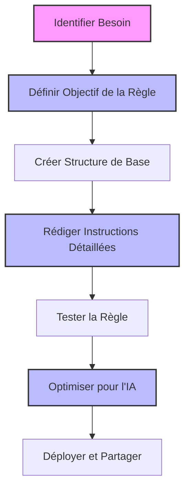
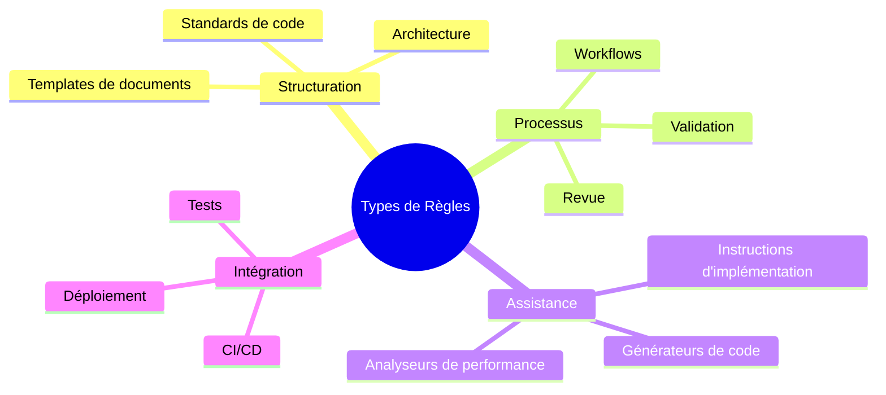
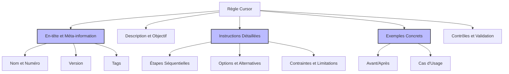
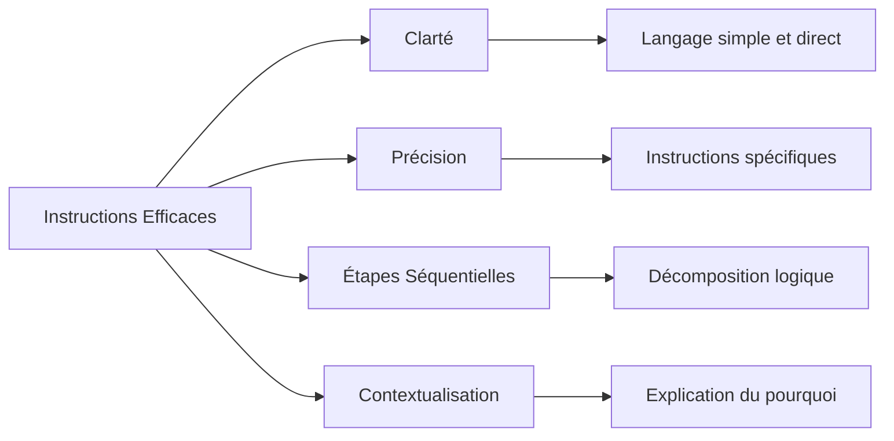
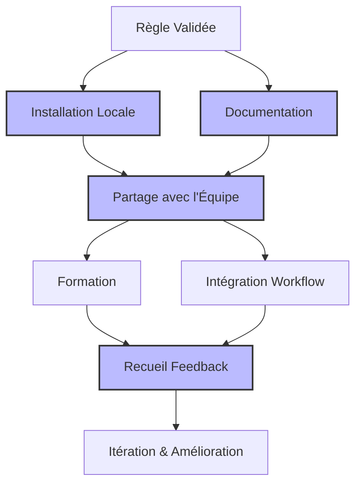

# Scénario 7: Création d'une Nouvelle Règle Cursor Personnalisée

## Objectif

Ce guide vous explique comment créer une nouvelle règle Cursor personnalisée pour répondre à des besoins spécifiques de votre équipe ou projet, et comment l'intégrer efficacement dans votre workflow de développement.

## Vue d'ensemble du processus



## 1. Identification du Besoin et Définition de l'Objectif

### Types de règles Cursor courants



### Questions à se poser

1. Quel problème spécifique cette règle va-t-elle résoudre?
2. Qui utilisera cette règle? (développeurs, testeurs, product owners, etc.)
3. Quand et comment la règle sera-t-elle déclenchée?
4. Quelles sont les informations nécessaires pour que l'IA comprenne et applique correctement la règle?
5. Comment mesurerez-vous l'efficacité de la règle?

## 2. Structure de Base d'une Règle Cursor



### Création du fichier de règle

```bash
# Créer un répertoire pour la règle si nécessaire
mkdir -p .cursor/rules

# Créer le fichier de règle avec un numéro d'identification unique
touch .cursor/rules/950-ma-regle-personnalisee.mdc
```

### Structure recommandée

```markdown
# 950: Titre de Ma Règle Personnalisée

<version>1.0.0</version>
<tags>catégorie, fonction, contexte</tags>
<déclencheurs>context_technique, nom_fichier.ext</déclencheurs>

> Résumé concis de la règle expliquant son objectif et son utilité.

## Contexte et Objectifs

Description détaillée du problème que cette règle résout et des bénéfices qu'elle apporte.

## Instructions

Instructions détaillées et claires que l'IA doit suivre lorsqu'elle applique cette règle.

## Exemples

Exemples concrets montrant l'application de la règle.

## Validation

Critères permettant de vérifier que la règle a été correctement appliquée.
```

## 3. Rédaction des Instructions Détaillées



### Conseils pour des instructions efficaces

1. **Soyez précis et direct**: Évitez le langage ambigu
2. **Structurez en étapes séquentielles**: Numérotez les étapes si possible
3. **Fournissez des exemples concrets**: Pour chaque point important
4. **Expliquez le "pourquoi"**: Aide l'IA à comprendre l'intention
5. **Anticipez les cas particuliers**: Et fournissez des instructions adaptées

### Exemple d'instructions bien structurées

```markdown
## Instructions pour générer un rapport de performance

1. **Analyser les métriques de performance**:

   - Examiner les temps de réponse moyens (valeurs cibles: <200ms)
   - Identifier les goulots d'étranglement (>500ms)
   - Vérifier la consommation de ressources (CPU, mémoire)

2. **Structurer le rapport**:

   - Créer un en-tête avec date, version, et environnement testé
   - Organiser les résultats par composant/service
   - Inclure un résumé exécutif au début
   - Terminer par des recommandations classées par priorité

3. **Formater les résultats**:

   - Utiliser des tableaux pour les comparaisons
   - Créer des graphiques pour les tendances
   - Mettre en évidence (bold) les valeurs hors des seuils acceptables
   - Ajouter des annotations pour expliquer les anomalies

4. **Formuler des recommandations**:
   - Proposer des solutions concrètes pour chaque problème identifié
   - Estimer l'impact de chaque solution (Élevé/Moyen/Faible)
   - Suggérer des modifications de code spécifiques lorsque possible
```

## 4. Exemple Concret: Création d'une Règle pour Rapports de Performance

### Fichier complet de la règle

````markdown
# 950: Rapport d'Analyse de Performance

<version>1.0.0</version>
<tags>performance, rapport, analyse</tags>
<déclencheurs>perf-report.md, performance-analysis.md</déclencheurs>

> Cette règle guide la création de rapports d'analyse de performance standardisés, assurant une documentation complète et actionnable des problèmes de performance et de leurs solutions.

## Contexte et Objectifs

Les analyses de performance sont essentielles pour maintenir la qualité du service, mais sont souvent documentées de manière incohérente. Cette règle standardise la structure et le contenu des rapports de performance pour:

- Assurer que toutes les métriques critiques sont analysées
- Permettre la comparaison facile entre différentes analyses
- Faciliter la prise de décision basée sur des données concrètes
- Accélérer la résolution des problèmes de performance

## Instructions

Lorsque vous créez ou mettez à jour un rapport d'analyse de performance, suivez cette structure:

1. **En-tête et résumé**:

   - Titre: "Analyse de Performance: [Système/Composant]"
   - Date de l'analyse: YYYY-MM-DD
   - Version testée: x.y.z
   - Environnement: DEV/STAGING/PROD
   - Résumé exécutif: 2-3 phrases synthétisant les conclusions principales

2. **Contexte du test**:

   - Configuration matérielle/cloud utilisée
   - Outils de test employés (JMeter, Lighthouse, etc.)
   - Scénarios testés (nombre d'utilisateurs, durée, etc.)
   - Conditions particulières à noter

3. **Tableau récapitulatif des métriques**:
   | Métrique | Valeur Actuelle | Valeur Cible | Écart | Statut |
   |----------|----------------|--------------|-------|--------|
   | Temps de réponse moyen | X ms | Y ms | Z% | 🟢/🟠/🔴 |
   | Temps de chargement page | X s | Y s | Z% | 🟢/🟠/🔴 |
   | Requêtes/sec | X | Y | Z% | 🟢/🟠/🔴 |
   | Utilisation CPU pic | X% | Y% | Z% | 🟢/🟠/🔴 |
   | Utilisation mémoire pic | X MB | Y MB | Z% | 🟢/🟠/🔴 |

4. **Analyse détaillée par composant**:
   Pour chaque composant présentant des problèmes:

   - Nom du composant
   - Description du problème observé
   - Métriques spécifiques
   - Causes probables
   - Capture d'écran ou graphique pertinent

5. **Diagramme de flux de performance**:
   ```mermaid
   flowchart LR
       A[Client] -->|X ms| B[API Gateway]
       B -->|Y ms| C[Service A]
       B -->|Z ms| D[Service B]
       C -->|W ms| E[Base de données]
       style D fill:#f99,stroke:#f00,stroke-width:2px
   ```
````

_Note: Mettre en évidence les composants problématiques avec un style différent_

6. **Recommandations**:
   | Problème | Recommandation | Impact Estimé | Complexité | Priorité |
   |----------|----------------|---------------|------------|----------|
   | [Description] | [Solution proposée] | Élevé/Moyen/Faible | Élevée/Moyenne/Faible | P1/P2/P3 |

7. **Plan d'action**:

   - Actions immédiates (pour la prochaine release)
   - Actions à moyen terme (dans les 2-3 sprints)
   - Actions futures (optimisations à considérer)

8. **Annexes**:
   - Logs pertinents
   - Configuration détaillée
   - Requêtes/code problématique
   - Liens vers les outils d'analyse

## Exemples

### Exemple d'analyse de goulot d'étranglement

```markdown
## Analyse détaillée: Service de Paiement

### Problème observé

Le service de paiement montre un temps de réponse moyen de 2.3s, dépassant la cible de 0.5s de 360%.

### Métriques spécifiques

- 95% des requêtes: >1.8s
- CPU: 85% d'utilisation constante
- DB Connection pool: 98% utilisé

### Causes probables

1. **Requêtes SQL non optimisées**: La requête de vérification de fraude parcourt une table non indexée
2. **Connexions DB non libérées**: Détectées 15 connexions zombies
3. **Timeout trop long**: Configuré à 5s, masquant les erreurs

### Graphique de performance

[Graphique montrant les pics de latence]

## Recommandations

| Problème            | Recommandation                                         | Impact | Complexité | Priorité |
| ------------------- | ------------------------------------------------------ | ------ | ---------- | -------- |
| Requêtes SQL lentes | Ajouter index sur colonnes (user_id, transaction_date) | Élevé  | Faible     | P1       |
| Connexions zombies  | Corriger fermeture dans TransactionManager.java:156    | Moyen  | Faible     | P1       |
| Timeouts trop longs | Réduire à 2s et implémenter circuit breaker            | Moyen  | Moyenne    | P2       |
```

## Validation

Un rapport conforme à cette règle doit:

- Contenir toutes les sections mentionnées
- Inclure des métriques quantitatives avec comparaisons aux valeurs cibles
- Présenter au moins un diagramme de flux illustrant les points de latence
- Fournir des recommandations concrètes classées par priorité
- Proposer un plan d'action clair et actionnable

````

## 5. Optimisation de la Règle pour l'IA

```mermaid
flowchart TD
    A[Optimisation pour l'IA] --> B[Clarté du Langage]
    A --> C[Exemples Variés]
    A --> D[Hiérarchisation]
    A --> E[Principes sur Détails]

    B --> B1[Éviter jargon ambigu]
    C --> C1[Couvrir cas typiques]
    D --> D1[Organiser par importance]
    E --> E1[Expliquer logique générale]

    style B fill:#bbf,stroke:#333,stroke-width:2px
    style C fill:#bbf,stroke:#333,stroke-width:2px
    style D fill:#bbf,stroke:#333,stroke-width:2px
    style E fill:#bbf,stroke:#333,stroke-width:2px
````

### Conseils pour améliorer la compréhension par l'IA

1. **Utilisez un langage précis et non ambigu**:

   - Préférez "toujours inclure A, B et C" à "inclure des éléments appropriés"
   - Évitez les expressions vagues comme "assez bon" ou "raisonnable"

2. **Structurez hiérarchiquement les informations**:

   - Mettez les informations les plus importantes en premier
   - Utilisez des titres de section clairs et descriptifs
   - Employez des listes à puces et numérotées pour les séquences

3. **Fournissez des exemples couvrant différents scénarios**:

   - Cas standard/typique
   - Cas particuliers et exceptions
   - Exemples de résultats incorrects à éviter

4. **Expliquez les principes plutôt que juste les détails**:

   - Décrivez "pourquoi" pas seulement "quoi"
   - Donnez le raisonnement derrière les règles

5. **Utilisez un format cohérent**:
   - Appliquez le même style tout au long du document
   - Utilisez des formatages (gras, italique) de manière cohérente

## 6. Test et Validation de la Règle

```mermaid
flowchart LR
    A[Règle Draft] --> B[Test Simple]
    B --> C{Résultat OK?}
    C -->|Non| D[Réviser]
    D --> B
    C -->|Oui| E[Test Avancé]
    E --> F{Résultat OK?}
    F -->|Non| D
    F -->|Oui| G[Règle Validée]

    style B fill:#bbf,stroke:#333,stroke-width:2px
    style E fill:#bbf,stroke:#333,stroke-width:2px
```

### Processus de test

1. **Test initial**:

   - Créez un document simple qui devrait déclencher la règle
   - Demandez à Cursor d'appliquer la règle
   - Vérifiez si le résultat correspond à vos attentes

2. **Identification des problèmes**:

   - L'IA a-t-elle compris l'objectif principal?
   - A-t-elle appliqué toutes les sections requises?
   - Les exemples générés sont-ils pertinents?

3. **Révision et amélioration**:

   - Clarifiez les instructions ambiguës
   - Ajoutez des exemples pour les cas mal interprétés
   - Renforcez les points importants mal appliqués

4. **Test approfondi**:
   - Testez avec différents scénarios
   - Simulez différents niveaux de complexité
   - Vérifiez la performance sur des documents existants

### Exemple de processus de test

```bash
# 1. Créer un document de test
echo "# Analyse de Performance: API de Paiement" > test-perf-report.md

# 2. Ouvrir dans l'éditeur et demander à Cursor d'appliquer la règle
# "Je veux créer un rapport d'analyse de performance pour notre API de paiement.
# Peux-tu m'aider en suivant notre format standardisé?"

# 3. Évaluer le résultat et itérer sur la règle
```

## 7. Déploiement et Partage de la Règle



### Installation de la règle

```bash
# Installation individuelle
cp 950-ma-regle-personnalisee.mdc ~/.cursor/rules/

# Installation pour un projet
cp 950-ma-regle-personnalisee.mdc .cursor/rules/
git add .cursor/rules/950-ma-regle-personnalisee.mdc
git commit -m "Ajout d'une nouvelle règle Cursor pour [fonctionnalité]"
git push
```

### Documentation et formation

1. **Créez une documentation claire**:

   - Dans un wiki, README ou document partagé
   - Expliquez quand et comment utiliser la règle
   - Fournissez des exemples de cas d'utilisation

2. **Formez votre équipe**:

   - Présentez la règle lors d'une réunion d'équipe
   - Démontrez son utilisation en temps réel
   - Répondez aux questions et préoccupations

3. **Encouragez l'adoption**:
   - Intégrez la règle dans les workflows existants
   - Créez des modèles de démarrage
   - Désignez des "champions" pour aider les autres

### Recueil de feedback et amélioration

1. **Établissez un mécanisme de feedback**:

   - Créez un canal Slack/Teams dédié
   - Ajoutez un point d'agenda aux réunions de sprint
   - Mettez en place un formulaire de feedback

2. **Itérez régulièrement**:
   - Planifiez des révisions périodiques
   - Mettez à jour la règle en fonction du feedback
   - Communiquez clairement les changements

## 8. Exemples de Règles Cursor Populaires

### Règle pour la Génération de Tests

```markdown
# 960: Générateur de Tests Unitaires

<version>1.1.0</version>
<tags>tests, qualité, développement</tags>
<déclencheurs>_.test.js, _.spec.ts</déclencheurs>

> Guide pour générer des tests unitaires complets et efficaces pour les fonctions JavaScript/TypeScript.

## Instructions

Lorsque vous créez des tests unitaires:

1. **Structure du fichier de test**:

   - Importez les dépendances nécessaires (framework de test, module à tester)
   - Groupez les tests dans des blocs `describe` par fonctionnalité
   - Utilisez des blocs `it` ou `test` descriptifs pour chaque cas de test

2. **Couverture des tests**:

   - Cas nominal (entrées valides attendues)
   - Cas limites (valeurs aux limites)
   - Cas d'erreur (entrées invalides, exceptions)
   - Cas d'intégration (interaction avec d'autres modules si nécessaire)

3. **Format AAA (Arrange-Act-Assert)**:

   - Arrange: préparez les données et conditions pour le test
   - Act: exécutez la fonction/méthode à tester
   - Assert: vérifiez que le résultat correspond à l'attendu

4. **Mocks et stubs**:
   - Isolez l'unité testée en mockant les dépendances externes
   - Définissez clairement le comportement attendu des mocks
   - Vérifiez les interactions avec les mocks si nécessaire
```

### Règle pour les Code Reviews

```markdown
# 970: Guide de Code Review

<version>1.0.0</version>
<tags>revue, qualité, collaboration</tags>
<déclencheurs>PULL_REQUEST.md, REVIEW.md</déclencheurs>

> Guide pour effectuer des code reviews constructives et complètes.

## Instructions

Lors de la revue de code, examinez systématiquement:

1. **Qualité du code**:

   - Lisibilité et clarté
   - Respect des conventions de nommage
   - Modularité et responsabilité unique
   - Duplication minimale (DRY)

2. **Correctness**:

   - Exactitude fonctionnelle (répond aux exigences)
   - Gestion des cas limites
   - Gestion des erreurs appropriée
   - Sécurité (validation d'entrée, protection contre injections)

3. **Performance**:

   - Complexité algorithmique
   - Opérations coûteuses (I/O, réseau)
   - Utilisation mémoire
   - Opportunités d'optimisation

4. **Testabilité**:

   - Couverture de tests adéquate
   - Qualité des tests (arrangés selon AAA)
   - Mocks appropriés pour isoler les unités testées

5. **Format du feedback**:
   - Commencez par les points positifs
   - Organisez les commentaires par importance
   - Expliquez le "pourquoi" pas seulement le "quoi"
   - Suggérez des solutions concrètes
   - Distinguez clairement problèmes bloquants et suggestions d'amélioration
```

## Récapitulatif

La création de règles Cursor personnalisées vous permet de:

- Standardiser les pratiques et processus spécifiques à votre équipe
- Automatiser les tâches répétitives de documentation et de revue
- Améliorer la qualité et la cohérence de votre code et documentation
- Faciliter l'intégration de nouveaux membres dans l'équipe
- Capitaliser sur l'expertise collective

Points clés à retenir:

1. Définissez clairement l'objectif et la portée de chaque règle
2. Structurez vos instructions de manière logique et séquentielle
3. Fournissez des exemples concrets pour guider l'application
4. Optimisez le contenu pour la compréhension par l'IA
5. Testez et itérez pour affiner l'efficacité
6. Documentez et partagez pour maximiser l'adoption

En suivant ce processus, vous créerez des règles personnalisées qui amélioreront considérablement l'efficacité et la qualité de votre workflow de développement.
