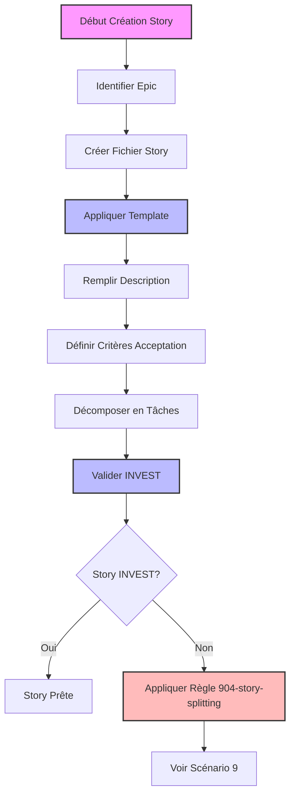
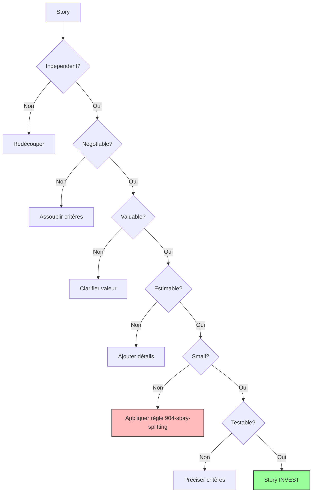
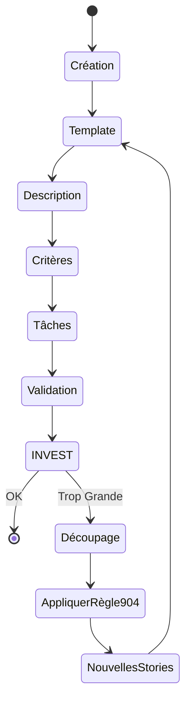

# Scénario 8: Utilisation du Template de User Story

## Objectif

Ce guide vous accompagne dans l'utilisation du template standardisé de user story pour garantir la cohérence et la qualité des stories dans votre projet agile.

## Vue d'ensemble du processus



## 1. Structure du Template

Le template de story standardisé suit une structure précise:

```markdown
# Titre de la Story

Epic-X: Nom de l'Epic
Story-Y: Nom Court de la Story

## Description de la Story

**En tant que** [type d'utilisateur]
**Je veux** [objectif]
**afin de** [bénéfice]

## Statut

[Draft/In Progress/Review/Done]

## Contexte

[Contexte métier et technique pertinent]

## Estimation

Story Points: [nombre]

## Critères d'Acceptation

1. Étant donné [contexte], quand [action], alors [résultat attendu]
2. ...

## Tâches

1. - [ ] Tâche principale
   1. - [ ] Sous-tâche 1
   2. - [ ] Sous-tâche 2
2. - [ ] Tâche secondaire
   1. - [ ] Sous-tâche 1

## Notes de Développement

[Notes techniques, contraintes, dépendances]
```

## 2. Création d'une Nouvelle Story

### Structure de répertoires

Organisez vos stories par epic dans le répertoire `.ai`:

```bash
mkdir -p .ai/epic-{numéro}
touch .ai/epic-{numéro}/{numéro}-{nom-court}.story.md
```

### Exemple de création

```bash
# Créer un dossier pour l'epic d'authentification
mkdir -p .ai/epic-1
# Créer le fichier de la story
touch .ai/epic-1/1-connexion-utilisateur.story.md
```

## 3. Application du Template

1. **Ouvrez le fichier** dans votre éditeur
2. **Demandez à Cursor d'initialiser le template**:
   ```
   Je souhaite créer une nouvelle story pour la connexion utilisateur.
   Peux-tu initialiser le fichier avec le template standardisé?
   ```
3. **Cursor détectera** automatiquement que vous travaillez sur une story et appliquera le template `903-story-template-standardized`

## 4. Remplissage du Template

### Description de la Story

La description doit suivre le format "En tant que/Je veux/afin de":

```markdown
**En tant que** utilisateur non authentifié
**Je veux** pouvoir me connecter avec mon email et mot de passe
**afin de** accéder à mes données personnelles
```

### Critères d'Acceptation

Utilisez le format "Étant donné/quand/alors":

```markdown
1. Étant donné un utilisateur enregistré
   quand il saisit des identifiants valides
   alors il est connecté et redirigé vers la page d'accueil

2. Étant donné un utilisateur
   quand il saisit un email non enregistré
   alors un message d'erreur approprié s'affiche
```

### Décomposition en Tâches

Structurez les tâches de manière hiérarchique:

```markdown
1. - [ ] Frontend
   1. - [ ] Créer le formulaire de connexion
   2. - [ ] Implémenter la validation des champs
   3. - [ ] Gérer les messages d'erreur
2. - [ ] Backend
   1. - [ ] Créer l'endpoint d'authentification
   2. - [ ] Implémenter la validation des identifiants
   3. - [ ] Générer le token JWT
```

## 5. Validation INVEST

Vérifiez que votre story respecte les critères INVEST:



### Checklist INVEST

- [ ] **Independent**: Peut être développée indépendamment des autres stories
- [ ] **Negotiable**: Les détails peuvent être discutés et ajustés
- [ ] **Valuable**: Apporte une valeur métier claire
- [ ] **Estimable**: L'équipe peut estimer l'effort nécessaire
- [ ] **Small**: Réalisable dans un sprint
- [ ] **Testable**: Critères d'acceptation clairs et vérifiables

> ⚠️ **Attention**: Si votre story ne respecte pas le critère "Small" (plus de 8 points, plus de 5 critères d'acceptation, etc.), appliquez la règle `904-story-splitting-standardized.mdc` pour la découper en stories plus petites. Voir le [Scénario 9](scenario-9-story-splitting-workflow.md) pour le processus détaillé.

## 6. Exemples Complets

### Exemple 1: Story Simple

```markdown
# Connexion Utilisateur

Epic-1: Système d'Authentification
Story-1: Connexion Utilisateur

## Description de la Story

**En tant que** utilisateur non authentifié
**Je veux** pouvoir me connecter avec mon email et mot de passe
**afin de** accéder à mes données personnelles

## Statut

Draft

## Contexte

Cette story fait partie de l'epic d'authentification et constitue
la fonctionnalité de base pour accéder à l'application.

## Estimation

Story Points: 3

## Critères d'Acceptation

1. Étant donné un utilisateur enregistré
   quand il saisit des identifiants valides
   alors il est connecté et redirigé vers la page d'accueil

2. Étant donné un utilisateur
   quand il saisit un email non enregistré
   alors un message d'erreur approprié s'affiche

3. Étant donné un utilisateur
   quand il saisit un mot de passe incorrect
   alors un message d'erreur approprié s'affiche

## Tâches

1. - [ ] Frontend
   1. - [ ] Créer le formulaire de connexion
   2. - [ ] Implémenter la validation des champs
   3. - [ ] Gérer les messages d'erreur
2. - [ ] Backend
   1. - [ ] Créer l'endpoint d'authentification
   2. - [ ] Implémenter la validation des identifiants
   3. - [ ] Générer le token JWT

## Notes de Développement

- Utiliser JWT pour l'authentification
- Stocker le token en localStorage
- Durée de validité du token: 24h
```

### Exemple 2: Story Nécessitant un Découpage

```markdown
# Gestion du Profil Utilisateur

Epic-1: Système d'Authentification
Story-2: Gestion Profil Utilisateur

## Description de la Story

**En tant que** utilisateur authentifié
**Je veux** pouvoir gérer mon profil utilisateur
**afin de** maintenir mes informations à jour

## Statut

Draft

## Contexte

Cette story permet aux utilisateurs de gérer leurs informations personnelles
après la création de leur compte.

## Estimation

Story Points: 13 ⚠️

## Critères d'Acceptation

1. Étant donné un utilisateur authentifié
   quand il accède à son profil
   alors il voit toutes ses informations personnelles

2. Étant donné un utilisateur authentifié
   quand il modifie ses informations
   alors les changements sont sauvegardés

3. Étant donné un utilisateur authentifié
   quand il change son mot de passe
   alors le nouveau mot de passe est enregistré

4. Étant donné un utilisateur authentifié
   quand il ajoute une photo de profil
   alors l'image est redimensionnée et sauvegardée

5. Étant donné un utilisateur authentifié
   quand il configure ses préférences de notification
   alors ses préférences sont appliquées

6. Étant donné un utilisateur authentifié
   quand il supprime son compte
   alors toutes ses données sont effacées

## Tâches

1. - [ ] Frontend
   1. - [ ] Créer la page de profil
   2. - [ ] Implémenter le formulaire d'édition
   3. - [ ] Ajouter l'upload de photo
   4. - [ ] Créer l'interface de préférences
   5. - [ ] Gérer la suppression de compte
2. - [ ] Backend
   1. - [ ] Créer les endpoints CRUD
   2. - [ ] Implémenter le stockage des images
   3. - [ ] Gérer les préférences utilisateur
   4. - [ ] Développer la suppression de compte

## Notes de Développement

⚠️ Cette story est trop volumineuse selon les critères INVEST.
Appliquez la règle `904-story-splitting-standardized.mdc` pour découper cette story.
Voir le scénario 9 pour le processus détaillé de découpage.
```

## 7. Bonnes Pratiques

1. **Nommage des fichiers**

   - Format: `{numéro}-{nom-court}.story.md`
   - Exemple: `1-connexion-utilisateur.story.md`

2. **Description**

   - Utilisez des verbes d'action
   - Soyez spécifique sur le bénéfice
   - Évitez le jargon technique

3. **Critères d'Acceptation**

   - 3-5 critères par story
   - Format Gherkin: Étant donné/quand/alors
   - Testables et mesurables

4. **Tâches**

   - Granularité fine (2-4h par tâche)
   - Organisation hiérarchique
   - Inclure les tests

5. **Estimation**
   - Utiliser les story points
   - Réévaluer si > 8 points
   - Noter les incertitudes

## 8. Résolution des Problèmes Courants

### Story Trop Grande

Si votre story dépasse 8 points ou a plus de 5 critères d'acceptation:

1. Notez l'avertissement dans les Notes de Développement
2. Appliquez la règle `904-story-splitting-standardized.mdc` pour découper la story
3. Référez-vous au [scénario 9](scenario-9-story-splitting-workflow.md) pour le processus détaillé
4. Créez de nouvelles stories plus petites en suivant le workflow de découpage

> 📌 **Conseil**: La règle `904-story-splitting-standardized.mdc` fournit 15 patterns de découpage différents adaptés à divers types de stories. Choisissez le pattern le plus approprié à votre contexte.

### Critères d'Acceptation Flous

Pour améliorer des critères peu clairs:

1. Utilisez le format Gherkin strict
2. Ajoutez des exemples concrets
3. Spécifiez les valeurs attendues

### Tâches Mal Définies

Pour améliorer la définition des tâches:

1. Décomposez en sous-tâches de 2-4h
2. Incluez les tests explicitement
3. Spécifiez les dépendances

## 9. Workflow Complet



## 10. Résumé

Le template de story standardisé assure:

1. **Cohérence** dans la documentation
2. **Clarté** des exigences
3. **Traçabilité** des besoins
4. **Validation** via INVEST
5. **Intégration** avec le découpage si nécessaire via la règle `904-story-splitting-standardized.mdc`

### Commandes Utiles

```bash
# Créer une nouvelle epic
mkdir -p .ai/epic-1

# Créer une nouvelle story
touch .ai/epic-1/1-connexion-utilisateur.story.md

# Vérifier la structure
tree .ai
```

---

Pour aller plus loin:

- [Découpage de Stories avec la règle 904](scenario-9-story-splitting-workflow.md)
- [Workflow Agile](scenario-1-premiere-utilisation.md)
- [Validation de Documentation](scenario-4-validation-documentation.md)
