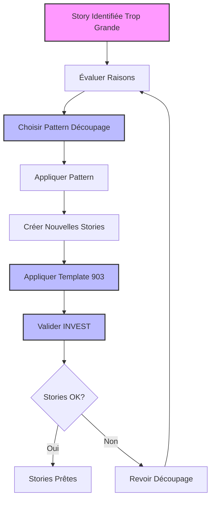
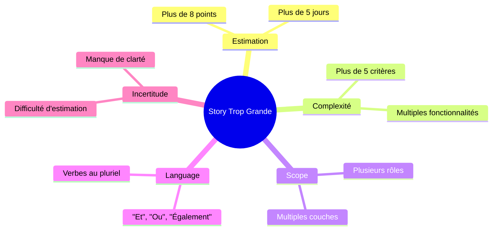
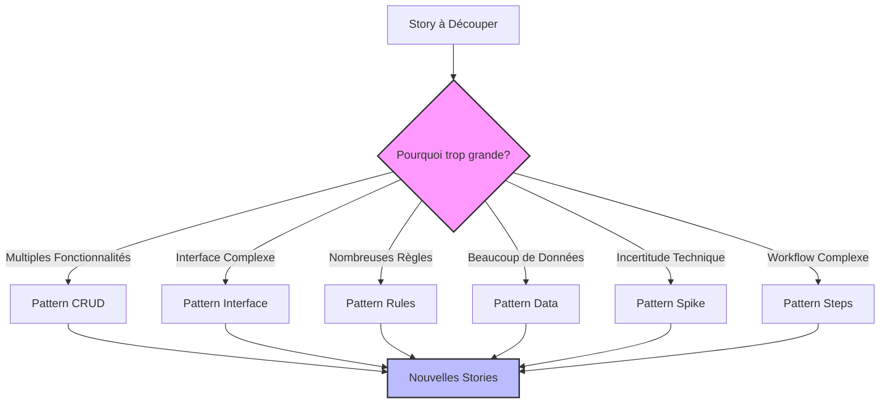
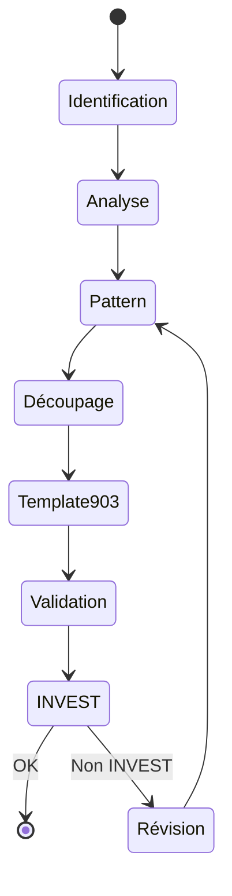

# Scénario 9: Workflow de Découpage des Stories

## Objectif

Ce guide vous accompagne dans le processus de découpage des user stories trop volumineuses en stories plus petites et indépendantes, tout en maintenant la cohérence avec le template standardisé.

## Vue d'ensemble du processus



## 1. Identification des Stories à Découper

### Indicateurs d'une Story Trop Volumineuse



### Exemple d'Identification

```markdown
# Gestion des Utilisateurs ⚠️

## Estimation

Story Points: 13 (Trop grand!)

## Critères d'Acceptation

1. Créer des utilisateurs
2. Modifier les profils
3. Gérer les rôles
4. Configurer les permissions
5. Supprimer les comptes
6. Gérer les préférences
7. Exporter les données

⚠️ Indicateurs de découpage nécessaire:

- Plus de 8 points
- Plus de 5 critères d'acceptation
- Verbes au pluriel ("gérer", "configurer")
- Multiple fonctionnalités
```

## 2. Sélection du Pattern de Découpage

### Arbre de Décision



### Patterns Disponibles

1. **SPIDR (Mike Cohn)**

   - **S**pike: Investigation technique
   - **P**ath: Chemins utilisateur
   - **I**nterface: Types d'interface
   - **D**ata: Types de données
   - **R**ules: Règles métier

2. **Patterns Complémentaires**
   - Opérations CRUD
   - Étapes de workflow
   - Variations fonctionnelles
   - Performance différée
   - Réduction d'effort

## 3. Application du Pattern

### Définitions des Patterns de Découpage

#### Pattern CRUD (Create, Read, Update, Delete)

**Définition**: Découpe une story de "gestion" en opérations atomiques de création, lecture, modification et suppression.  
**Quand l'utiliser**: Pour les stories impliquant la gestion complète d'une entité ou ressource.  
**Avantages**: Chaque opération apporte une valeur métier distincte et peut être développée indépendamment.

#### Pattern Interface

**Définition**: Découpe une story par niveaux de complexité d'interface ou types d'interaction.  
**Quand l'utiliser**: Pour les stories avec des interfaces utilisateur complexes ou multiples.  
**Avantages**: Permet de livrer rapidement une interface minimale fonctionnelle puis de l'enrichir.

#### Pattern Path (Chemins)

**Définition**: Découpe une story par scénarios ou chemins utilisateur alternatifs.  
**Quand l'utiliser**: Pour les stories avec plusieurs flux d'utilisation ou cas d'erreur.  
**Avantages**: Permet de se concentrer d'abord sur le "happy path" puis d'ajouter les cas alternatifs.

#### Pattern Data (Données)

**Définition**: Découpe une story par types ou ensembles de données traités.  
**Quand l'utiliser**: Pour les stories manipulant plusieurs types de données ou formats.  
**Avantages**: Simplifie la complexité en traitant un sous-ensemble de données à la fois.

#### Pattern Rules (Règles)

**Définition**: Découpe une story par règles métier ou validations.  
**Quand l'utiliser**: Pour les stories avec de nombreuses règles métier ou validations.  
**Avantages**: Permet d'implémenter d'abord les règles essentielles puis d'ajouter les règles complexes.

#### Pattern Spike (Exploration)

**Définition**: Extrait une activité d'investigation technique ou métier en une story séparée.  
**Quand l'utiliser**: Face à des incertitudes techniques ou métier significatives.  
**Avantages**: Réduit les risques en explorant les zones d'incertitude avant l'implémentation.

#### Pattern Steps (Étapes de Workflow)

**Définition**: Découpe un processus en étapes distinctes qui peuvent être implémentées séparément.  
**Quand l'utiliser**: Pour les stories décrivant un workflow ou processus multi-étapes.  
**Avantages**: Permet de livrer un workflow simplifié puis de l'enrichir progressivement.

#### Pattern Variations (Fonctionnelles)

**Définition**: Sépare les fonctionnalités de base des variations ou options avancées.  
**Quand l'utiliser**: Pour les stories avec des fonctionnalités de base et avancées.  
**Avantages**: Permet de livrer rapidement les fonctionnalités essentielles puis d'ajouter les options.

#### Pattern Performance (Différée)

**Définition**: Sépare la fonctionnalité de base de ses exigences de performance.  
**Quand l'utiliser**: Pour les stories avec des exigences de performance strictes.  
**Avantages**: Permet de valider d'abord la fonctionnalité puis d'optimiser les performances.

#### Pattern Effort (Réduction)

**Définition**: Identifie et isole les parties nécessitant le plus d'effort pour les traiter séparément.  
**Quand l'utiliser**: Pour les stories avec des composants à effort très variable.  
**Avantages**: Permet de livrer rapidement les parties simples à haute valeur.

### Exemples d'Application

#### Exemple: Pattern CRUD

Story originale trop grande:

```markdown
# Gestion du Profil Utilisateur

## Description

**En tant que** utilisateur
**Je veux** gérer mon profil
**afin de** maintenir mes informations à jour

## Estimation

Story Points: 13 ⚠️
```

Découpage en stories CRUD:

```markdown
# Story 1: Consultation du Profil

## Description

**En tant que** utilisateur
**Je veux** voir mon profil
**afin de** vérifier mes informations

## Estimation

Story Points: 2

---

# Story 2: Modification du Profil

## Description

**En tant que** utilisateur
**Je veux** modifier mes informations personnelles
**afin de** les maintenir à jour

## Estimation

Story Points: 3

---

# Story 3: Suppression du Profil

## Description

**En tant que** utilisateur
**Je veux** supprimer mon compte
**afin de** retirer mes données du système

## Estimation

Story Points: 3
```

#### Exemple: Pattern Interface

Story originale trop grande:

```markdown
# Interface de Recherche Avancée

## Description

**En tant que** utilisateur
**Je veux** rechercher des produits avec des filtres avancés
**afin de** trouver exactement ce que je cherche

## Estimation

Story Points: 13 ⚠️
```

Découpage par interface:

```markdown
# Story 1: Recherche Simple

## Description

**En tant que** utilisateur
**Je veux** rechercher par mot-clé
**afin de** trouver rapidement des produits

## Estimation

Story Points: 3

---

# Story 2: Filtres de Base

## Description

**En tant que** utilisateur
**Je veux** filtrer par catégorie et prix
**afin d'affiner** ma recherche

## Estimation

Story Points: 3

---

# Story 3: Filtres Avancés

## Description

**En tant que** utilisateur
**Je veux** utiliser des filtres avancés
**afin de** faire une recherche précise

## Estimation

Story Points: 5
```

#### Exemple: Pattern Path

Story originale trop grande:

```markdown
# Processus de Paiement

## Description

**En tant que** client
**Je veux** finaliser mon achat avec différentes méthodes de paiement
**afin de** compléter ma commande selon mes préférences

## Estimation

Story Points: 13 ⚠️
```

Découpage par chemins:

```markdown
# Story 1: Paiement par Carte Bancaire (Happy Path)

## Description

**En tant que** client
**Je veux** payer par carte bancaire
**afin de** finaliser rapidement ma commande

## Estimation

Story Points: 5

---

# Story 2: Paiement par PayPal

## Description

**En tant que** client
**Je veux** payer via PayPal
**afin d'** utiliser mon compte PayPal existant

## Estimation

Story Points: 3

---

# Story 3: Gestion des Erreurs de Paiement

## Description

**En tant que** client
**Je veux** être informé des problèmes de paiement
**afin de** pouvoir les résoudre

## Estimation

Story Points: 5
```

#### Exemple: Pattern Rules

Story originale trop grande:

```markdown
# Validation des Commandes

## Description

**En tant que** gestionnaire
**Je veux** valider les commandes selon plusieurs critères
**afin d'** assurer leur conformité

## Estimation

Story Points: 13 ⚠️
```

Découpage par règles:

```markdown
# Story 1: Validation de Base des Commandes

## Description

**En tant que** gestionnaire
**Je veux** vérifier les informations essentielles des commandes
**afin d'** assurer leur validité minimale

## Estimation

Story Points: 3

---

# Story 2: Validation des Limites de Crédit

## Description

**En tant que** gestionnaire
**Je veux** vérifier les limites de crédit des clients
**afin d'** éviter les risques financiers

## Estimation

Story Points: 5

---

# Story 3: Validation des Restrictions Géographiques

## Description

**En tant que** gestionnaire
**Je veux** vérifier les restrictions d'expédition par zone
**afin de** respecter les contraintes réglementaires

## Estimation

Story Points: 5
```

## 4. Création des Nouvelles Stories

### Structure de Répertoires

```bash
.ai/
└── epic-1/
    ├── 1-profil-consultation.story.md
    ├── 2-profil-modification.story.md
    └── 3-profil-suppression.story.md
```

### Application du Template

Pour chaque story découpée:

1. **Créer le fichier**:

   ```bash
   touch .ai/epic-1/1-profil-consultation.story.md
   ```

2. **Demander à Cursor d'appliquer le template**:

   ```
   Je souhaite créer une nouvelle story pour la consultation du profil utilisateur,
   issue du découpage de la story de gestion de profil.
   Peux-tu initialiser le fichier avec le template standardisé?
   ```

3. **Remplir le template** selon la règle `903-story-template-standardized`

## 5. Validation INVEST

### Checklist par Story

Pour chaque story résultante:

```markdown
## Validation INVEST

- [ ] Independent

  - La story peut être développée indépendamment
  - Pas de dépendances bloquantes

- [ ] Negotiable

  - Les détails d'implémentation sont flexibles
  - La solution n'est pas trop contrainte

- [ ] Valuable

  - Apporte une valeur métier claire
  - Utilisable seule

- [ ] Estimable

  - L'équipe peut estimer avec confiance
  - Scope clair et compréhensible

- [ ] Small

  - Réalisable en un sprint
  - < 8 points de story

- [ ] Testable
  - Critères d'acceptation clairs
  - Tests automatisables
```

### Exemple de Validation

```markdown
# Consultation du Profil

## Validation INVEST

- [x] Independent
      ✓ Peut être développée sans modification du profil
      ✓ Utilise les données existantes

- [x] Negotiable
      ✓ Format d'affichage flexible
      ✓ Ordre des informations adaptable

- [x] Valuable
      ✓ Utilisateurs peuvent voir leurs données
      ✓ Base pour d'autres fonctionnalités

- [x] Estimable
      ✓ Interface de lecture simple
      ✓ Pas de logique complexe

- [x] Small
      ✓ 2 points de story
      ✓ Un seul écran

- [x] Testable
      ✓ Vérification des données affichées
      ✓ Tests d'interface utilisateur
```

## 6. Workflow Détaillé



### Étapes du Workflow

1. **Identification**

   - Repérer les indicateurs de taille excessive
   - Documenter les raisons du découpage

2. **Analyse**

   - Comprendre la complexité
   - Identifier les composants indépendants

3. **Choix du Pattern**

   - Sélectionner le pattern approprié
   - Planifier le découpage

4. **Découpage**

   - Appliquer le pattern choisi
   - Créer les nouvelles stories

5. **Application Template**

   - Utiliser `903-story-template-standardized`
   - Remplir tous les champs requis

6. **Validation**
   - Vérifier les critères INVEST
   - Ajuster si nécessaire

## 7. Exemples Complets

### Exemple: Découpage d'une Story de Reporting

Story originale:

```markdown
# Génération de Rapports d'Activité

## Description

**En tant que** manager
**Je veux** générer des rapports d'activité
**afin de** suivre la performance de l'équipe

## Estimation

Story Points: 21 ⚠️

## Critères d'Acceptation

1. Générer des rapports quotidiens
2. Générer des rapports hebdomadaires
3. Générer des rapports mensuels
4. Exporter en PDF
5. Exporter en Excel
6. Envoyer par email
7. Programmer des envois automatiques
```

Découpage par type de rapport:

```markdown
# Story 1: Rapport Quotidien Basic

## Description

**En tant que** manager
**Je veux** voir les métriques du jour
**afin de** suivre l'activité quotidienne

## Estimation

Story Points: 5

## Critères d'Acceptation

1. Afficher les métriques clés du jour
2. Exporter en PDF
3. Actualisation toutes les heures

---

# Story 2: Rapport Hebdomadaire

## Description

**En tant que** manager
**Je veux** analyser les tendances hebdomadaires
**afin de** ajuster les objectifs

## Estimation

Story Points: 5

## Critères d'Acceptation

1. Agréger les données sur 7 jours
2. Calculer les tendances
3. Exporter en Excel

---

# Story 3: Automatisation des Rapports

## Description

**En tant que** manager
**Je veux** programmer l'envoi de rapports
**afin d'** automatiser le suivi

## Estimation

Story Points: 5

## Critères d'Acceptation

1. Définir la fréquence d'envoi
2. Choisir le format
3. Configurer les destinataires
```

## 8. Bonnes Pratiques

### Principes de Découpage

1. **Valeur d'abord**

   - Chaque story doit apporter une valeur métier
   - Éviter le découpage purement technique

2. **Indépendance**

   - Minimiser les dépendances entre stories
   - Permettre le développement parallèle

3. **Progression logique**

   - Commencer par les fonctionnalités core
   - Ajouter les améliorations progressivement

4. **Clarté**
   - Descriptions précises
   - Critères d'acceptation spécifiques

### À Éviter

1. **Découpage horizontal**

   ```markdown
   ❌ Story 1: "Créer les tables de la base de données"
   ❌ Story 2: "Développer l'API"
   ❌ Story 3: "Créer l'interface utilisateur"
   ```

2. **Dépendances en cascade**
   ```markdown
   ❌ Story 1: "Créer le système de base"
   ❌ Story 2: "Ajouter les fonctionnalités" (dépend de 1)
   ❌ Story 3: "Optimiser les performances" (dépend de 2)
   ```

### Recommandé

1. **Découpage vertical**

   ```markdown
   ✅ Story 1: "Consulter son profil (lecture seule)"
   ✅ Story 2: "Modifier ses informations de base"
   ✅ Story 3: "Gérer ses préférences avancées"
   ```

2. **Progression indépendante**
   ```markdown
   ✅ Story 1: "Recherche simple par mot-clé"
   ✅ Story 2: "Filtres de catégories"
   ✅ Story 3: "Recherche avancée avec combinaison de filtres"
   ```

## 9. Résolution des Problèmes Courants

### Dépendances Persistantes

Si des dépendances subsistent après le découpage:

1. **Documenter** explicitement les dépendances
2. **Regrouper** les stories fortement couplées
3. **Revoir** le découpage si nécessaire

### Stories Encore Trop Grandes

Si une story reste trop grande après un premier découpage:

1. **Appliquer** un second pattern de découpage
2. **Simplifier** la première itération
3. **Reporter** les fonctionnalités complexes

### Perte de Cohérence

Pour maintenir la cohérence après le découpage:

1. **Référencer** la story originale
2. **Maintenir** une progression logique
3. **Valider** la couverture fonctionnelle

## 10. Résumé

Le workflow de découpage assure:

1. **Identification** précise des stories à découper
2. **Sélection** du pattern approprié
3. **Application** cohérente avec le template
4. **Validation** via critères INVEST
5. **Maintien** de la valeur métier

### Commandes Utiles

```bash
# Créer les fichiers pour les stories découpées
mkdir -p .ai/epic-1
touch .ai/epic-1/{1..3}-profil-{consultation,modification,suppression}.story.md

# Vérifier la structure
tree .ai/epic-1
```

---

Pour aller plus loin:

- [Template de Story](scenario-8-creation-story-template.md)
- [Workflow Agile](scenario-1-premiere-utilisation.md)
- [Validation de Documentation](scenario-4-validation-documentation.md)
