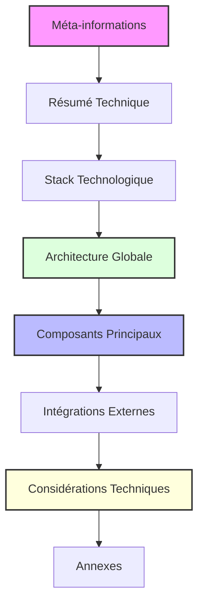
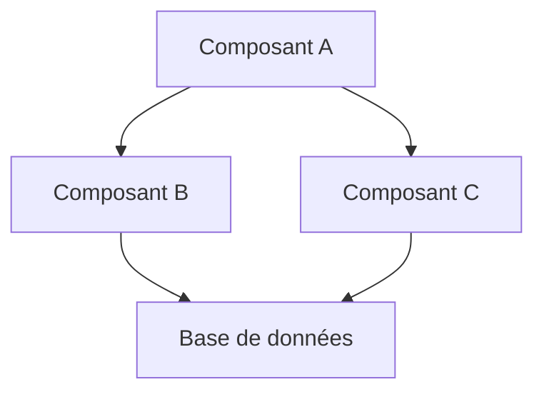
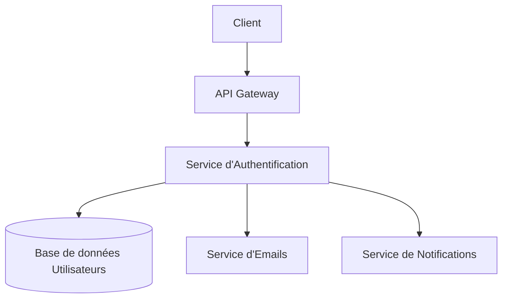

# 📐 Template de Document d'Architecture

## 📋 Vue d'Ensemble

Ce template définit la structure standard pour documenter l'architecture technique d'un projet. Il permet de capturer clairement les décisions techniques, les choix technologiques et la structure du système à développer.

> 💡 **Note importante**: Le document d'architecture doit être élaboré après l'approbation du PRD et doit être lui-même approuvé avant le début de l'implémentation.

## 🎯 Objectifs

- Documenter clairement les décisions d'architecture du projet
- Fournir une vision technique globale du système
- Définir les standards techniques et les conventions
- Anticiper les défis techniques et proposer des solutions
- Faciliter la compréhension de la structure du système pour toute l'équipe

## 🔄 Structure du Document d'Architecture

## 📝 Sections Requises

### 1️⃣ Méta-informations

- **Titre**: "Architecture pour {projet}"
- **Statut**: Draft / Approved
- **Version**: X.Y.Z
- **Date de dernière mise à jour**: YYYY-MM-DD
- **Auteur(s)**: Noms des responsables
- **Approbateurs**: Personnes devant approuver le document

### 2️⃣ Résumé Technique

Résumé concis (1-2 paragraphes) de l'approche architecturale globale, incluant:

- Vision technique générale
- Principes directeurs
- Contraintes principales
- Particularités notables

### 3️⃣ Stack Technologique

Table détaillée des choix technologiques:

| Catégorie       | Technologie   | Description/Justification |
| :-------------- | :------------ | :------------------------ |
| Backend         | {technologie} | {justification}           |
| Frontend        | {technologie} | {justification}           |
| Base de données | {technologie} | {justification}           |
| Infrastructure  | {technologie} | {justification}           |
| CI/CD           | {technologie} | {justification}           |
| Monitoring      | {technologie} | {justification}           |

### 4️⃣ Architecture Globale

Présentation de l'architecture globale du système:

Accompagnée d'une explication textuelle de:

- La structure générale
- Les flux de données principaux
- Les patterns architecturaux utilisés (Microservices, Monolithique, etc.)

### 5️⃣ Composants Principaux

Pour chaque composant majeur du système:

- **Nom et objectif**: Description du rôle
- **Responsabilités**: Fonctionnalités principales
- **Interfaces**: Points d'entrée/sortie
- **Dépendances**: Autres composants requis
- **Considérations spéciales**: Sécurité, performance, etc.

### 6️⃣ Intégrations Externes

Pour chaque système externe avec lequel le système interagit:

- **Système**: Nom du système externe
- **Type d'intégration**: API, Base de données, File system, etc.
- **Protocole**: REST, GraphQL, etc.
- **Flux de données**: Description des données échangées
- **Considérations**: Authentification, limites, etc.

### 7️⃣ Considérations Techniques

Sections dédiées aux considérations techniques spécifiques:

- **Sécurité**: Stratégies d'authentification, autorisation, etc.
- **Performance**: Stratégies de mise en cache, optimisations, etc.
- **Scalabilité**: Approches pour le scaling horizontal/vertical
- **Résilience**: Gestion des erreurs, retries, circuit breakers
- **Monitoring**: Stratégies de logging, métriques, alertes

### 8️⃣ Annexes

- **Décisions d'Architecture (ADRs)**: Décisions majeures avec justifications
- **Diagrammes détaillés**: Diagrammes de séquence, modèles de données, etc.
- **Références**: Liens vers les ressources techniques pertinentes
- **Glossaire**: Termes techniques spécifiques au projet

## 💡 Exemples

<example>
**Bon exemple de description de composant**:

### 5.1 Service d'Authentification

**Nom et objectif**: Service responsable de la gestion des identités utilisateurs, de l'authentification et de l'autorisation.

**Responsabilités**:

- Enregistrement et gestion des comptes utilisateurs
- Authentification via plusieurs méthodes (email/mot de passe, OAuth, SSO)
- Gestion des sessions utilisateurs
- Contrôle d'accès basé sur les rôles (RBAC)
- Audit des connexions et actions sensibles

**Interfaces**:

- API REST pour les opérations d'authentification
- Webhooks pour les événements liés à l'identité
- Interface Admin pour la gestion des utilisateurs

**Dépendances**:

- Base de données utilisateur (PostgreSQL)
- Service d'emails pour les confirmations
- Service de notifications pour les alertes de sécurité

**Considérations spéciales**:

- Chiffrement des mots de passe avec bcrypt (facteur de coût 12)
- Implémentation JWT avec rotation des clés
- Rate limiting sur les tentatives de connexion (5 par 15 minutes)
- Conformité GDPR pour les données personnelles

Cette description est complète, détaillée et fournit toutes les informations nécessaires pour comprendre le composant, ses responsabilités et ses interactions.
</example>

<example type="invalid">
**Exemple à éviter**:

### Authentication

Gérera l'authentification des utilisateurs. Utilisera une base de données pour stocker les utilisateurs et JWT pour les tokens. Il faudra aussi penser à la sécurité.

Ce composant sera développé en Node.js.

Cette description est trop vague, manque de détails sur les responsabilités précises, les interfaces, les dépendances et les considérations de sécurité. Elle ne fournit pas assez d'informations pour guider l'implémentation.
</example>

## ✅ Bonnes Pratiques

- **Diagrammes**: Utilisez des diagrammes Mermaid pour visualiser l'architecture
- **Niveau de détail**: Trouvez l'équilibre entre trop de détails et trop peu
- **Justifications**: Expliquez le "pourquoi" derrière chaque décision importante
- **Alternatives**: Mentionnez les alternatives considérées et pourquoi elles n'ont pas été retenues
- **Changements**: Maintenez un historique des changements (changelog)
- **Consistance**: Utilisez une terminologie cohérente dans tout le document
- **Validation**: Faites valider par des pairs avant l'approbation finale

## 📊 Modèle de Changelog

| Version | Date       | Auteur | Description           |
| :------ | :--------- | :----- | :-------------------- |
| 0.1.0   | YYYY-MM-DD | Nom    | Version initiale      |
| 0.2.0   | YYYY-MM-DD | Nom    | Ajout de la section X |
| 1.0.0   | YYYY-MM-DD | Nom    | Version approuvée     |

## 🔗 Références

- [C4 Model pour la visualisation d'architecture](https://c4model.com/)
- [Architectural Decision Records (ADR)](https://adr.github.io/)
- [Template PRD](mdc:xnotes/template-prd-standardized.md)
- [Template de Story](mdc:xnotes/template-story-standardized.md)

<version>2.0.0</version>
