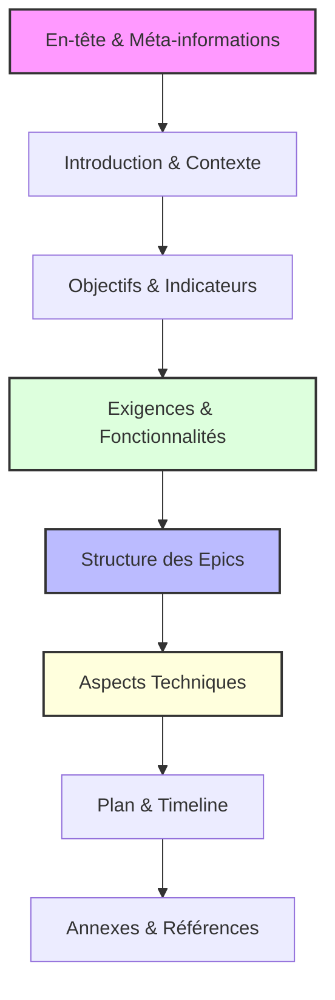

# 📄 Template de Document d'Exigences Produit (PRD)

## 📋 Vue d'Ensemble

Ce template définit la structure standard pour les Documents d'Exigences Produit (PRD). Il assure une documentation complète et cohérente des exigences, fonctionnalités et objectifs du produit à développer.

> 💡 **Note importante**: Le PRD est le document fondamental qui guide tout le développement. Il doit être approuvé avant de commencer l'implémentation.

## 🎯 Objectifs

- Fournir une structure claire et complète pour la documentation des exigences produit
- Assurer que toutes les informations essentielles sont documentées
- Faciliter la compréhension et la validation des exigences par toutes les parties prenantes
- Servir de référence tout au long du cycle de développement

## 🔄 Structure du PRD

## 📝 Sections Requises

### 1️⃣ En-tête et Méta-informations

- **Titre**: "Product Requirements Document (PRD) pour {projet}"
- **Statut**: Draft / Approved
- **Version**: X.Y.Z
- **Date de dernière mise à jour**: YYYY-MM-DD
- **Auteur(s)**: Noms des responsables
- **Approbateurs**: Personnes devant approuver le document

### 2️⃣ Introduction et Contexte

- **Description du projet**: Présentation générale
- **Contexte business**: Motivations et enjeux commerciaux
- **Public cible**: Utilisateurs finaux ou parties prenantes
- **Problématique**: Problèmes que le produit vise à résoudre

### 3️⃣ Objectifs et Indicateurs de Succès

- **Objectifs principaux**: Buts clairs et mesurables
- **Critères de succès**: Comment mesurer l'atteinte des objectifs
- **Indicateurs de performance (KPIs)**: Métriques spécifiques à suivre

### 4️⃣ Exigences et Fonctionnalités

- **Exigences fonctionnelles**: Capacités et comportements
- **Exigences non-fonctionnelles**: Performance, sécurité, etc.
- **Exigences d'expérience utilisateur**: UX/UI
- **Exigences d'intégration**: Compatibilité avec d'autres systèmes
- **Exigences de conformité**: Normes et réglementations

### 5️⃣ Structure des Epics

- **Epic-1**: Titre (Statut)
  - Description
  - Stories principales
- **Epic-2**: Titre (Statut)
  - Description
  - Stories principales
- **Epic-3**: Titre (Statut)
  - Description
  - Stories principales

### 6️⃣ Aspects Techniques

- **Stack technologique**: Langages, frameworks, etc.
- **Contraintes**: Limitations techniques
- **Considérations d'architecture**: Principes directeurs
- **Intégrations externes**: APIs, services tiers

### 7️⃣ Plan et Timeline

- **Phases de développement**: Étapes principales
- **Priorités**: Ordre d'implémentation
- **Jalons**: Dates clés
- **Dépendances**: Contraintes temporelles

### 8️⃣ Annexes et Références

- **Études de marché**: Recherches utilisateurs
- **Maquettes/Wireframes**: Liens vers les designs
- **Documents liés**: Architecture, spécifications techniques
- **Glossaire**: Termes spécifiques au domaine

## 💡 Exemples

<example>
**Bon exemple d'objectifs**:

### 3️⃣ Objectifs et Indicateurs de Succès

#### Objectifs principaux

- Réduire le temps de traitement des demandes client de 40% par rapport au système actuel
- Augmenter le taux de conversion des essais gratuits de 5% à 12%
- Permettre aux utilisateurs de compléter leur profil en moins de 3 minutes

#### Critères de succès

- 90% des utilisateurs peuvent effectuer une demande sans assistance
- Réduction des tickets de support de 25% dans les 3 mois suivant le lancement
- Score NPS supérieur à 45 après 6 mois d'utilisation

#### Indicateurs de performance (KPIs)

- Temps moyen pour compléter une demande < 2 minutes
- Taux d'abandon du formulaire < 15%
- Taux de réussite de la première utilisation > 85%

Ces objectifs sont précis, mesurables, et directement liés à la valeur business et à l'expérience utilisateur.
</example>

<example type="invalid">
**Exemple d'objectifs à éviter**:

### Objectifs

- Créer une meilleure interface
- Améliorer l'expérience utilisateur
- Rendre l'application plus rapide

Ces objectifs sont vagues, non mesurables, et ne fournissent pas de critères clairs pour déterminer si le produit est un succès.
</example>

## ✅ Bonnes Pratiques pour la Rédaction d'un PRD

- **Clarté**: Utilisez un langage simple et précis
- **Spécificité**: Évitez les généralités, préférez les descriptions détaillées
- **Mesurabilité**: Assurez-vous que les objectifs et critères peuvent être mesurés
- **Priorités**: Indiquez clairement l'importance relative des fonctionnalités
- **Validation**: Faites valider le PRD par toutes les parties prenantes
- **Itération**: Traitez le PRD comme un document vivant qui évolue
- **Visualisation**: Utilisez des diagrammes, tableaux et maquettes quand c'est pertinent

## 🔗 Références

- [Guide du Product Owner](https://www.scrum.org/resources/what-is-a-product-owner)
- [Techniques de rédaction des User Stories](https://www.mountaingoatsoftware.com/agile/user-stories)
- [Templates d'Architecture](mdc:xnotes/template-arch.md)
- [Templates de Stories](mdc:xnotes/template-story.md)

<version>2.0.0</version>
