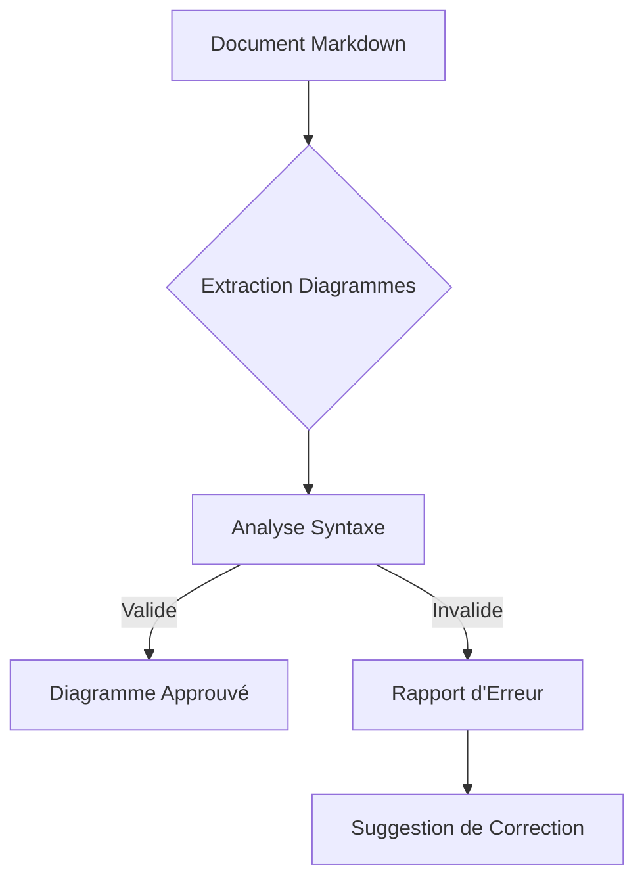
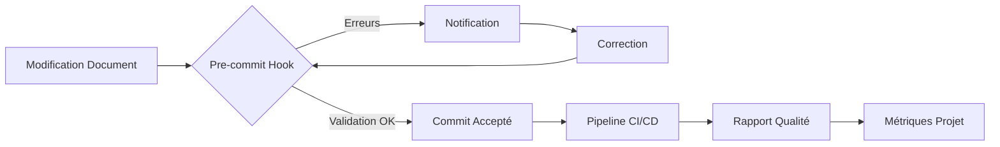
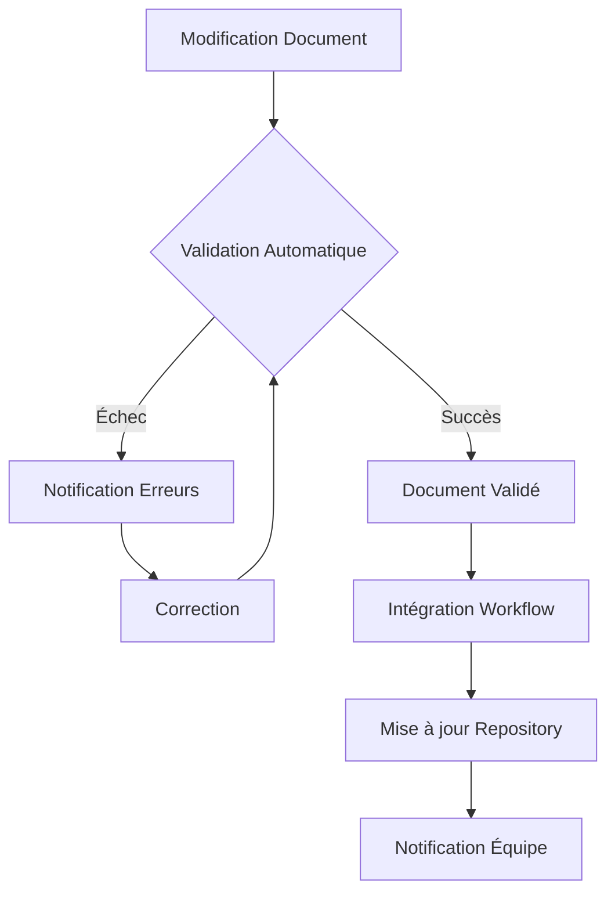

# Agile Workflow Template

<version>2.3.0</version>

> Ce template définit le flux de travail agile à suivre pour tous les projets. Il garantit une approche structurée et cohérente pour la planification, le développement et le suivi des projets avec une attention particulière à la qualité, la documentation et la gestion proactive des risques.

## 🎯 Vue d'Ensemble

Le workflow agile est notre méthodologie standard pour livrer des solutions logicielles de haute qualité. Ce template définit chaque étape du processus, depuis la définition initiale des exigences jusqu'à la livraison itérative des fonctionnalités, en mettant l'accent sur la documentation, les tests, la gestion des risques et la communication.

## 📝 Processus Étape par Étape

### 1️⃣ Initialisation du Projet

- **Vérification du PRD**: S'assurer qu'un fichier `.ai/prd.md` existe
- **Création du PRD**: Si le PRD n'existe pas, travailler avec l'utilisateur pour le créer
- **Objectifs du PRD**:
  - Documenter l'objectif du projet
  - Définir les problèmes à résoudre
  - Établir la séquence des tâches
  - Identifier les technologies et contraintes
  - **Identification initiale des risques de projet**: Documenter les risques majeurs et les stratégies d'atténuation

### 2️⃣ Amélioration du PRD

- **Raffinement**: Améliorer le PRD jusqu'à ce qu'il soit marqué comme approuvé
- **Contenu Requis**:
  - Objectif détaillé et problèmes résolus
  - Séquence de tâches détaillée
  - Modèles d'architecture et décisions techniques clés
  - Diagrammes Mermaid pour visualiser l'architecture
  - Technologies, configuration et contraintes
  - **Risques projet identifiés**: Liste complète avec impact et probabilité
  - **Hypothèses principales**: Liste avec méthodes de validation
  - Inconnues et stratégies pour les résoudre

### 3️⃣ Documentation d'Architecture

- **Création**: Générer le document d'architecture `.ai/arch.md` (brouillon)
- **Approbation**: Obtenir l'approbation du document d'architecture
- **Analyse des risques techniques**: Documenter les risques techniques spécifiques et les stratégies d'atténuation

### 4️⃣ Création et Gestion des Stories

- **Première Story**: Créer le brouillon de la première story dans le dossier `.ai`
- **Format**: Utiliser le template de story standardisé
- **Convention de Nommage**: `.ai/story-{N}.story.md` ou `.ai/task-{N}.story.md`
- **Risques et Hypothèses**: S'assurer que chaque story contient une section dédiée aux risques et hypothèses
- **Approbation**: Attendre l'approbation de la story avant de commencer le travail
- **TDD**: Chaque sous-tâche inclut des tests unitaires avec au moins 80% de couverture

### 5️⃣ Développement Itératif

- **Tests**: Exécuter les tests et s'assurer qu'ils passent avant de passer à la sous-tâche ou story suivante
- **Mise à jour**: Mettre à jour le fichier de story au fur et à mesure que les sous-tâches sont terminées
- **Révision des risques et hypothèses**: Réévaluer régulièrement les risques et valider/invalider les hypothèses
- **Complétion**: Une fois une story terminée, générer un brouillon de la story suivante
- **Approbation**: Attendre l'approbation avant de continuer

### 6️⃣ Validation Automatisée des Documents

- **Vérification Continue**: Exécuter automatiquement les validations après chaque modification de document
- **Processus de Validation**:
  - **Linting Markdown**: Vérifier la structure, le formatage et les sections requises
  - **Validation des Diagrammes**: S'assurer que tous les diagrammes Mermaid sont syntaxiquement corrects
  - **Vérification des Critères d'Acceptation**: Valider le format "Étant donné/Quand/Alors"
  - **Validation des Tables de Risques et Hypothèses**: Vérifier le format et les champs requis
- **Feedback Immédiat**: Notifier l'auteur des erreurs détectées avec suggestions de correction
- **Intégration Git**: Exécuter les validations via des hooks pre-commit et dans le pipeline CI/CD
- **Rapport de Qualité**: Générer des métriques de qualité documentaire pour les rétrospectives

## ⚠️ Points Critiques

> 🚨 **Règle Critique**: Les informations du projet doivent toujours être enregistrées dans le dossier `.ai`. Ce dossier est crucial pour les systèmes de mémoire du projet, car il conserve tout ce qui est planifié, complété ou modifié.

> 🚨 **Règle Critique**: Maintenir une documentation de haute qualité et à jour. En cas de doute, consulter le PRD, l'architecture, les stories actuelles et précédentes. Ne jamais deviner - demander de l'aide à l'utilisateur.

> 🚨 **Règle Critique**: La gestion proactive des risques et hypothèses est essentielle. Chaque story doit explicitement documenter les risques potentiels et les hypothèses sous-jacentes, avec des stratégies claires pour les atténuer et les valider.

> 🚨 **Règle Critique**: Tous les documents doivent passer avec succès la validation automatisée avant d'être considérés comme prêts. Les erreurs de validation doivent être corrigées immédiatement pour maintenir la qualité documentaire.

## 🔄 Pendant le Développement

- **Mises à jour des stories**: Mettre à jour les fichiers de story au fur et à mesure que les sous-tâches sont terminées
- **Validation des hypothèses**: Documenter les résultats des tests de validation des hypothèses
- **Suivi des risques**: Mettre à jour l'état des risques et ajuster les stratégies d'atténuation si nécessaire
- **Clarifications**: Si l'étape suivante n'est pas claire, demander des clarifications à l'utilisateur
- **Commande 'update story'**: Lorsque l'utilisateur demande 'update story', mettre à jour la story actuelle pour :
  - Refléter l'état actuel
  - Mettre à jour le statut des risques et hypothèses
  - Clarifier les prochaines étapes
- **Vérification continue**: S'assurer que la story est correcte et que les prochaines étapes sont claires

## 🚀 Actions Automatiques

Les actions suivantes peuvent être effectuées sans demande explicite de l'utilisateur:

1. **Création de story**: Créer le fichier de story à traiter ensuite si aucun n'existe
2. **Tests unitaires**: Exécuter des tests unitaires pendant le processus de développement jusqu'à ce qu'ils réussissent
3. **Mise à jour des tâches**: Mettre à jour les critères d'acceptation et les tâches de la story au fur et à mesure qu'ils sont complétés
4. **Validation des hypothèses**: Exécuter les validations d'hypothèses prévues lorsque c'est possible
5. **Journal de communication**: Mettre à jour le fichier de story avec le journal de discussion ou d'autres mises à jour pour conserver la meilleure mémoire possible de la story
6. **Validation documentaire**: Exécuter les validations automatiques sur les documents et notifier des erreurs détectées
7. **Génération de rapports**: Produire des rapports de qualité documentaire pour les revues d'itération

## 🛠️ Outils d'Automatisation

Le système d'automatisation pour la validation documentaire permet d'assurer systématiquement la qualité et la cohérence des documents agiles. Notre solution comprend:

### 🔍 Installation et Configuration

```bash
# Installation du système de validation
cd scripts
./setup-validation.sh

# Vérification de l'installation
./validate-docs.js --verbose templates/*.md
```

L'installation configure:

- Les outils de validation nécessaires (markdownlint-cli, mermaid-cli)
- Les règles personnalisées pour la documentation agile
- Les hooks git pour la vérification automatique lors des commits

### 📝 Validation Markdown

Le système vérifie automatiquement:

- Le formatage correct du Markdown
- La présence des sections obligatoires selon le type de document
- La structure cohérente des titres
- Le respect des conventions de nommage

```bash
# Validation manuelle des documents Markdown
./scripts/validate-docs.js --verbose .ai/*.md

# Correction automatique des problèmes de formatage simples
./scripts/validate-docs.js --fix .ai/*.md
```

### 📊 Validation des Diagrammes Mermaid

Les diagrammes Mermaid sont un élément essentiel de notre documentation technique. Le système:

- Détecte tous les blocs Mermaid dans les documents
- Vérifie la syntaxe de chaque diagramme
- Identifie les erreurs précises avec leur emplacement
- Suggère des corrections pour les problèmes courants



### ✅ Validation des Critères d'Acceptation

Les critères d'acceptation doivent suivre le format Gherkin pour assurer la clarté et la testabilité:

```bash
# Format attendu
1. Étant donné [contexte initial], quand [action de l'utilisateur], alors [résultat attendu]
```

Le système vérifie:

- La présence de la section "Critères d'Acceptation" dans les stories
- Le respect du format "Étant donné/Quand/Alors" pour chaque critère
- La numérotation correcte des critères
- La complétude de chaque clause (contexte, action, résultat)

### 📋 Validation des Risques et Hypothèses

Pour chaque document concerné, le système vérifie les tables de risques et d'hypothèses:

**Table de Risques** - Colonnes obligatoires:

- Risque
- Impact
- Probabilité
- Stratégie d'atténuation

**Table d'Hypothèses** - Colonnes obligatoires:

- Hypothèse
- Impact si invalidée
- Méthode de validation

### 📈 Rapports de Qualité Documentaire

```bash
# Génération d'un rapport complet sur la qualité des documents
./scripts/validate-docs.js --report

# Le rapport inclut:
# - Taux de conformité global
# - Problèmes par catégorie
# - Tendances de qualité
# - Recommandations d'amélioration
```

### 🔁 Intégration Continue

Le système s'intègre au pipeline CI/CD pour:

- Bloquer les commits qui ne respectent pas les standards
- Générer des rapports automatiques de qualité
- Notifier l'équipe des problèmes détectés
- Suivre l'évolution de la qualité documentaire au fil du temps



## �� Bonnes Pratiques

- **Centré sur la documentation**: Maintenir des documents PRD, Architecture et Stories précis et à jour
- **Gestion proactive des risques**: Identifier et atténuer les risques à chaque niveau (projet, architecture, story)
- **Validation d'hypothèses**: Expliciter et tester systématiquement les hypothèses critiques du projet
- **Approche TDD**: Écrire les tests avant le code et s'assurer que tous les tests passent
- **Communication claire**: Documenter les décisions et les changements de direction
- **Traçabilité**: Maintenir des liens clairs entre les stories, le PRD et l'architecture
- **Incrémental**: Livrer des fonctionnalités complètes en petits incréments testables
- **Autonomie**: Prendre l'initiative d'améliorer la documentation et d'exécuter les tests sans attendre les instructions
- **Apprentissage continu**: Documenter les leçons apprises à partir des risques rencontrés et des hypothèses validées/invalidées
- **Automatisation**: Privilégier l'automatisation des tâches répétitives pour garantir qualité et cohérence
- **Convention plutôt que configuration**: Standardiser les formats et structures pour faciliter l'automatisation

## 📊 Métriques et Revues

- **Revue des risques**: Organiser une revue dédiée aux risques à la fin de chaque sprint
- **Taux de validation d'hypothèses**: Suivre le pourcentage d'hypothèses validées vs invalidées
- **Efficacité des mesures d'atténuation**: Évaluer régulièrement l'efficacité des stratégies de gestion des risques
- **Rétrospective améliorée**: Intégrer l'analyse des risques et hypothèses dans les rétrospectives régulières
- **Taux de conformité documentaire**: Mesurer le pourcentage de documents passant la validation automatique
- **Temps de correction**: Suivre le temps moyen pour corriger les erreurs de validation détectées
- **Tendances de qualité**: Analyser l'évolution de la qualité documentaire au fil du temps



<version>2.3.0</version>
