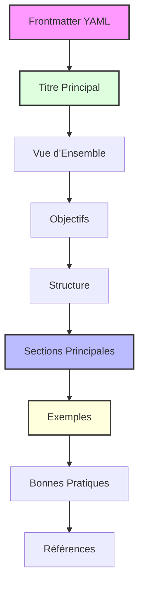

# 📄 Base Template

## 📋 Vue d'Ensemble

Ce template sert de base pour tous les autres templates du projet. Il définit la structure standard, les conventions de formatage et les éléments communs à utiliser dans la création de nouveaux templates.

> 💡 **Note importante**: Ce document est la référence officielle pour la standardisation des templates. Toute modification doit être propagée aux templates dérivés.

## 🎯 Objectifs

- Assurer une structure cohérente à travers tous les templates
- Faciliter la compréhension et l'utilisation des templates
- Optimiser la détection et l'application par l'IA de Cursor
- Améliorer l'expérience utilisateur grâce à une présentation claire et intuitive

## 🔄 Structure Standard



## 📝 Sections Standards

### 📌 Frontmatter YAML

Le frontmatter YAML doit contenir au minimum les champs suivants:

```yaml
---
title: "Titre du Document"
version: "X.Y.Z"
description: "ACTION when TRIGGER to OUTCOME"
lastUpdated: "YYYY-MM-DD"
tags: ["tag1", "tag2"]
---
```

Pour les règles Cursor (.mdc), ajouter:

```yaml
globs: "pattern/matching/*.ext"
```

### 🏷️ Titre Principal

Utilisez un emoji thématique suivi du titre principal:

```markdown
# 📄 Titre du Document
```

### 📋 Vue d'Ensemble

Une brève introduction (2-3 phrases) expliquant l'objectif et le contexte du document.

### 🎯 Objectifs

Liste à puces des objectifs principaux du document.

### 🔄 Structure

Diagramme Mermaid ou description textuelle de la structure du document.

### 📝 Sections Principales

Contenu spécifique au type de document, organisé hiérarchiquement.

### 💡 Exemples

Exemples concrets illustrant l'utilisation correcte et incorrecte du template.

<details>
<summary>Format standard pour les exemples</summary>

```markdown
<example>
**Bon exemple**:
```

[Code ou contenu]

```
[Explication]
</example>

<example type="invalid">
**Exemple à éviter**:
```

[Code ou contenu]

```
[Explication]
</example>
```

</details>

### ✅ Bonnes Pratiques

Liste de recommandations pour une utilisation optimale.

### 🔗 Références

Liens vers documents connexes ou ressources additionnelles.

## 📊 Conventions de Formatage

### Emojis Standards

| Catégorie        | Emoji | Description               |
| :--------------- | :---: | :------------------------ |
| Document         |  📄   | Document général          |
| Vue d'ensemble   |  📋   | Résumé ou introduction    |
| Objectifs        |  🎯   | Buts et objectifs         |
| Structure        |  🔄   | Organisation ou flux      |
| Contenu          |  📝   | Sections de contenu       |
| Exemples         |  💡   | Illustrations et exemples |
| Bonnes pratiques |  ✅   | Recommandations           |
| Attention        |  ⚠️   | Avertissements            |
| Note importante  |  💡   | Informations critiques    |
| Références       |  🔗   | Liens et ressources       |

### Mise en Forme

- Utilisez des titres hiérarchiques (# à ####) pour la structure
- Limitez-vous à 4 niveaux de titres maximum
- Utilisez des listes à puces pour les énumérations
- Utilisez des tableaux pour les informations structurées
- Utilisez des blockquotes pour les notes importantes
- Utilisez `<details>` pour le contenu optionnel ou détaillé

## 💡 Exemples

<example>
**Bon exemple de frontmatter**:
```yaml
---
title: "Guide d'Architecture"
version: "1.2.0"
description: "ALWAYS use when DESIGNING system architecture to ENSURE consistency and best practices"
lastUpdated: "2024-02-28"
tags: ["architecture", "design", "documentation"]
---
```
Ce frontmatter est complet, contient tous les champs requis et utilise le format ACTION-TRIGGER-OUTCOME pour la description.
</example>

<example type="invalid">
**Exemple de frontmatter à éviter**:
```yaml
---
title: Guide d'Architecture
description: Ce document explique comment faire l'architecture
---
```
Ce frontmatter est incomplet, manque de version et de date, et la description ne suit pas le format recommandé.
</example>

## ✅ Bonnes Pratiques

- Utilisez des noms de fichiers descriptifs et cohérents
- Maintenez la version à jour à chaque modification significative
- Suivez strictement le format ACTION-TRIGGER-OUTCOME pour les descriptions
- Incluez toujours au moins un exemple positif et un contre-exemple
- Utilisez des diagrammes pour clarifier les concepts complexes
- Vérifiez la cohérence entre les différents templates liés

## 🔗 Références

- [Markdown Guide](https://www.markdownguide.org/)
- [Mermaid Documentation](https://mermaid-js.github.io/mermaid/#/)
- [YAML Specification](https://yaml.org/spec/1.2/spec.html)

<version>1.0.0</version>
